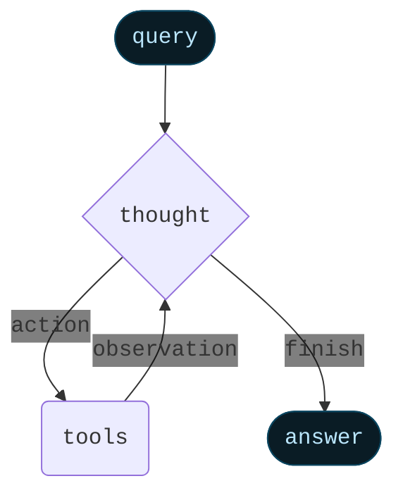
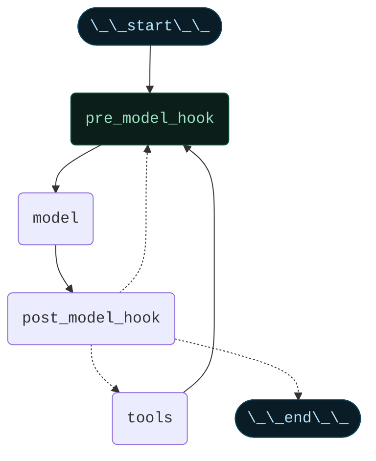
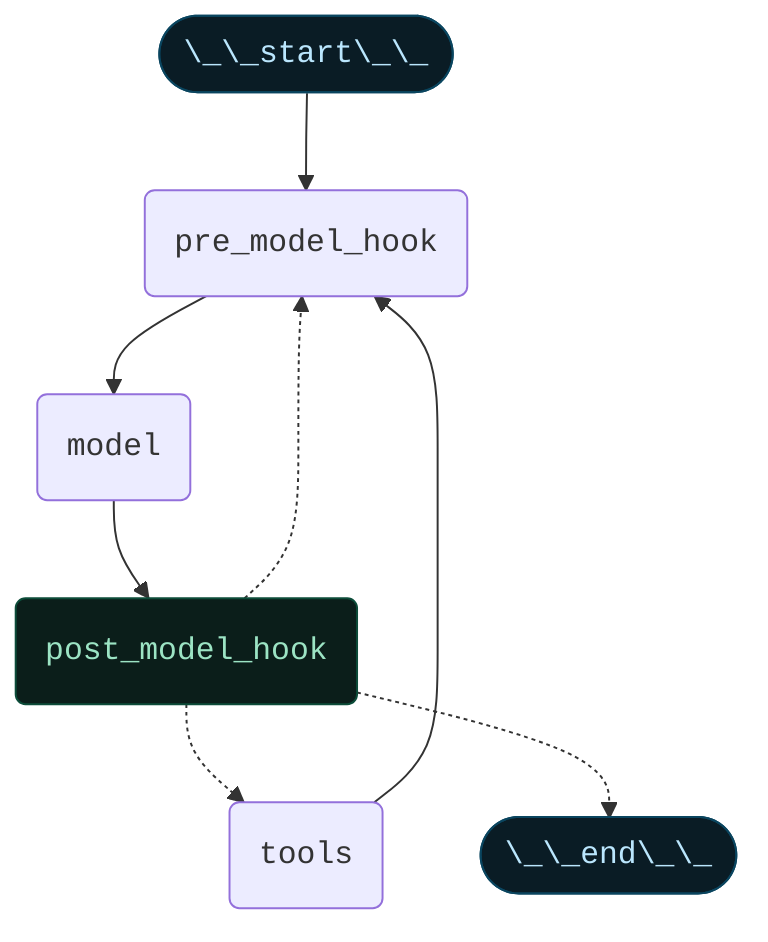

import AlphaCallout from '/snippets/alpha-lc-callout.mdx';

<AlphaCallout />

## Overview

Agents combine language models with tools to create systems that can reason about tasks, decide which tools to use, and iteratively work towards solutions. 


`createReactAgent()` provides a production-ready ReAct (Reasoning + Acting) agent implementation based on the paper [ReAct: Synergizing Reasoning and Acting in Language Models](https://arxiv.org/abs/2210.03629).


<Columns cols={2}>

<Card>
ReAct frames an agent's behavior as an interleaving of `thought` -> `action` -> `observation` steps, where the model writes out its reasoning, picks a tool, sees the tool's result, and then repeats. ReAct reduces hallucinations and makes the decision process auditable: the agent can form hypotheses (`thought`), test them with tools (`action`), and update its plan based on feedback (`observation`). 

A ReAct loop runs until a stop condition - i.e. when the model emits a final answer or a max-iterations limit is reached.
</Card>

<Card>

</Card>

</Columns>


<Info>
Under the hood, `create_react_agent()` builds a **graph**-based agent runtime. A graph consists of nodes (steps) and edges (connections) that define how your agent processes information. The agent moves through this graph, executing nodes like the model node (which calls the model), the tools node (which executes tools), or pre/post model hook nodes. Learn more about the [graph API](./langgraph-graph-api).
</Info>

## Core components

### Model

The [model](./langchain-models) is the reasoning engine of your agent. It can be specified in multiple ways, supporting both static and dynamic model selection.

#### Static model

Static models are configured once when creating the agent and remain unchanged throughout execution. This is the most common and straightforward approach.

To initialize a static model from a model identifier string:


```ts wrap
import { createReactAgent } from "langchain";

const agent = createReactAgent({
    model: "openai:gpt-5",
    tools: []
});
```


Model identifier strings use the format `provider:model` (e.g. `"openai:gpt-5"`) and support automatic inference (e.g. `"gpt-5"` will be inferred as `"openai:gpt-5"`).

The user may want more control over the model configuration, in which case they can initialize a model instance directly:


```ts wrap
import { createReactAgent } from "langchain";
import { ChatOpenAI } from "@langchain/openai";

const agent = createReactAgent({
    model: new ChatOpenAI({
        model: "gpt-4o",
        temperature: 0.1,
        maxTokens: 1000,
        timeout: 30
    }),
    tools: []
});
```


Model instances give you complete control over configuration. Use them when you need to set specific parameters like temperature, max tokens, timeouts, or configure API keys, base URLs, and other provider-specific settings. Refer to the [API reference](https://python.langchain.com/api_reference/) to see available params and methods on your model.

#### Dynamic model

<Info>
**`runtime`**: The execution environment of your agent, containing immutable configuration and contextual data that persists throughout the agent's execution (e.g., user IDs, session details, or application-specific configuration).
</Info>

<Info>
**`state`**: The data that flows through your agent's execution, including messages, custom fields, and any information that needs to be tracked and potentially modified during processing (e.g. user preferences or tool usage stats).
</Info>

Dynamic models are selected at runtime based on the current state and context. This enables sophisticated routing logic and cost optimization.

To use a dynamic model, you need to provide a function that receives the graph state and runtime and returns an instance of `BaseChatModel` with the tools bound to it using `.bind_tools(tools)`, where `tools` is a subset of the `tools` parameter.


```ts wrap
import { createReactAgent, AgentState } from "langchain";
import { ChatOpenAI } from "@langchain/openai";

const selectModel = (state: AgentState) => {
    const messageCount = state.messages.length;
    
    if (messageCount > 10) {
        return new ChatOpenAI({
            model: "gpt-4.1",
        });
    }
    return new ChatOpenAI({
        model: "gpt-4o",
    });
};

const agent = createReactAgent({
    llm: selectModel,
    tools: []
});
```


<Tip>
For model configuration details, see [Models](./langchain-models).
</Tip>

### Tools

Tools give agents the ability to take actions. Agents go beyond simple model-only tool binding by facilitating:

- Multiple tool calls in sequence triggered by a single prompt
- Parallel tool calls when appropriate
- Dynamic tool selection based on results
- Tool retry logic and error handling
- State persistence across tool calls

Tools can be provided to the agent as either:

1. A list of tools (created with `tool` function) 
2. A configured `ToolNode`


#### Passing a list of tools

Passing a list of tools to the agent will create a `ToolNode` under the hood. This is the simplest way to set up a tool-calling agent:


```ts wrap
import { z } from "zod";
import { createReactAgent, tool } from "langchain";

const search = tool(
  async ({ query }) => {
    return `Results for: ${query}`;
  },
  {
    name: "search",
    description: "Search for information",
    schema: z.object({
      query: z.string().describe("The query to search for"),
    }),
  }
);

const calculate = tool(
  async ({ expression }) => {
    return String(eval(expression));
  },
  {
    name: "calculate",
    description: "Perform calculations",
    schema: z.object({
      expression: z.string().describe("The expression to calculate"),
    }),
  }
);

const agent = createReactAgent({
  model: "openai:gpt-4o",
  tools: [search, calculate],
});

const result = await agent.invoke({
  messages: [
    {
      role: "user",
      content:
        "Find wireless headphones, check if they're in stock, and calculate shipping to New York",
    },
  ],
});

console.log(result);
```


If an empty tool list is provided, the agent will consist of a single LLM node without tool calling.

#### Passing a configured `ToolNode`

Alternatively, you can create a `ToolNode` directly and pass it to the agent. This allows you to customize the tool node's behavior, such as handling tool errors:


```ts wrap
import { ToolNode, ToolMessage } from "langchain";

const toolNode = new ToolNode({
    tools: [search, calculate],
    handleToolErrors: (error, toolCall) => {
        return new ToolMessage(
            content="Please check your input and try again.",
            tool_call_id=toolCall.id
        );
    }
});
```


<Tip>
To learn more about error handling in`ToolNode`, see [ToolNode](./langchain-tools#toolnode).
</Tip>

### Tool use in the ReAct loop

Agents follow the ReAct (*Reasoning* + *Acting*) pattern, alternating between brief reasoning steps with targeted tool calls and feeding the resulting observations into subsequent decisions until they can deliver a final answer.

Follow along as an agent applies ReAct to answer a user's question:

<Card title="Prompt: Identify the current most popular wireless headphones and verify availability.">

```
================================ Human Message =================================

Find the most popular wireless headphones right now and check if they're in stock
```

*Reasoning*: "Popularity is time-sensitive, I need to use the provided search tool."

*Acting*: Call `search_products("wireless headphones")`

```
================================== Ai Message ==================================
Tool Calls:
  search_products (call_abc123)
 Call ID: call_abc123
  Args:
    query: wireless headphones
```
```
================================= Tool Message =================================

Found 5 products matching "wireless headphones". Top 5 results: WH-1000XM5, ...
```

*Reasoning*: "I need to confirm availability for the top-ranked item before answering."

*Acting*: Call `check_inventory("WH-1000XM5")`

```
================================== Ai Message ==================================
Tool Calls:
  check_inventory (call_def456)
 Call ID: call_def456
  Args:
    product_id: WH-1000XM5
```
```
================================= Tool Message =================================

Product WH-1000XM5: 10 units in stock
```

*Reasoning*: "I have the most popular model and its stock status. I can now answer the user's question."

*Acting*: Produce final answer

```
================================== Ai Message ==================================

I found wireless headphones (model WH-1000XM5) with 10 units in stock...
```
</Card>

<Tip>
To learn more about tools, see [Tools](./langchain-tools).
</Tip>

### Prompt

You can shape how your agent approaches tasks by providing a prompt. The `prompt` parameter can be provided in several forms.

#### String


```ts wrap
const agent = createReactAgent({
    model,
    tools,
    prompt: "You are a helpful assistant. Be concise and accurate."
});
```


#### SystemMessage


```ts wrap
import { SystemMessage } from "langchain";
const agent = createReactAgent({
    model,
    tools,
    prompt: new SystemMessage("You are a research assistant. Cite your sources.")
});
```


#### Callable


```ts wrap
import { createReactAgent } from "langchain";

const agent = createReactAgent({
    model,
    tools,
    prompt: (state) => {
        const userType = state.userType || "standard";
        return [
            new SystemMessage(
                userType === "expert"
                    ? "Provide detailed technical responses."
                    : "Provide simple, clear explanations."
            ),
            ...state.messages
        ];
    }
});
```


#### Runnable


```ts wrap
import { createReactAgent } from "langchain";

const promptRunnable = new RunnableLambda({
  func: async (state: AgentState) => {
    return [
      new SystemMessage(`Current context: ${state.context}`),
      ...state.messages,
    ];
  },
});

const agent = createReactAgent({
  model: "openai:gpt-4o",
  tools,
  prompt: promptRunnable,
});
```


When no `prompt` is provided, the agent will infer its task from the messages directly.

<Tip>
For more details on message types and formatting, see [Messages](./langchain-messages).
</Tip>

## Advanced configuration

### Structured Output


In some situations, you may want the agent to return an output in a specific format. LangChain provides a simple, universal way to do this with the `responseFormat` parameter.

```ts wrap
import { z } from "zod";
import { createReactAgent } from "langchain";

const ContactInfo = z.object({
  name: z.string(),
  email: z.string(),
  phone: z.string(),
});

const agent = createReactAgent({
  model: "openai:gpt-4o",
  tools: [],
  responseFormat: ContactInfo,
});

const result = await agent.invoke({
  messages: [
    {
      role: "user",
      content:
        "Extract contact info from: John Doe, john@example.com, (555) 123-4567",
    },
  ],
});

console.log(result.structuredResponse);
/**
 * {
 *   name: 'John Doe',
 *   email: 'john@example.com',
 *   phone: '(555) 123-4567'
 * }
 */
```

<Tip>
To learn about structured output, see [Structured Output](./langchain-structured-output).
</Tip>

### Memory

Agents maintain conversation history automatically through the message state. You can also configure the agent to use a custom state schema to remember additional information during the conversation.

Information stored in the state can be thought of as the "short-term memory" of the agent:


```ts wrap
import { z } from "zod";
import { createReactAgent, type BaseMessage } from "langchain";

const customAgentState = z.object({
  userPreferences: z.record(z.string(), z.string()),
});

const CustomAgentState = createReactAgent({
  model: "openai:gpt-4o",
  tools: [],
  stateSchema: customAgentState,
});
```


<Tip>
To learn more about memory, including how to implement long-term memory that persists across sessions, see [Memory](./langchain-memory).
</Tip>

### Pre-model hook

Pre-model hook is an optional node that can process state before the model is called. Use cases include message trimming, summarization, and context injection.



It must be a callable or a runnable that takes in current graph state and returns a state update in the form of:


```ts wrap
const agent = createReactAgent({
  model: "openai:gpt-4o",
  preModelHook: (state) => {
    return {
      messages: [RemoveMessage({ id: REMOVE_ALL_MESSAGES }), ...state.messages],
    };
  },
});
```

Example of a pre-model hook that trims messages to fit the context window:


```ts wrap
import { createReactAgent, type AgentState } from "langchain";

const trimMessages = (state: AgentState) => {
    const messages = state.messages;

    if (messages.length <= 3) {
        return { messages };
    }

    const firstMsg = messages[0];
    const recentMessages = messages.length % 2 === 0
        ? messages.slice(-3)
        : messages.slice(-4);

    const newMessages = [firstMsg, ...recentMessages];
    return { messages: newMessages };
};

const agent = createReactAgent({
  model: "openai:gpt-4o",
  tools,
  preModelHook: trimMessages,
});
```


<Info>
`messages` must be provided and will be used as an input to the `agent` node (i.e., the node that calls the LLM). The rest of the keys will be added to the graph state.
</Info>

<Warning>
If you are returning `messages` in the pre-model hook, you should OVERWRITE the `messages` key by doing the following:


```ts wrap
const agent = createReactAgent({
    // ...
    preModelHook: (state) => {
        // ...
        return {
            messages: [
                RemoveMessage({ id: REMOVE_ALL_MESSAGES }),
                ...state.messages
            ],
        };
    };
});
```

</Warning>

### Post-model hook

Post-model hook is an optional node that can process the model's response before tool execution. Use cases include validation, guardrails, or other post-processing.



It must be a callable or a runnable that takes in current graph state and returns a state update.

Example of a post-model hook that filters out confidential information:


```ts wrap
import { createReactAgent, type AgentState, AIMessage } from "langchain";

const validateResponse = (state: AgentState) => {
  const lastMessage = state.messages.at(-1)?.content as string;
  if (lastMessage.toLowerCase().includes("confidential")) {
    return {
      messages: [
        ...state.messages.slice(0, -1),
        new AIMessage("I cannot share confidential information."),
      ],
    };
  }
  return {};
};

const agent = createReactAgent({
  model: "openai:gpt-4o",
  tools,
  postModelHook: validateResponse,
});
```


### Streaming

We've seen how the agent can be called with `.invoke` to get a final response. If the agent executes multiple steps, this may take a while. To show intermediate progress, we can stream back messages as they occur.


```ts wrap
const stream = await agent.stream({
    messages: [new HumanMessage("What's the weather in NYC?")],
}, { streamMode: "values" });

for await (const chunk of stream) {
    // Each chunk contains the full state at that point
    const latestMessage = chunk.messages.at(-1);
    if (latestMessage?.content) {
        console.log(`Agent: ${latestMessage.content}`);
    } else if (latestMessage?.tool_calls) {
        console.log(`Calling tools: ${latestMessage.tool_calls.map((tc: ToolCall) => tc.name).join(", ")}`);
    }
}
```


<Tip>
For more details on streaming, see [Streaming](./langchain-streaming).
</Tip>

## End-to-end examples

### Simple search agent

A simple agent that answers questions by searching for information using the Tavily search tool.

To run this example, you'll need to set your Tavily and OpenAI API keys in your environment variables.


```ts wrap
import { createReactAgent, HumanMessage } from "langchain";
import { TavilySearch } from "@langchain/tavily";

const agent = createReactAgent({
  model: "openai:gpt-4o",
  tools: [new TavilySearch({ maxResults: 2 })],
});

const result = await agent.invoke({
  messages: [new HumanMessage("Tell me about LangChain.")],
});

console.log(result.messages.at(-1)?.content);
/**
 * LangChain is an open-source orchestration framework ...
 */
```


### Multi-step researcher agent

A more sophisticated agent that researches topics by collecting and summarizing multiple articles.


This example uses a Tavily search tool to browse the web, a `store` to persist state across sessions, a `postModelHook` to track tool usage, a custom `stateSchema` to store additional state.

```ts wrap expandable
import { z } from "zod";
import {
  createReactAgent,
  InMemoryStore,
  tool,
  MemorySaver,
  HumanMessage,
  type AgentState,
} from "langchain";
import { isAIMessage } from "@langchain/core/messages";
import { TavilySearch } from "@langchain/tavily";

const search = new TavilySearch({ maxResults: 3 });

const store = new InMemoryStore();

const researcherState = z.object({
  tool_usage_stats: z.record(z.string(), z.number()),
});

const storeArticle = tool(
  async ({ name, url, summary }) => {
    const namespace = ["research", "articles"];
    const existing = await store.get(namespace, "collected_articles");
    const articles = existing?.value ?? [];

    articles.push({ name, url, summary });
    store.put(namespace, "collected_articles", articles);

    return `Stored article: ${name}`;
  },
  {
    name: "store_article",
    description: "Store an article's information in memory.",
    schema: z.object({
      name: z.string(),
      url: z.string(),
      summary: z.string(),
    }),
  }
);

const getStoredArticles = tool(
  async () => {
    const namespace = ["research", "articles"];
    const existing = await store.get(namespace, "collected_articles");
    if (!existing) {
      return "No articles stored yet.";
    }

    const articles = existing?.value;
    if (!articles) {
      return "No articles stored yet.";
    }

    return JSON.stringify(articles, null, 2);
  },
  {
    name: "get_stored_articles",
    description: "Retrieve all stored articles.",
    schema: z.object({}),
  }
);

const trackToolUsage = (state: AgentState<typeof researcherState>) => {
  const { messages } = state;
  const lastMessage = messages.at(-1);

  if (lastMessage && isAIMessage(lastMessage)) {
    const toolNames = lastMessage.tool_calls?.map((tc) => tc.name);

    // Create a copy of the existing stats or start with empty object
    const updatedStats = { ...(state.tool_usage_stats || {}) };

    for (const toolName of toolNames ?? []) {
      updatedStats[toolName] = (updatedStats[toolName] ?? 0) + 1;
    }

    return {
      ...state,
      tool_usage_stats: updatedStats,
    };
  }

  if (lastMessage && isAIMessage(lastMessage) && !lastMessage.tool_calls) {
    if (state.tool_usage_stats) {
      console.log(
        `Tool usage summary: ${JSON.stringify(state.tool_usage_stats)}`
      );
    }
  }

  return state;
};

const agent = createReactAgent({
  model: "openai:gpt-5",
  tools: [search, storeArticle, getStoredArticles],
  postModelHook: trackToolUsage,
  prompt:
    "You are a research assistant. When asked to find articles: 1. Search for relevant content 2. Store each article with a descriptive name, URL, and summary 3. Only perform at most one tool call at a time 4. Keep track of what you've collected 5. Continue until you have the requested number of articles 6. Before you finish, double check that you have the requested number of articles by calling the get_stored_articles tool 6. If you have the requested number of articles, stop and present them in an organized format",
  checkpointer: new MemorySaver(),
  store,
  stateSchema: researcherState,
});
```

Invoke a research session:
```ts wrap expandable
const config = {
  configurable: { thread_id: "langchain-agents" },
  recursionLimit: 100,
};
const result = await agent.invoke(
  {
    messages: [
      new HumanMessage(
        "Find 5 relevant articles about LangChain and AI agents."
      ),
    ],
  },
  config
);

console.log(result.messages.at(-1)?.content);

/**
 * Here are 5 relevant articles about LangChain and AI agents:
 *
 * 1) LangGraph — LangChain Blog
 * - URL: https://blog.langchain.dev/langgraph
 * - Summary: Official introduction to LangGraph (built on LangChain) explaining why cyclical graphs are useful for agent runtimes. Covers core concepts and how LangGraph enables robust, stateful agents with loops and branching beyond traditional DAGs.
 *
 * 2) LangGraph: Multi-Agent Workflows — LangChain Blog
 * - URL: https://blog.langchain.dev/langgraph-multi-agent-workflows
 * - Summary: Shows how to build multi-agent systems with LangGraph, including coordination patterns and examples. Compares to other frameworks (e.g., AutoGen) and links to repo examples for practical implementation.
 *
 * 3) Plan-and-Execute Agents — LangChain Blog
 * - URL: https://blog.langchain.dev/planning-agents
 * - Summary: Discusses plan-and-execute agent architectures in LangChain. Explains separating a planner LLM from a tool-execution runtime, variations like ReWOO, and a "joiner” component for dynamic replanning to improve speed and reliability.
 *
 * 4) LangGraph Tutorial: Building LLM Agents with LangChain (Zep)
 * - URL: https://www.getzep.com/ai-agents/langgraph-tutorial/
 * - Summary: Hands-on tutorial for building agents using LangGraph, including ReAct-style agents, tool integration (ToolNode), memory (MemorySaver), and guidelines for production-ready agent architectures.
 *
 * 5) Building AI agent systems with LangGraph (Medium)
 * - URL: https://medium.com/pythoneers/building-ai-agent-systems-with-langgraph-9d85537a6326
 * - Summary: Overview of using LangGraph (on top of LangChain) to build AI agents with cyclic, stateful graphs. Compares with LangChain’s AgentExecutor loop and highlights benefits for error handling, tool use, and adaptable multi-agent workflows.
 */
```


We can then use the same `thread_id` to invoke a follow-up session where the agent maintains access to work performed in the previous session:

```ts wrap expandable
const config = {
  configurable: { thread_id: "langchain-agents" },
  recursionLimit: 100,
};
const result = await agent.invoke(
  {
    messages: [
      new HumanMessage(
        "Find 2 more articles."
      ),
    ],
  },
  config
);

console.log(result.messages.at(-1)?.content);
/**
 * Here are 2 more relevant articles about LangChain and AI agents:
 *
 * 6) LangGraph Studio: The first agent IDE — LangChain Blog
 * - URL: https://blog.langchain.com/langgraph-studio-the-first-agent-ide/
 * - Summary: Official announcement of LangGraph Studio, an IDE for developing, visualizing, and debugging agentic applications. Explains why specialized tooling matters for agents and how to get started using Studio.
 *
 * 7) Tool calling — Python LangChain (Docs)
 * - URL: https://python.langchain.com/docs/concepts/tool_calling/
 * - Summary: Concept guide to LangChain’s standardized tool-calling interface. Covers binding tools to models, controlling tool choice, and how this underpins agent behavior and AgentExecutor loops.
 */
```
