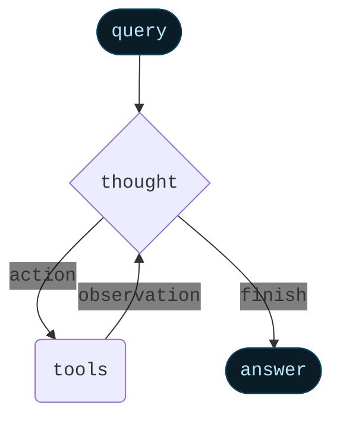
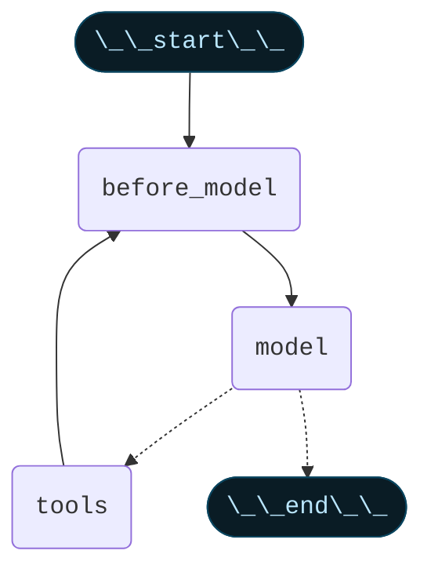
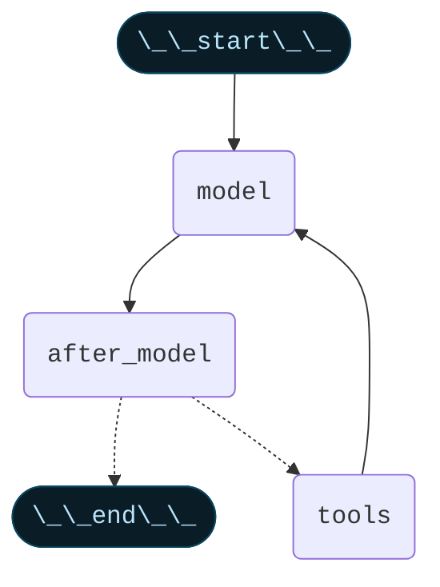

import AlphaCallout from '/snippets/alpha-lc-callout.mdx';

<AlphaCallout />

Agents combine language models with tools to create systems that can reason about tasks, decide which tools to use, and iteratively work towards solutions.


`createAgent()` provides a production-ready ReAct (Reasoning + Acting) agent implementation based on the paper [ReAct: Synergizing Reasoning and Acting in Language Models](https://arxiv.org/abs/2210.03629).


ReAct frames an agent's behavior as an interleaving of `thought` -> `action` -> `observation` steps, where the model writes out its reasoning, picks a tool, sees the tool's result, and then repeats. ReAct reduces hallucinations and makes the decision process auditable: the agent can form hypotheses (`thought`), test them with tools (`action`), and update its plan based on feedback (`observation`).

A ReAct loop runs until a stop condition - i.e., when the model emits a final answer or an iteration limit is reached.



<Info>


`createAgent()` builds a **graph**-based agent runtime using [LangGraph](/oss/javascript/langgraph/overview). A graph consists of nodes (steps) and edges (connections) that define how your agent processes information. The agent moves through this graph, executing nodes like the model node (which calls the model), the tools node (which executes tools), or pre/post model hook nodes.


Learn more about the [graph API](/oss/javascript/langgraph/graph-api).

</Info>

## Core components

### Model

The [model](/oss/javascript/langchain/models) is the reasoning engine of your agent. It can be specified in multiple ways, supporting both static and dynamic model selection.

#### Static model

Static models are configured once when creating the agent and remain unchanged throughout execution. This is the most common and straightforward approach. To initialize a static model from a <Tooltip tip="A string that follows the format `provider:model` (e.g. openai:gpt-5)">model identifier string</Tooltip>:


```ts wrap
import { createAgent } from "langchain";

const agent = createAgent({
  model: "openai:gpt-5",
  tools: []
});
```


Model identifier strings use the format `provider:model` (e.g. `"openai:gpt-5"`). You may want more control over the model configuration, in which case you can initialize a model instance directly using the provider package:

```ts wrap
import { createAgent } from "langchain";
import { ChatOpenAI } from "@langchain/openai";

const model = new ChatOpenAI({
  model: "gpt-4o",
  temperature: 0.1,
  maxTokens: 1000,
  timeout: 30
});

const agent = createAgent({
  model,
  tools: []
});
```

Model instances give you complete control over configuration. Use them when you need to set specific parameters like temperature, max tokens, timeouts, or configure API keys, base URLs, and other provider-specific settings. Refer to the [API reference](/oss/javascript/integrations/providers/) to see available params and methods on your model.


#### Dynamic model

Dynamic models are selected at <Tooltip tip="The execution environment of your agent, containing immutable configuration and contextual data that persists throughout the agent's execution (e.g., user IDs, session details, or application-specific configuration).">runtime</Tooltip> based on the current <Tooltip tip="The data that flows through your agent's execution, including messages, custom fields, and any information that needs to be tracked and potentially modified during processing (e.g., user preferences or tool usage stats).">state</Tooltip> and context. This enables sophisticated routing logic and cost optimization.


To use a dynamic model, you need to provide a function that receives the graph state and runtime and returns an instance of a chat model. The returned chat model needs to have the tools bound to it using `.bindTools(tools)`, where `tools` is a subset of the `tools` parameter.

```ts wrap
import { createAgent, AgentState } from "langchain";
import { ChatOpenAI } from "@langchain/openai";

const selectModel = (state: AgentState) => {
  const messageCount = state.messages.length;

  if (messageCount > 10) {
    return new ChatOpenAI({ model: "gpt-4.1" }).bindTools(tools);
  }
  return new ChatOpenAI({ model: "gpt-4o" }).bindTools(tools);
};

const agent = createAgent({
  llm: selectModel,
  tools,
});
```


<Tip>
For model configuration details, see [Models](/oss/javascript/langchain/models).
</Tip>

### Tools

Tools give agents the ability to take actions. Agents go beyond simple model-only tool binding by facilitating:

- Multiple tool calls in sequence (triggered by a single prompt)
- Parallel tool calls when appropriate
- Dynamic tool selection based on previous results
- Tool retry logic and error handling
- State persistence across tool calls

#### Defining tools

Pass a list of tools to the agent.


```ts wrap
import { z } from "zod";
import { createAgent, tool } from "langchain";

const search = tool(
  ({ query }) => `Results for: ${query}`,
  {
    name: "search",
    description: "Search for information",
    schema: z.object({
      query: z.string().describe("The query to search for"),
    }),
  }
);

const getWeather = tool(
  ({ location }) => `Weather in ${location}: Sunny, 72°F`,
  {
    name: "get_weather",
    description: "Get weather information for a location",
    schema: z.object({
      location: z.string().describe("The location to get weather for"),
    }),
  }
);

const agent = createAgent({
  model: "openai:gpt-4o",
  tools: [search, getWeather],
});
```


If an empty tool list is provided, the agent will consist of a single LLM node without tool-calling capabilities.

#### Tool error handling


```ts wrap
import { ToolNode, ToolMessage } from "langchain";

const toolNode = new ToolNode(
  [search, calculate],
  {
    handleToolErrors: (error, toolCall) => {
      return new ToolMessage({
        content: "Please check your input and try again.",
        tool_call_id: toolCall.id
      });
    }
  }
);

const agent = createAgent({
  model: "openai:gpt-4o",
  tools: toolNode,
})
```


<Tip>
Learn more about tools in [tools](/oss/javascript/langchain/tools).
</Tip>

#### Tool use in the ReAct loop

Agents follow the ReAct (*Reasoning* + *Acting*) pattern, alternating between brief reasoning steps with targeted tool calls and feeding the resulting observations into subsequent decisions until they can deliver a final answer.

<Accordion title="Example of ReAct loop">
Prompt: Identify the current most popular wireless headphones and verify availability.

```
================================ Human Message =================================

Find the most popular wireless headphones right now and check if they're in stock
```

* **Reasoning**: "Popularity is time-sensitive, I need to use the provided search tool."
* **Acting**: Call `search_products("wireless headphones")`

```
================================== Ai Message ==================================
Tool Calls:
  search_products (call_abc123)
 Call ID: call_abc123
  Args:
    query: wireless headphones
```
```
================================= Tool Message =================================

Found 5 products matching "wireless headphones". Top 5 results: WH-1000XM5, ...
```

* **Reasoning**: "I need to confirm availability for the top-ranked item before answering."
* **Acting**: Call `check_inventory("WH-1000XM5")`

```
================================== Ai Message ==================================
Tool Calls:
  check_inventory (call_def456)
 Call ID: call_def456
  Args:
    product_id: WH-1000XM5
```
```
================================= Tool Message =================================

Product WH-1000XM5: 10 units in stock
```

* **Reasoning**: "I have the most popular model and its stock status. I can now answer the user's question."
* **Acting**: Produce final answer

```
================================== Ai Message ==================================

I found wireless headphones (model WH-1000XM5) with 10 units in stock...
```
</Accordion>

<Tip>
To learn more about tools, see [Tools](/oss/javascript/langchain/tools).
</Tip>

### System prompt

You can shape how your agent approaches tasks by providing a prompt. The `system_prompt` parameter can be provided as a string:


```ts wrap
const agent = createAgent({
  model,
  tools,
  systemPrompt: "You are a helpful assistant. Be concise and accurate.",
});
```


When no `system_prompt` is provided, the agent will infer its task from the messages directly.

#### Dynamic system prompt

For more advanced use cases where you need to modify the system prompt based on runtime context or agent state, you can use [middleware](/oss/javascript/langchain/middleware).


```typescript wrap
import { z } from "zod";
import { createAgent } from "langchain";
import { dynamicSystemPromptMiddleware } from "langchain/middleware";

const contextSchema = z.object({
  userRole: z.enum(["expert", "beginner"]),
});

const agent = createAgent({
  model: "openai:gpt-4o",
  tools: [/* ... */],
  contextSchema,
  middleware: [
    dynamicSystemPromptMiddleware<z.infer<typeof contextSchema>>((state, runtime) => {
      const userRole = runtime.context.userRole || "user";
      const basePrompt = "You are a helpful assistant.";

      if (userRole === "expert") {
        return `${basePrompt} Provide detailed technical responses.`;
      } else if (userRole === "beginner") {
        return `${basePrompt} Explain concepts simply and avoid jargon.`;
      }
      return basePrompt;
    }),
  ],
});

// The system prompt will be set dynamically based on context
const result = await agent.invoke(
  { messages: [{ role: "user", content: "Explain machine learning" }] },
  { context: { userRole: "expert" } }
);
```


<Tip>
For more details on message types and formatting, see [Messages](/oss/javascript/langchain/messages). For comprehensive middleware documentation, see [Middleware](/oss/javascript/langchain/middleware).
</Tip>

## Advanced configuration

### Structured output


In some situations, you may want the agent to return an output in a specific format. LangChain provides a simple, universal way to do this with the `responseFormat` parameter.

```ts wrap
import { z } from "zod";
import { createAgent } from "langchain";

const ContactInfo = z.object({
  name: z.string(),
  email: z.string(),
  phone: z.string(),
});

const agent = createAgent({
  model: "openai:gpt-4o",
  responseFormat: ContactInfo,
});

const result = await agent.invoke({
  messages: [
    {
      role: "user",
      content: "Extract contact info from: John Doe, john@example.com, (555) 123-4567",
    },
  ],
});

console.log(result.structuredResponse);
// {
//   name: 'John Doe',
//   email: 'john@example.com',
//   phone: '(555) 123-4567'
// }
```

<Tip>
To learn about structured output, see [Structured output](/oss/javascript/langchain/structured-output).
</Tip>

### Memory

Agents maintain conversation history automatically through the message state. You can also configure the agent to use a custom state schema to remember additional information during the conversation.

Information stored in the state can be thought of as the [short-term memory](/oss/javascript/langchain/short-term-memory) of the agent:


```ts wrap
import { z } from "zod";
import { MessagesZodState } from "@langchain/langgraph";
import { createAgent, type BaseMessage } from "langchain";

const customAgentState = z.object({
  messages: MessagesZodState.shape.messages,
  userPreferences: z.record(z.string(), z.string()),
});

const CustomAgentState = createAgent({
  model: "openai:gpt-4o",
  tools: [],
  stateSchema: customAgentState,
});
```


<Tip>
To learn more about memory, see [Memory](/oss/javascript/concepts/memory). For information on implementing long-term memory that persists across sessions, see [Long-term memory](/oss/javascript/langchain/long-term-memory).
</Tip>

### Before model hook

Pre-model hook is middleware that processes state before the model is called. Use cases include message trimming, summarization, and context injection.




```ts wrap
import { createAgent, type AgentState } from "langchain";
import { REMOVE_ALL_MESSAGES } from "@langchain/langgraph";
import { RemoveMessage } from "@langchain/core/messages";

const trimMessages = (state: AgentState) => {
  const messages = state.messages;

  if (messages.length <= 3) {
    return { messages };
  }

  const firstMsg = messages[0];
  const recentMessages = messages.length % 2 === 0
    ? messages.slice(-3)
    : messages.slice(-4);

  const newMessages = [firstMsg, ...recentMessages];

  return {
    messages: [
      new RemoveMessage({ id: REMOVE_ALL_MESSAGES }),
      ...newMessages
    ]
  };
};

const agent = createAgent({
  model: "openai:gpt-4o",
  tools,
  preModelHook: trimMessages,
});
```


### After model hook

After model hook is middleware that processes the model's response before tool execution. Use cases include validation, guardrails, or other post-processing.




```ts wrap
import { createAgent, type AgentState, AIMessage, RemoveMessage } from "langchain";
import { REMOVE_ALL_MESSAGES } from "@langchain/langgraph";

const validateResponse = (state: AgentState) => {
  const messages = state.messages;
  const lastMessage = messages.at(-1)?.text;

  if (lastMessage?.toLowerCase().includes("confidential")) {
    return {
      messages: [
        new RemoveMessage({ id: REMOVE_ALL_MESSAGES }),
        ...state.messages.slice(0, -1),
        new AIMessage("I cannot share confidential information."),
      ],
    };
  }
  return {};
};

const agent = createAgent({
  model: "openai:gpt-4o",
  tools,
  postModelHook: validateResponse,
});
```


### Streaming

We've seen how the agent can be called with `.invoke` to get a final response. If the agent executes multiple steps, this may take a while. To show intermediate progress, we can stream back messages as they occur.


```ts wrap
const stream = await agent.stream(
  {
    messages: [{
      role: "user",
      content: "Search for AI news and summarize the findings"
    }],
  },
  { streamMode: "values" }
);

for await (const chunk of stream) {
  // Each chunk contains the full state at that point
  const latestMessage = chunk.messages.at(-1);
  if (latestMessage?.content) {
    console.log(`Agent: ${latestMessage.content}`);
  } else if (latestMessage?.tool_calls) {
    const toolCallNames = latestMessage.tool_calls.map((tc) => tc.name);
    console.log(`Calling tools: ${toolCallNames.join(", ")}`);
  }
}
```


<Tip>
For more details on streaming, see [Streaming](/oss/javascript/langchain/streaming).
</Tip>

---

<Callout icon="pen-to-square" iconType="regular">
  [Edit the source of this page on GitHub](https://github.com/langchain-ai/docs/edit/main/src/oss/langchain/agents.mdx)
</Callout>
