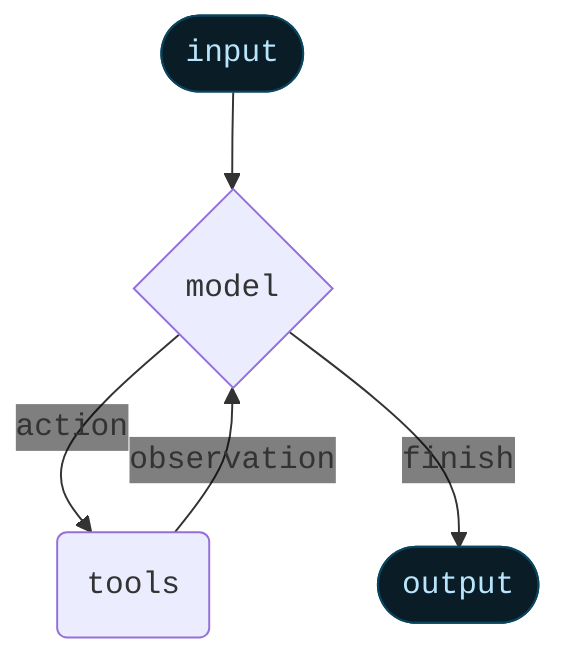
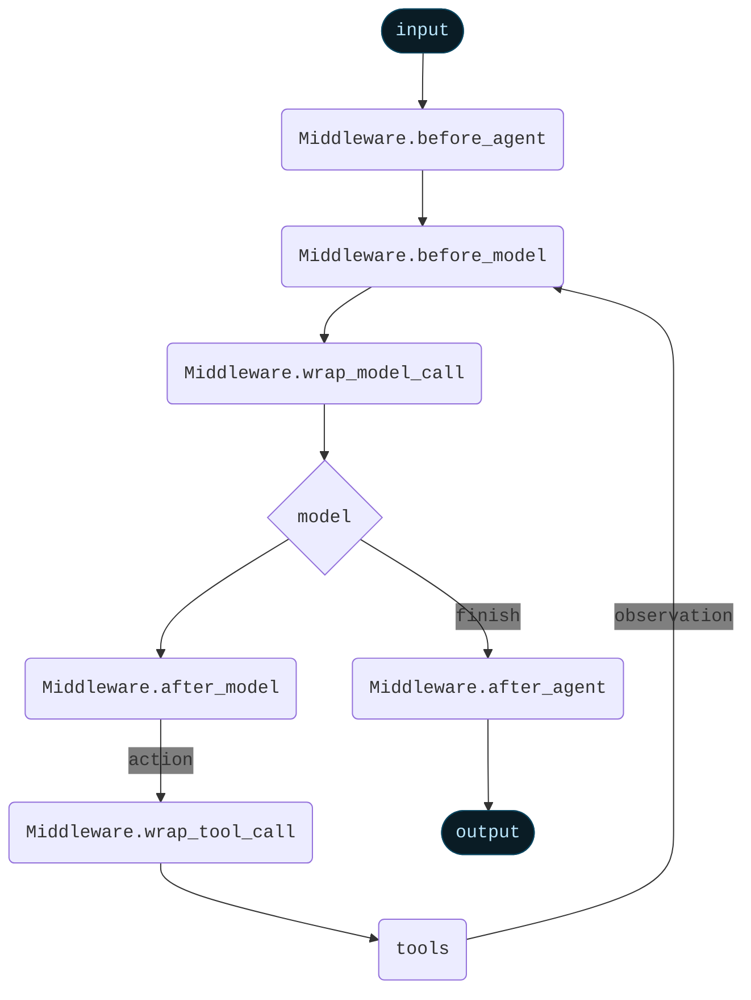

import AlphaCallout from '/snippets/alpha-lc-callout.mdx';

<AlphaCallout />


Middleware provides a way to more tightly control what happens inside the agent.

The core agent loop involves calling a `model`, letting it choose `tools` to execute, and then finishing when it calls no more tools.


<Card>

</Card>

Middleware provides control over what happens before and after those steps.

Build custom middleware by implementing any of these hooks on a subclass of the `AgentMiddleware` class:


| Hook | When it runs | Use cases |
|------|--------------|-----------|
| `beforeAgent` | Before calling the agent | Load memory, validate input |
| `beforeModel` | Before each LLM call | Update prompts, trim messages |
| `wrapModelCall` | Around each LLM call | Intercept and modify requests/responses |
| `wrapToolCall` | Around each tool call | Intercept and modify tool execution |
| `afterModel` | After each LLM response | Validate output, apply guardrails |
| `afterAgent` | After agent completes | Save results, cleanup |

In addition to that, each middleware can define the following static properties:
- `name`: The name of the middleware (required)
- `tools`: The tools that the middleware makes available to the agent (optional)
- `stateSchema`: The schema of the state that the middleware requires (optional)
- `contextSchema`: The schema of the context that the middleware requires (optional)


An agent can contain multiple middleware. Each middleware does not need to implement all hooks.


<Card>

</Card>

## Using in an agent


```typescript
import {
  createAgent,
  summarizationMiddleware,
  humanInTheLoopMiddleware,
} from "langchain";

const agent = createAgent({
  // ...
  middleware: [summarizationMiddleware, humanInTheLoopMiddleware],
  // ...
});
```


Middleware is highly flexible and replaces some other functionality in the agent.
As such, when middleware are used, there are some restrictions on the arguments used to create the agent:

- `model` must be either a string or a BaseChatModel. Will error if a function is passed. If you want to dynamically control the model, use `AgentMiddleware.wrapModelCall`
- `prompt` must be either a string or None. Will error if a function is passed. If you want to dynamically control the prompt, use `AgentMiddleware.wrapModelCall`
- `preModelHook` must not be provided. Use `AgentMiddleware.beforeModel` instead.
- `postModelHook` must not be provided. Use `AgentMiddleware.afterModel` instead.


## Built-in middleware

LangChain provides several built in middleware to use off-the-shelf

- [Summarization](#summarization)
- [Human-in-the-loop](#human-in-the-loop)
- [Anthropic prompt caching](#anthropic-prompt-caching)

### Summarization

The `summarizationMiddleware` automatically manages conversation history by summarizing older messages when token limits are approached. This middleware monitors the total token count of messages and creates concise summaries to preserve context while staying within model limits.

**Key features:**

- Automatic token counting and threshold monitoring
- Intelligent message partitioning that preserves AI/Tool message pairs
- Customizable summary prompts and token limits

**Use Cases:**

- Long-running conversations that exceed token limits
- Multi-turn dialogues with extensive context


```typescript
import { createAgent, summarizationMiddleware } from "langchain";

const agent = createAgent({
  model: "openai:gpt-4o",
  tools: [weatherTool, calculatorTool],
  middleware: [
    summarizationMiddleware({
      model: "openai:gpt-4o-mini",
      maxTokensBeforeSummary: 4000, // Trigger summarization at 4000 tokens
      messagesToKeep: 20, // Keep last 20 messages after summary
      summaryPrompt: "Custom prompt for summarization...", // Optional
    }),
  ],
});
```


**Configuration options:**


- `model`: Language model to use for generating summaries (required)
- `maxTokensBeforeSummary`: Token threshold that triggers summarization
- `messagesToKeep`: Number of recent messages to preserve (default: 20)
- `tokenCounter`: Custom function for counting tokens (defaults to character-based approximation)
- `summaryPrompt`: Custom prompt template for summary generation
- `summaryPrefix`: Prefix added to system messages containing summaries (default: "## Previous conversation summary:")


The middleware ensures tool call integrity by:

1. Never splitting AI messages from their corresponding tool responses
2. Preserving the most recent messages for continuity
3. Including previous summaries in new summarization cycles

### Human-in-the-loop

The `HumanInTheLoopMiddleware` enables human oversight and intervention for tool calls made by the agents. Please
see [human-in-the-loop documentation](/oss/javascript/langchain/human-in-the-loop) for more details.

This middleware intercepts tool executions and allows human operators to approve, modify, reject, or manually respond to tool calls before they execute.

### Anthropic prompt caching

`AnthropicPromptCachingMiddleware` is a middleware that enables you to enable Anthropic's native prompt caching.

Prompt caching enables optimal API usage by allowing resuming from specific prefixes in your prompts.
This is particularly useful for tasks with repetitive prompts or prompts with redundant information.

<Info>
Learn more about Anthropic Prompt Caching (strategies, limitations, etc.) [here](https://docs.anthropic.com/en/docs/build-with-claude/prompt-caching#cache-limitations).
</Info>

When using prompt caching, you'll likely want to use a checkpointer to store conversation
history across invocations.


```typescript
import { createAgent, HumanMessage, anthropicPromptCachingMiddleware } from "langchain";

const LONG_PROMPT = `
Please be a helpful assistant.

<Lots more context ...>
`;

const agent = createAgent({
  model: "anthropic:claude-sonnet-4-latest",
  prompt: LONG_PROMPT,
  middleware: [anthropicPromptCachingMiddleware({ ttl: "5m" })],
});

// cache store
await agent.invoke({
  messages: [HumanMessage("Hi, my name is Bob")]
});

// cache hit, system prompt is cached
const result = await agent.invoke({
  messages: [HumanMessage("What's my name?")]
});
```


## Custom Middleware

Middleware for agents are subclasses of `AgentMiddleware`, which implement one or more of its hooks.

`AgentMiddleware` provides six different hooks to control the core agent loop:


- `beforeAgent`: runs before the agent starts. Can load memory, validate input, or exit early with a jump.
- `beforeModel`: runs before each model call. Can update prompts, trim messages, or exit early with a jump.
- `wrapModelCall`: wraps each model call. Can intercept and modify the model request/response.
- `wrapToolCall`: wraps each tool call. Can intercept and modify tool execution.
- `afterModel`: runs after each model response. Can validate output, apply guardrails, or exit early with a jump.
- `afterAgent`: runs after the agent completes. Can save results or perform cleanup.


In order to **exit early**, you can add a `jump_to` key to the state update with one of the following values:

- `"model"`: Jump to the model node
- `"tools"`: Jump to the tools node
- `"end"`: Jump to the end node

If this is specified, all subsequent middleware will not run.

Learn more about exiting early in the [agent jumps](#agent-jumps) section.


### `beforeAgent`


Runs before the agent starts. Can load memory, validate input, or exit early.

Signature:

```typescript
import { createMiddleware, AIMessage } from "langchain";

const myMiddleware = createMiddleware({
  name: "MyMiddleware",
  beforeAgent: (state) => {
    if (!state.messages || state.messages.length === 0) {
      return {
        messages: [new AIMessage("No input provided")],
        jumpTo: "end",
      };
    }
    return;
  },
});
```


### `beforeModel`


Runs before each model call. Can update prompts, trim messages, or exit early.

Signature:

```typescript
import { createMiddleware, AIMessage } from "langchain";

const myMiddleware = createMiddleware({
  name: "MyMiddleware",
  beforeModel: (state) => {
    if (state.messages.length > 50) {
      return {
        messages: [
          new AIMessage("I'm sorry, the conversation has been terminated."),
        ],
        jumpTo: "end",
      };
    }
    return state;
  },
});
```


### `wrapModelCall`


Wraps each model call, allowing you to intercept and modify the model request and/or response. This is useful for dynamic model selection, modifying system prompts, or intercepting model responses.

Signature:

```typescript
import { createMiddleware } from "langchain";

const myMiddleware = createMiddleware({
  name: "MyMiddleware",
  wrapModelCall: (request, handler) => {
    // Modify the request before calling the model
    let modifiedRequest = request;
    if (request.state.messages.length > 10) {
      modifiedRequest = { ...request, model: "gpt-5" };
    } else {
      modifiedRequest = { ...request, model: "gpt-5-nano" };
    }

    // Call the model with the modified request
    const response = handler(modifiedRequest);

    // Optionally modify the response before returning
    return response;
  },
});
```


### `wrapToolCall`


Wraps each tool call, allowing you to intercept and modify tool execution. This is useful for error handling, logging, or modifying tool inputs/outputs.

Signature:

```typescript
import { createMiddleware } from "langchain";

const myMiddleware = createMiddleware({
  name: "MyMiddleware",
  wrapToolCall: (request, handler) => {
    // Add logging before tool execution
    console.log(`Executing tool: ${request.toolName}`);

    try {
      // Call the tool
      const result = handler(request);
      return result;
    } catch (error) {
      // Handle errors gracefully
      return `Error executing ${request.toolName}: ${error.message}`;
    }
  },
});
```


### `afterModel`


Runs after each model response. Can validate output, apply guardrails, or exit early.

Signature:

```typescript
import { createMiddleware, AIMessage } from "langchain";

const myMiddleware = createMiddleware({
  name: "MyMiddleware",
  afterModel: (state) => {
    // Validate the model's output
    const lastMessage = state.messages[state.messages.length - 1];
    if (lastMessage.content && lastMessage.content.toLowerCase().includes("inappropriate")) {
      return {
        messages: [new AIMessage("I cannot provide that response.")],
        jumpTo: "end",
      };
    }
    return;
  },
});
```


### `afterAgent`


Runs after the agent completes. Can save results or perform cleanup.

Signature:

```typescript
import { createMiddleware } from "langchain";

const myMiddleware = createMiddleware({
  name: "MyMiddleware",
  afterAgent: (state) => {
    // Save the conversation to a database
    console.log(`Agent completed with ${state.messages.length} messages`);
    // Perform any cleanup or logging
    return;
  },
});
```


## New state keys

Middleware can extend the agent's state with custom properties, enabling rich data flow between middleware components and ensuring type safety throughout the agent execution.

### State extension

Middleware can define additional state properties that persist throughout the agent's execution. These properties become part of the agent's state and are available to all hooks for said middleware.


When a middleware defines required state properties through its `stateSchema`, these properties must be provided when invoking the agent:

```typescript
import { createMiddleware, createAgent, HumanMessage } from "langchain";
import { z } from "zod";

// Middleware with custom state requirements
const authMiddleware = createMiddleware({
  name: "AuthMiddleware",
  stateSchema: z.object({
    userId: z.string(), // Required
    userRole: z.string().default("user"), // Optional with default
  }),
  beforeModel: (state) => {
    // Access custom state properties
    console.log(`User ${state.userId} with role ${state.userRole}`);
    return;
  },
});

const agent = createAgent({
  model: "openai:gpt-4o",
  tools: [],
  middleware: [authMiddleware] as const,
});

// TypeScript enforces required state properties
const result = await agent.invoke({
  messages: [new HumanMessage("Hello")],
  userId: "user-123", // Required by middleware
  // userRole is optional due to default value
});
```


### Context extension

<Note>
This is currently only available in JavaScript.
</Note>

Context properties are configuration values passed through the runnable config. Unlike state, context is read-only and typically used for configuration that doesn't change during execution.

Middleware can define context requirements that must be satisfied through the agent's configuration:

```typescript
import { z } from "zod";
import { createMiddleware, HumanMessage } from "langchain";

const rateLimitMiddleware = createMiddleware({
  name: "RateLimitMiddleware",
  contextSchema: z.object({
    maxRequestsPerMinute: z.number(),
    apiKey: z.string(),
  }),
  beforeModel: async (state, runtime) => {
    // Access context through runtime
    const { maxRequestsPerMinute, apiKey } = runtime.context;

    // Implement rate limiting logic
    const allowed = await checkRateLimit(apiKey, maxRequestsPerMinute);
    if (!allowed) {
      return { jumpTo: "END" };
    }

    return state;
  },
});

// Context is provided through config
await agent.invoke(
  { messages: [new HumanMessage("Process data")] },
  {
    context: {
      maxRequestsPerMinute: 60,
      apiKey: "api-key-123",
    },
  }
);
```


### Combining multiple middleware

When using multiple middleware, their state and context schemas are merged. All required properties from all middleware must be satisfied:


```typescript
import { createMiddleware, createAgent, HumanMessage } from "langchain";
import { z } from "zod";

const middleware1 = createMiddleware({
  name: "Middleware1",
  stateSchema: z.object({
    prop1: z.string(),
    sharedProp: z.number(),
  }),
});

const middleware2 = createMiddleware({
  name: "Middleware2",
  stateSchema: z.object({
    prop2: z.boolean(),
    sharedProp: z.number(), // Same property name must have compatible types
  }),
});

const agent = createAgent({
  model: "openai:gpt-4o",
  tools: [],
  middleware: [middleware1, middleware2] as const,
});

// Must provide all required properties
const result = await agent.invoke({
  messages: [new HumanMessage("Hello")],
  prop1: "value1", // Required by middleware1
  prop2: true, // Required by middleware2
  sharedProp: 42, // Required by both
});
```


### Agent-level context schema

Agents can also define their own context requirements that combine with middleware requirements:


```typescript
import { createAgent, HumanMessage } from "langchain";
import { z } from "zod";

const agent = createAgent({
  model: "openai:gpt-4o",
  tools: [],
  contextSchema: z.object({
    environment: z.enum(["development", "production"]),
  }),
  middleware: [rateLimitMiddleware] as const,
});

// Must satisfy both agent and middleware context requirements
await agent.invoke(
  { messages: [new HumanMessage("Deploy application")] },
  {
    context: {
      environment: "production", // Required by agent
      maxRequestsPerMinute: 60, // Required by middleware
      apiKey: "api-key-123", // Required by middleware
    },
  }
);
```


### Best practices

1. **Use State for Dynamic Data**: Properties that change during execution (user session, accumulated data)
2. **Use Context for Configuration**: Static configuration values (API keys, feature flags, limits)
3. **Provide Defaults When Possible**: Use `.default()` in Zod schemas to make properties optional
4. **Document Requirements**: Clearly document what state and context properties your middleware requires
5. **Type Safety**: Leverage TypeScript's type checking to catch missing properties at compile time

The type system ensures all required properties are provided, preventing runtime errors:

```typescript
// TypeScript error: Property 'userId' is missing
await agent.invoke({
  messages: [new HumanMessage("Hello")],
  // userId is required but not provided
});

// TypeScript error: Type 'number' is not assignable to type 'string'
await agent.invoke({
  messages: [new HumanMessage("Hello")],
  userId: 123, // Wrong type
});
```


## Middleware execution order

You can provide multiple middlewares. They are executed in the following logic:


**`beforeAgent`**: Runs once at the start, in the order middleware are passed in. If one exits early, following middleware are not run.
**`beforeModel`**: Runs before each model call, in the order middleware are passed in. If one exits early, following middleware are not run.
**`wrapModelCall`**: Wraps are executed in the order middleware are passed in, with each wrapper calling the next.
**`wrapToolCall`**: Wraps are executed in the order middleware are passed in, with each wrapper calling the next.
**`afterModel`**: Runs after each model response, in the _reverse_ order that middleware are passed in. If one exits early, following middleware are not run.
**`afterAgent`**: Runs once at the end, in the _reverse_ order that middleware are passed in.


## Agent jumps


In order to **exit early**, you can add a `jumpTo` key to the state update with one of the following values:


- `"model"`: Jump to the model node
- `"tools"`: Jump to the tools node
- `"end"`: Jump to the end node

If this is specified, all subsequent middleware will not run.


If you jump to `model` node, all `beforeModel` middleware will run. It's forbidden to jump to `model` from an existing `beforeModel` middleware.


Example usage:

```typescript
import { createMiddleware } from "langchain";

const middleware = createMiddleware({
  name: "MyMiddleware",
  afterModel: (state) => {
    // ...
    return {
      messages: [
        /* ... */
      ],
      jumpTo: "model",
    };
  },
});
```


## Examples

### Dynamically selecting tools

In many applications, you may have a large set of tools, but only a small subset is relevant for a specific request. To optimize performance and accuracy, it’s best to **expose only the tools that are needed for each request**.

Doing so provides several benefits:

* **Shorter prompts** – reducing unnecessary complexity.
* **Improved accuracy** – the model chooses from fewer options.
* **Permission control** – can select tools based on user permissions.

Use middleware to dynamically select which tools are available at runtime based on context.


```typescript
import { createAgent, createMiddleware } from "langchain";

const toolSelectorMiddleware = createMiddleware({
  name: "ToolSelector",
  wrapModelCall: (request, handler) => {
    // Select a small, relevant subset of tools based on state/context
    const modifiedRequest = { ...request, tools: ["relevant_tool_1", "relevant_tool_2"] }; // [!code highlight]
    return handler(modifiedRequest);
  },
});

const agent = createAgent({
  model: "openai:gpt-4o",
  tools: allTools,  // All available tools need to be registered upfront
  // Middleware can be used to select a smaller subset that's relevant for the given run.
  middleware: [toolSelectorMiddleware], // [!code highlight]
});
```


<Expandable title="Extended example: Select tools based on runtime context">

This example shows how to select between GitHub and GitLab tools based on the user's provider.


```typescript Expandable
import { z } from "zod";
import { createAgent, createMiddleware, tool, HumanMessage } from "langchain";

const githubCreateIssue = tool(
  async ({ repo, title }) => ({
    url: `https://github.com/${repo}/issues/1`,
    title,
  }),
  {
    name: "github_create_issue",
    description: "Create an issue in a GitHub repository",
    schema: z.object({ repo: z.string(), title: z.string() }),
  }
);

const gitlabCreateIssue = tool(
  async ({ project, title }) => ({
    url: `https://gitlab.com/${project}/-/issues/1`,
    title,
  }),
  {
    name: "gitlab_create_issue",
    description: "Create an issue in a GitLab project",
    schema: z.object({ project: z.string(), title: z.string() }),
  }
);

const allTools = [githubCreateIssue, gitlabCreateIssue];

const toolSelector = createMiddleware({
  name: "toolSelector",
  contextSchema: z.object({ provider: z.enum(["github", "gitlab"]) }),
  wrapModelCall: (request, handler) => {
    const provider = request.runtime.context.provider;
    const toolName = provider === "gitlab" ? "gitlab_create_issue" : "github_create_issue";
    const modifiedRequest = { ...request, tools: [toolName] };
    return handler(modifiedRequest);
  },
});

const agent = createAgent({
  model: "openai:gpt-4o",
  tools: allTools,
  middleware: [toolSelector],
});

// Invoke with GitHub context
await agent.invoke(
  {
    messages: [
      new HumanMessage("Open an issue titled 'Bug: where are the cats' in the repository `its-a-cats-game`"),
    ],
  },
  {
    context: { provider: "github" },
  }
);
```


**Key points:**

- Register all tools with the agent upfront
- Use middleware to select the relevant subset per request
- Define required context properties using `contextSchema`
- Use context for configuration that doesn't change during execution
- Use state for values that change during the agent run

</Expandable>

---

<Callout icon="pen-to-square" iconType="regular">
  [Edit the source of this page on GitHub](https://github.com/langchain-ai/docs/edit/main/src/oss/langchain/middleware.mdx)
</Callout>
