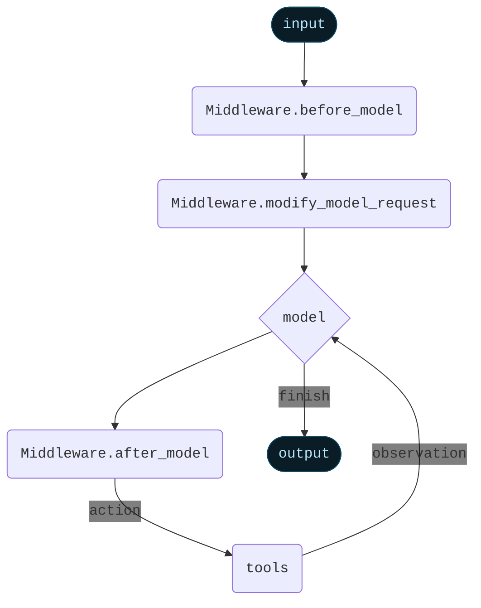

import AlphaCallout from '/snippets/alpha-lc-callout.mdx';

<AlphaCallout />


Middleware provides a way to more tightly control what happens inside the agent.

The core agent loop involves calling a `model`, letting it choose `tools` to execute, and then finishing when it calls no more tools.


<Card>

</Card>

Middleware provides control over what happens before and after those steps.
Each middleware can add in three different types of modifiers:


- `beforeModel`: Runs before model execution. Can update state or jump to a different node (`model`, `tools`, `end`)
- `modifyModelRequest`: Runs before model execution, to prepare the model request object. Can only modify the current model request object (no permanent state updates) and cannot jump to a different node.
- `afterModel`: Runs after model execution, before tools are executed. Can update state or jump to a different node (`model`, `tools`, `end`)


An agent can contain multiple middleware. Each middleware does not need to implement all three of `beforeModel`, `modifyModelRequest`, `afterModel`.


<Card>

</Card>

## Using in an agent


```typescript
import { createAgent } from "langchain";
import { summarizationMiddleware, humanInTheLoopMiddleware } from "langchain/middleware";

const agent = createAgent({
    // ...
    middleware: [summarizationMiddleware, humanInTheLoopMiddleware],
    // ...
});
```


Middleware is highly flexible and replaces some other functionality in the agent.
As such, when middleware are used, there are some restrictions on the arguments used to create the agent:

- `model` must be either a string or a BaseChatModel. Will error if a function is passed. If you want to dynamically control the model, use `AgentMiddleware.modifyModelRequest`
- `prompt` must be either a string or None. Will error if a function is passed. If you want to dynamically control the prompt, use `AgentMiddleware.modifyModelRequest`
- `preModelHook` must not be provided. Use `AgentMiddleware.beforeModel` instead.
- `postModelHook` must not be provided. Use `AgentMiddleware.afterModel` instead.


## Built-in middleware

LangChain provides several built in middleware to use off-the-shelf

- [Summarization](#summarization)
- [Human-in-the-loop](#human-in-the-loop)
- [Anthropic prompt caching](#anthropic-prompt-caching)
- [Dynamic system prompt](#dynamic-system-prompt)

### Summarization

The `summarizationMiddleware` automatically manages conversation history by summarizing older messages when token limits are approached. This middleware monitors the total token count of messages and creates concise summaries to preserve context while staying within model limits.

**Key features:**

- Automatic token counting and threshold monitoring
- Intelligent message partitioning that preserves AI/Tool message pairs
- Customizable summary prompts and token limits

**Use Cases:**

- Long-running conversations that exceed token limits
- Multi-turn dialogues with extensive context


```typescript
import { createAgent } from "langchain";
import { summarizationMiddleware } from "langchain/middleware";
import { ChatOpenAI } from "@langchain/openai";

const agent = createAgent({
    model: "openai:gpt-4o",
    tools: [weatherTool, calculatorTool],
    middleware: [
        summarizationMiddleware({
            model: new ChatOpenAI({ model: "gpt-4o-mini" }),
            maxTokensBeforeSummary: 4000, // Trigger summarization at 4000 tokens
            messagesToKeep: 20, // Keep last 20 messages after summary
            summaryPrompt: "Custom prompt for summarization...", // Optional
        }),
    ],
});
```


**Configuration options:**


- `model`: Language model to use for generating summaries (required)
- `maxTokensBeforeSummary`: Token threshold that triggers summarization
- `messagesToKeep`: Number of recent messages to preserve (default: 20)
- `tokenCounter`: Custom function for counting tokens (defaults to character-based approximation)
- `summaryPrompt`: Custom prompt template for summary generation
- `summaryPrefix`: Prefix added to system messages containing summaries (default: "## Previous conversation summary:")


The middleware ensures tool call integrity by:

1. Never splitting AI messages from their corresponding tool responses
2. Preserving the most recent messages for continuity
3. Including previous summaries in new summarization cycles

### Human-in-the-loop

The `HumanInTheLoopMiddleware` enables human oversight and intervention for tool calls made by the agents. Please
see [human-in-the-loop documentation](/oss/javascript/langchain/human-in-the-loop) for more details.

This middleware intercepts tool executions and allows human operators to approve, modify, reject, or manually respond to tool calls before they execute.

### Anthropic prompt caching

`AnthropicPromptCachingMiddleware` is a middleware that enables you to enable Anthropic's native prompt caching.

Prompt caching enables optimal API usage by allowing resuming from specific prefixes in your prompts.
This is particularly useful for tasks with repetitive prompts or prompts with redundant information.

<Info>
Learn more about Anthropic Prompt Caching (strategies, limitations, etc.) [here](https://docs.anthropic.com/en/docs/build-with-claude/prompt-caching#cache-limitations).
</Info>

When using prompt caching, you'll likely want to use a checkpointer to store conversation
history across invocations.


```typescript
import { createAgent, HumanMessage } from "langchain";
import { anthropicPromptCachingMiddleware } from "langchain/middleware";

const LONG_PROMPT = `
Please be a helpful assistant.

<Lots more context ...>
`;

const agent = createAgent({
  model: "anthropic:claude-sonnet-4-latest",
  prompt: LONG_PROMPT,
  middleware: [anthropicPromptCachingMiddleware({ ttl: "5m" })],
});

// cache store
await agent.invoke({
  messages: [HumanMessage("Hi, my name is Bob")]
});

// cache hit, system prompt is cached
const result = await agent.invoke({
  messages: [HumanMessage("What's my name?")]
});
```


### Dynamic system prompt


A system prompt can be dynamically set right before each model invocation using the `dynamicSystemPromptMiddleware` middleware. This middleware is particularly useful when the prompt depends on the current agent state or runtime context.

For example, you can adjust the system prompt based on the user's expertise level:

```typescript
import { z } from "zod";
import { createAgent } from "langchain";
import { dynamicSystemPromptMiddleware } from "langchain/middleware";

const contextSchema = z.object({
    userRole: z.enum(["expert", "beginner"]),
});

const agent = createAgent({
    model: "openai:gpt-4o",
    tools: [...],
    contextSchema,
    middleware: [
        dynamicSystemPromptMiddleware<z.infer<typeof contextSchema>>((state, runtime) => {
            const userRole = runtime.context.userRole || "user";
            const basePrompt = "You are a helpful assistant.";

            if (userRole === "expert") {
                return `${basePrompt} Provide detailed technical responses.`;
            } else if (userRole === "beginner") {
                return `${basePrompt} Explain concepts simply and avoid jargon.`;
            }
            return basePrompt;
        }),
    ],
});

// The system prompt will be set dynamically based on context
const result = await agent.invoke(
    { messages: [{ role: "user", content: "Explain async programming" }] },
    { context: { userRole: "expert" } }
);
```


Alternatively, you can adjust the system prompt based on the conversation length:


```typescript
const agent = createAgent({
    model: "openai:gpt-4o",
    tools: [searchTool],
    middleware: [
        dynamicSystemPromptMiddleware((state) => {
            const messageCount = state.messages.length;

            if (messageCount > 10) {
                return "You are in an extended conversation. Be more concise.";
            }
            return "You are a helpful assistant.";
        }),
    ],
});
```


## Custom Middleware

Middleware for agents are subclasses of `AgentMiddleware`, which implement one or more of its hooks.

`AgentMiddleware` currently provides three different ways to modify the core agent loop:


- `beforeModel`: runs before the model is run. Can update state or exit early with a jump.
- `modifyModelRequest`: runs before the model is run. Cannot update state or exit early with a jump.
- `afterModel`: runs after the model is run. Can update state or exit early with a jump.


In order to **exit early**, you can add a `jump_to` key to the state update with one of the following values:

- `"model"`: Jump to the model node
- `"tools"`: Jump to the tools node
- `"end"`: Jump to the end node

If this is specified, all subsequent middleware will not run.

Learn more about exiting early in the [agent jumps](#agent-jumps) section.


### `beforeModel`


Runs before the model is run. Can modify state by returning a new state object or state update.

Signature:

```typescript
import type { AgentState, AgentJump } from "langchain";

function beforeModel(state: AgentState): AgentState | AgentJump | undefined {
    // ...
}
```


### `modifyModelRequest`


Runs before the model has run, but after all the `beforeModel` calls.

These functions **cannot** modify permanent state or exit early.
Rather, they are intended to modify calls to the model in a **stateless** way.

If you want to modify calls to the model in a **stateful** way, you will need to use `beforeModel`


Modifies the model request. The model request has several key properties:
- `model` (`BaseChatModel`): the model to use. Note: this needs to the base chat model, not a string.

- `systemPrompt` (`string`): the system prompt to use. Will get prepended to `messages`

- `messages` (list of messages): the message list. Should not include system prompt.

- `toolChoice`: Can be one of:
  - `"auto"`: means the model can pick between generating a message or calling one or more tools.
  - `"none"`: means the model will not call any tool and instead generates a message.
  - `"required"`: means the model must call one or more tools.
  - `{ type: "function", function: { name: string } }`: The model will use the specified function.

- `tools` (list of `BaseTool`): the tools to use for this model call

- `responseFormat` (`ResponseFormat`): the response format to use for structured output


Signature:

```typescript
function modifyModelRequest (request: ModelRequest, state: AgentState): ModelRequest {
    return request;
}
```


### `afterModel`


Runs after the model is run. Can modify state by returning a new state object or state update.

Signature:

```typescript
import type { AgentState, AgentUpdate, AgentJump } from "langchain";

function afterModel (state: AgentState): AgentUpdate | AgentJump | undefined {
    // ...
}
```


## New state keys

Middleware can extend the agent's state with custom properties, enabling rich data flow between middleware components and ensuring type safety throughout the agent execution.

### State extension

Middleware can define additional state properties that persist throughout the agent's execution. These properties become part of the agent's state and are available to all hooks for said middleware.


When a middleware defines required state properties through its `stateSchema`, these properties must be provided when invoking the agent:

```typescript
import { createMiddleware, createAgent } from "langchain";
import { z } from "zod";

// Middleware with custom state requirements
const authMiddleware = createMiddleware({
    name: "AuthMiddleware",
    stateSchema: z.object({
        userId: z.string(), // Required
        userRole: z.string().default("user"), // Optional with default
    }),
    beforeModel: (state) => {
        // Access custom state properties
        console.log(`User ${state.userId} with role ${state.userRole}`);
        return;
    },
});

const agent = createAgent({
    model: "openai:gpt-4o",
    tools: [],
    middlewares: [authMiddleware] as const,
});

// TypeScript enforces required state properties
const result = await agent.invoke({
    messages: [new HumanMessage("Hello")],
    userId: "user-123", // Required by middleware
    // userRole is optional due to default value
});
```


### Context extension

<Note>
This is currently only available in JavaScript.
</Note>

Context properties are configuration values passed through the runnable config. Unlike state, context is read-only and typically used for configuration that doesn't change during execution.

Middleware can define context requirements that must be satisfied through the agent's configuration:

```typescript
const rateLimitMiddleware = createMiddleware({
    name: "RateLimitMiddleware",
    contextSchema: z.object({
        maxRequestsPerMinute: z.number(),
        apiKey: z.string(),
    }),
    beforeModel: async (state, runtime) => {
        // Access context through runtime
        const { maxRequestsPerMinute, apiKey } = runtime.context;

        // Implement rate limiting logic
        const allowed = await checkRateLimit(apiKey, maxRequestsPerMinute);
        if (!allowed) {
            return { jump_to: "END" };
        }
    },
});

// Context is provided through config
await agent.invoke(
    { messages: [new HumanMessage("Process data")] },
    {
        context: {
            maxRequestsPerMinute: 60,
            apiKey: "api-key-123",
        },
    }
);
```


### Combining multiple middleware

When using multiple middleware, their state and context schemas are merged. All required properties from all middleware must be satisfied:


```typescript
const middleware1 = createMiddleware({
    name: "Middleware1",
    stateSchema: z.object({
        prop1: z.string(),
        sharedProp: z.number(),
    }),
});

const middleware2 = createMiddleware({
    name: "Middleware2",
    stateSchema: z.object({
        prop2: z.boolean(),
        sharedProp: z.number(), // Same property name must have compatible types
    }),
});

const agent = createAgent({
    model: "openai:gpt-4o",
    tools: [],
    middlewares: [middleware1, middleware2] as const,
});

// Must provide all required properties
const result = await agent.invoke({
    messages: [new HumanMessage("Hello")],
    prop1: "value1", // Required by middleware1
    prop2: true, // Required by middleware2
    sharedProp: 42, // Required by both
});
```


### Agent-level context schema

Agents can also define their own context requirements that combine with middleware requirements:


```typescript
const agent = createAgent({
    model: "openai:gpt-4o",
    tools: [],
    contextSchema: z.object({
        environment: z.enum(["development", "production"]),
    }),
    middlewares: [rateLimitMiddleware] as const,
});

// Must satisfy both agent and middleware context requirements
await agent.invoke(
    { messages: [new HumanMessage("Deploy application")] },
    {
        context: {
            environment: "production", // Required by agent
            maxRequestsPerMinute: 60, // Required by middleware
            apiKey: "api-key-123", // Required by middleware
        },
    }
);
```


### Best practices

1. **Use State for Dynamic Data**: Properties that change during execution (user session, accumulated data)
2. **Use Context for Configuration**: Static configuration values (API keys, feature flags, limits)
3. **Provide Defaults When Possible**: Use `.default()` in Zod schemas to make properties optional
4. **Document Requirements**: Clearly document what state and context properties your middleware requires
5. **Type Safety**: Leverage TypeScript's type checking to catch missing properties at compile time

The type system ensures all required properties are provided, preventing runtime errors:

```typescript
// TypeScript error: Property 'userId' is missing
await agent.invoke({
    messages: [new HumanMessage("Hello")],
    // userId is required but not provided
});

// TypeScript error: Type 'number' is not assignable to type 'string'
await agent.invoke({
    messages: [new HumanMessage("Hello")],
    userId: 123, // Wrong type
});
```


## Middleware execution order

You can provide multiple middlewares. They are executed in the following logic:


**`beforeModel`**: Are run in the order they are passed in. If an earlier middleware exits early, then following middleware are not run
**`modifyModelRequest`**: Are run in the order they are passed in.
**`afterModel`**: Are run in the _reverse_ order that they are passed in. If an earlier middleware exits early, then following middleware are not run


## Agent jumps


In order to **exit early**, you can add a `jumpTo` key to the state update with one of the following values:


- `"model"`: Jump to the model node
- `"tools"`: Jump to the tools node
- `"end"`: Jump to the end node

If this is specified, all subsequent middleware will not run.


If you jump to `model` node, all `beforeModel` middleware will run. It's forbidden to jump to `model` from an existing `beforeModel` middleware.


Example usage:

```typescript
import { createMiddleware } from "langchain";

const middleware = createMiddleware({
    name: "MyMiddleware",
    afterModel: (state) => {
        return {
            messages: ...,
            jumpTo: "model"
        }
    }
});
```

