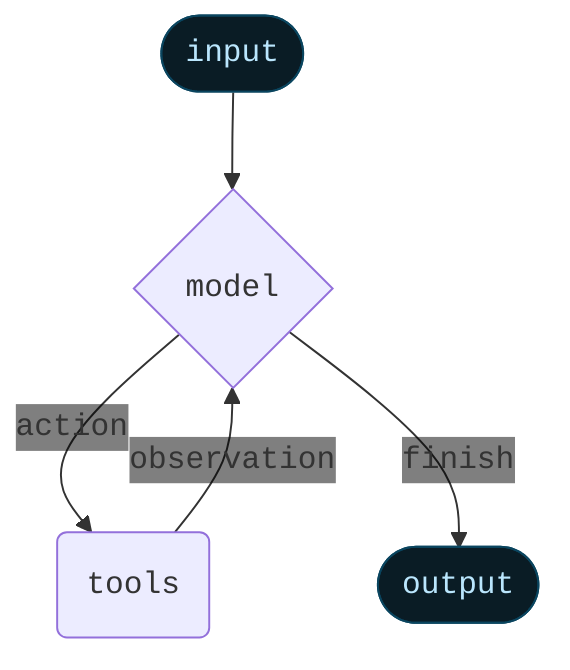
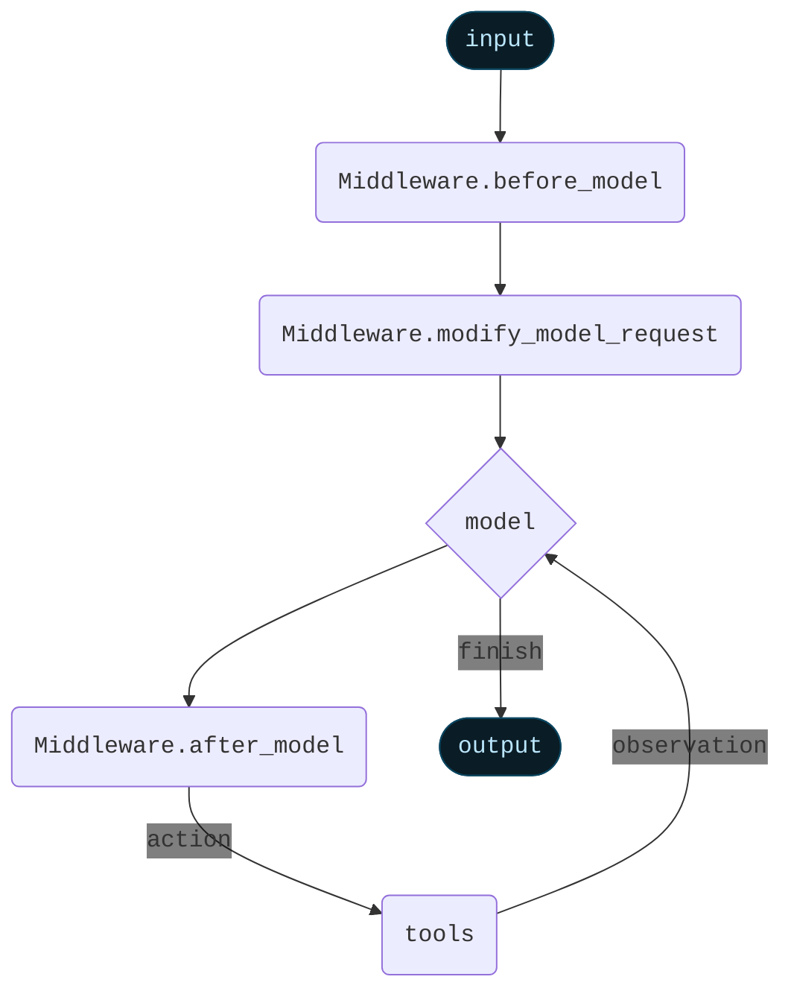

import AlphaCallout from '/snippets/alpha-lc-callout.mdx';

<AlphaCallout />


Middleware provides a way to more tightly control what happens inside the agent.

The core agent loop involves calling a `model`, letting it choose `tools` to execute, and then finishing when it calls no more tools.


<Card>

</Card>

Middleware provides control over what happens before and after those steps.
Each middleware can add in three different types of modifiers:

- `before_model`: Runs before model execution. Can update state or jump to a different node (`model`, `tools`, `end`)
- `modify_model_request`: Runs before model execution, to prepare the model request object. Can only modify the current model request object (no permanent state updates) and cannot jump to a different node.
- `after_model`: Runs after model execution, before tools are executed. Can update state or jump to a different node (`model`, `tools`, `END`)


An agent can contain `before_model`, `modify_model_request`, or `after_model` middleware. All three do not need to be implemented.


<Card>

</Card>

## Using in an agent

You can use middleware in an agent by passing it `create_agent`:
```python
from langchain.agents import create_agent
from langchain.agents.middleware import SummarizationMiddleware, HumanInTheLoopMiddleware

agent = create_agent(
    ...,
    middleware=[SummarizationMiddleware(), HumanInTheLoopMiddleware()],
    ...
)
```


Middleware is highly flexible and replaces some other functionality in the agent.
As such, when middleware are used, there are some restrictions on the arguments used to create the agent:
- `model` must be either a string or a `BaseChatModel`. Will error if a function is passed. If you want to dynamically control the model, use `AgentMiddleware.modify_model_request`
- `prompt` must be either a string or None. Will error if a function is passed. If you want to dynamically control the prompt, use `AgentMiddleware.modify_model_request`
- `pre_model_hook` must not be provided. Use `AgentMiddleware.before_model` instead.
- `post_model_hook` must not be provided. Use `AgentMiddleware.after_model` instead.


## Built-in middleware

LangChain provides several built in middleware to use off-the-shelf

- [Summarization](#summarization)
- [Human-in-the-loop](#human-in-the-loop)
- [Anthropic prompt caching](#anthropic-prompt-caching)
- [Dynamic system prompt](#dynamic-system-prompt)

### Summarization

The `summarizationMiddleware` automatically manages conversation history by summarizing older messages when token limits are approached. This middleware monitors the total token count of messages and creates concise summaries to preserve context while staying within model limits.

**Key features:**

- Automatic token counting and threshold monitoring
- Intelligent message partitioning that preserves AI/Tool message pairs
- Customizable summary prompts and token limits

**Use Cases:**

- Long-running conversations that exceed token limits
- Multi-turn dialogues with extensive context

```python
from langchain.agents import create_agent
from langchain.agents.middleware import SummarizationMiddleware

agent = create_agent(
    model="openai:gpt-4o",
    tools=[weather_tool, calculator_tool],
    middleware=[
        SummarizationMiddleware(
            model="openai:gpt-4o-mini",
            max_tokens_before_summary=4000,  # Trigger summarization at 4000 tokens
            messages_to_keep=20,  # Keep last 20 messages after summary
            summary_prompt="Custom prompt for summarization...",  # Optional
        ),
    ],
)
```


**Configuration options:**

- `model`: Language model to use for generating summaries (required)
- `max_tokens_before_summary`: Token threshold that triggers summarization
- `messages_to_keep`: Number of recent messages to preserve (default: 20)
- `token_counter`: Custom function for counting tokens (defaults to character-based approximation)
- `summary_prompt`: Custom prompt template for summary generation
- `summary_prefix`: Prefix added to system messages containing summaries (default: "## Previous conversation summary:")


The middleware ensures tool call integrity by:

1. Never splitting AI messages from their corresponding tool responses
2. Preserving the most recent messages for continuity
3. Including previous summaries in new summarization cycles

### Human-in-the-loop

The `HumanInTheLoopMiddleware` enables human oversight and intervention for tool calls made by AI agents. This middleware intercepts tool executions and allows human operators to approve, modify, reject, or manually respond to tool calls before they execute.


**Key features:**

- Selective tool approval based on configuration
- Multiple response types (accept, edit, ignore, response)
- Asynchronous approval workflow using LangGraph interrupts
- Custom approval messages with contextual information

**Use cases:**

- High-stakes operations requiring human approval (database writes, file system changes)
- Quality control and safety checks for AI actions
- Compliance scenarios requiring audit trails
- Development and testing of agent behaviors

<Note>
This middleware requires a checkpointer to store the agent state. Please ensure to import a checkpointer and pass it to the agent.

For more information, please refer to the [persistence](/oss/python/langgraph/persistence) documentation.
</Note>

```python
from langchain.agents import create_agent
from langchain.agents.middleware import HumanInTheLoopMiddleware
from langgraph.checkpoint.memory import InMemorySaver

agent = create_agent(
    model="openai:gpt-4o",
    tools=[write_file_tool, execute_sql_tool, read_data_tool],
    middleware=[
        HumanInTheLoopMiddleware(
            tool_configs={
                "write_file": {
                    "allow_accept": True,
                    "allow_edit": True,
                    "allow_respond": True,
                    "description": "⚠️ File write operation requires approval",
                },
                "execute_sql": {
                    "allow_accept": True,
                    "description": "🚨 SQL execution requires careful review",
                },
                "read_data": False,  # Safe operation, no approval needed
            },
            description_prefix="Tool execution pending approval",
        ),
    ],
    checkpointer=InMemorySaver(),  # Required for interrupts
)
```


**Handling approval requests:**

When a tool requires approval, the agent execution pauses and waits for human input:

```python
from langchain_core.messages import HumanMessage
from langgraph.types import Command

# Initial invocation
result = agent.invoke(
    {
        "messages": [HumanMessage("Delete old records from the database")],
    },
    config
)

# Check if paused for approval
state = agent.get_state(config)
if state.next:
    request = state["__interrupt__"].value[0]["action_request"]

    # Display tool details to human
    print("Tool:", request["action"])
    print("Arguments:", request["args"])

    # Resume with approval decision
    agent.invoke(
        Command(
            resume=[{"type": "accept"}]  # or "edit", "ignore", "response"
        ),
        config=config
    )
```


**Handling edit requests:**

When a tool requires editing, the agent execution pauses and waits for human input:

```python
from langchain.agents import create_agent
from langchain.agents.middleware import HumanInTheLoopMiddleware
from langchain_core.messages import HumanMessage
from langgraph.checkpoint.memory import InMemorySaver
from langgraph.types import Command

# Create the human-in-the-loop middleware
hitl_middleware = HumanInTheLoopMiddleware(
    tool_configs={
        "write_file": {
            "allow_edit": True,
            "allow_accept": True,
            "description": "⚠️ File write operation requires approval",
        },
        "calculator": True,
    }
)

checkpointer = InMemorySaver()
agent = create_agent(
    model="openai:gpt-4o",
    checkpointer=checkpointer,
    prompt="You are a helpful assistant. Use the tools provided to help the user.",
    tools=[write_file_tool],
    middleware=[hitl_middleware],
)

config = {
    "configurable": {
        "thread_id": "conversation-id-123",
    }
}

# Initial invocation
initial_result = agent.invoke(
    {
        "messages": [HumanMessage("Write to greeting.txt with the content 'Hello, world!'")],
    },
    config
)

# Check if execution was interrupted for approval
state = agent.get_state(config)
if state.next:
    interrupt_request = state.tasks[0].interrupts[0].value[0]

    # Create resume command with edited arguments
    resume = [
        {
            "type": "edit",
            "args": {
                "action": "write_file",
                "args": {"filename": "greeting.txt", "content": "Safe content"},
            },
        }
    ]

    # Resume with approval
    agent.invoke(Command(resume=resume), config)
```


<Note>
When editing tool arguments, make changes conservatively. Significant modifications to the original arguments may cause the model to re-evaluate its approach and potentially execute the tool multiple times or take unexpected actions.
</Note>

**Rejecting a tool call:**

If you like to reject the tool call and (optionally) provide a custom response, you can do so by setting the `type` to `response`:

```python
from langchain.agents import create_agent
from langchain.agents.middleware import HumanInTheLoopMiddleware
from langchain_core.messages import HumanMessage
from langgraph.checkpoint.memory import InMemorySaver
from langgraph.types import Command

hitl_middleware = HumanInTheLoopMiddleware(
    tool_configs={
        "write_file": True,
    }
)

checkpointer = InMemorySaver()
agent = create_agent(
    model="openai:gpt-4o",
    checkpointer=checkpointer,
    prompt="You are a helpful assistant. Use the tools provided to help the user.",
    tools=[write_file_tool],
    middleware=[hitl_middleware],
)

config = {
    "configurable": {
        "thread_id": "conversation-id-123",
    }
}

result = agent.invoke(
    {"messages": [HumanMessage("Write to greeting.txt with the content 'Hello, world!'")]},
    config
)

# Check if paused for approval
state = agent.get_state(config)
if state.next:
    request = state["__interrupt__"].value[0]["action_request"]

    resume = [(
        {
            "type": "response",
            "args": "File operation not allowed for this file",
        }
        if (
            request["action"] == "write_file"
            and request["args"]["filename"] == "important.txt"
        )
        else {"type": "accept"}
    )]

    agent.invoke(Command(resume=resume), config)
```


**Response types:**

- `accept`: Execute the tool with original arguments
- `edit`: Modify arguments before execution - `{ type: "edit", args: { action: "tool_name", args: { modified: "args" } } }`
- `response`: Provide manual response instead of executing tool - `{ type: "response", args: "Manual response text" }`

**Configuration:**

- `tool_configs`: Map of tool names to their approval settings, each with the following options:
    - `allow_accept`: Whether the human can approve the current action without changes
    - `allow_edit`: Whether the human can reject the current action with feedback
    - `allow_respond`: Whether the human can approve the current action with edited content
    - `description`: The description attached to the request for human input
- `description_prefix`: The prefix to use when constructing action requests.


The middleware processes tool calls in order, bundling multiple approval requests into a single interrupt for efficiency. Tools not requiring approval execute immediately without interruption.

### Anthropic prompt caching

`AnthropicPromptCachingMiddleware` is a middleware that enables you to enable Anthropic's native prompt caching.

Prompt caching enables optimal API usage by allowing resuming from specific prefixes in your prompts.
This is particularly useful for tasks with repetitive prompts or prompts with redundant information.

<Info>
Learn more about Anthropic Prompt Caching (strategies, limitations, etc.) [here](https://docs.anthropic.com/en/docs/build-with-claude/prompt-caching#cache-limitations).
</Info>

When using prompt caching, you'll likely want to use a checkpointer to store conversation
history across invocations.

```python
from langchain_anthropic import ChatAnthropic
from langchain.agents.middleware.prompt_caching import AnthropicPromptCachingMiddleware
from langchain.agents import create_agent

LONG_PROMPT = """
Please be a helpful assistant.

<Lots more context ...>
"""

agent = create_agent(
    model=ChatAnthropic(model="claude-sonnet-4-latest"),
    prompt=LONG_PROMPT,
    middleware=[AnthropicPromptCachingMiddleware(ttl="5m")],
)

# cache store
agent.invoke({"messages": [HumanMessage("Hi, my name is Bob")]})

# cache hit, system prompt is cached
agent.invoke({"messages": [HumanMessage("What's my name?")]})
```


### Dynamic system prompt

A system prompt can be dynamically set right before each model invocation using the `@modify_model_request` decorator. This middleware is particularly useful when the prompt depends on the current agent state or runtime context.

For example, you can adjust the system prompt based on the user's expertise level:

```python
from typing import TypedDict

from langchain.agents import create_agent, AgentState
from langchain.agents.middleware.types import modify_model_request
from langgraph.runtime import Runtime

class Context(TypedDict):
    user_role: str

@modify_model_request
def dynamic_system_prompt(state: AgentState, request: ModelRequest, runtime: Runtime[Context]) -> ModelRequest:
    user_role = runtime.context.get("user_role", "user")
    base_prompt = "You are a helpful assistant."

    if user_role == "expert":
        prompt = f"{base_prompt} Provide detailed technical responses."
    elif user_role == "beginner":
        prompt = f"{base_prompt} Explain concepts simply and avoid jargon."
    else:
        prompt = base_prompt

    request.system_prompt = prompt
    return request

agent = create_agent(
    model="openai:gpt-4o",
    tools=[web_search],
    middleware=[dynamic_system_prompt],
)

# Use with context
result = agent.invoke(
    {"messages": [{"role": "user", "content": "Explain async programming"}]},
    {"context": {"user_role": "expert"}}
)
```


Alternatively, you can adjust the system prompt based on the conversation length:

```python
from langchain.agents.middleware.types import modify_model_request

@modify_model_request
def simple_prompt(state: AgentState, request: ModelRequest) -> ModelRequest:
    message_count = len(state["messages"])

    if message_count > 10:
        prompt = "You are in an extended conversation. Be more concise."
    else:
        prompt = "You are a helpful assistant."

    request.system_prompt = prompt
    return request

agent = create_agent(
    model="openai:gpt-4o",
    tools=[search_tool],
    middleware=[simple_prompt],
)
```


## Custom Middleware

Middleware for agents are subclasses of `AgentMiddleware`, which implement one or more of its hooks.

`AgentMiddleware` currently provides three different ways to modify the core agent loop:

- `before_model`: runs before the model is run. Can update state or exit early with a jump.
- `modify_model_request`: runs before the model is run. Cannot update state or exit early with a jump.
- `after_model`: runs after the model is run. Can update state or exit early with a jump.


In order to **exit early**, you can add a `jump_to` key to the state update with one of the following values:

- `"model"`: Jump to the model node
- `"tools"`: Jump to the tools node
- `"end"`: Jump to the end node

If this is specified, all subsequent middleware will not run.

Learn more about exiting early in the [agent jumps](#agent-jumps) section.

### `before_model`


Runs before the model is run. Can modify state by returning a new state object or state update.

Signature:
```python
from langchain.agents.middleware import AgentMiddleware, AgentState
from langchain_core.messages import AIMessage

class MyMiddleware(AgentMiddleware):
    def before_model(self, state: AgentState) -> dict[str, Any] | None:
        # terminate early if the conversation is too long
        if len(state["messages"]) > 50:
            return {
                "messages": [AIMessage("I'm sorry, the conversation has been terminated.")],
                "jump_to": "end"
            }
        return state
```


### `modify_model_request`


Runs before the model has run, but after all the `before_model` calls.


These functions **cannot** modify permanent state or exit early.
Rather, they are intended to modify calls to the model in a **stateless** way.
If you want to modify calls to the model in a **stateful** way, you will need to use `before_model`


Modifies the model request. The model request has several key properties:
- `model` (`BaseChatModel`): the model to use. Note: this needs to the base chat model, not a string.
- `system_prompt` (`str`): the system prompt to use. Will get prepended to `messages`


- `messages` (list of messages): the message list. Should not include system prompt.
- `tool_choice` (Any): the tool choice to use


- `tools` (list of `BaseTool`): the tools to use for this model call
- `response_format` (`ResponseFormat`): the response format to use for structured output


Signature:
```python
from langchain.agents.middleware import AgentState, ModelRequest, AgentMiddleware

class MyMiddleware(AgentMiddleware):
    def modify_model_request(self, request: ModelRequest, state: AgentState) -> ModelRequest:
        if len(state["messages"]) > 10:
            request.model = "gpt-5"
        else:
            request.model = "gpt-5-nano"
        return request
```


### `after_model`


Runs after the model is run. Can modify state by returning a new state object or state update.

Signature:
```python
from langchain.agents.middleware import AgentState, AgentUpdate, AgentMiddleware

class MyMiddleware(AgentMiddleware):
    def after_model(self, state: AgentState) -> dict[str, Any] | None:
        ...
```


## New state keys

Middleware can extend the agent's state with custom properties, enabling rich data flow between middleware components and ensuring type safety throughout the agent execution.

### State extension

Middleware can define additional state properties that persist throughout the agent's execution. These properties become part of the agent's state and are available to all hooks for said middleware.

```python
from langchain.agents.middleware import AgentState, AgentMiddleware

class MyState(AgentState):
    model_call_count: int

class MyMiddleware(AgentMiddleware[MyState]):
    state_schema: MyState

    def before_model(self, state: AgentState) -> dict[str, Any] | None:
        # terminate early if the model has been called too many times
        if state["model_call_count"] > 10:
            return {"jump_to": "end"}
        return state

    def after_model(self, state: AgentState) -> dict[str, Any] | None:
        return {"model_call_count": state["model_call_count"] + 1}
```


### Context extension

<Note>
This is currently only available in JavaScript.
</Note>

Context properties are configuration values passed through the runnable config. Unlike state, context is read-only and typically used for configuration that doesn't change during execution.


### Combining multiple middleware

When using multiple middleware, their state and context schemas are merged. All required properties from all middleware must be satisfied:

```python
from langchain.agents.middleware import AgentMiddleware
from langchain_core.messages import HumanMessage
from typing import Any, Dict

class Middleware1State(AgentState):
    prop_1: str
    shared_prop: int

class Middleware2State(AgentState):
    prop_2: bool
    shared_prop: int

class Middleware1(AgentMiddleware):
    def before_model(self, state: Dict[str, Any]) -> Dict[str, Any] | None:
        # Access prop1 and sharedProp from state
        print(f"Middleware1: prop1={state.get('prop_1')}, sharedProp={state.get('shared_prop')}")
        return None

class Middleware2(AgentMiddleware):
    def before_model(self, state: Dict[str, Any]) -> Dict[str, Any] | None:
        # Access prop2 and sharedProp from state
        print(f"Middleware2: prop2={state.get('prop_2')}, sharedProp={state.get('shared_prop')}")
        return None

agent = create_agent(
    model="openai:gpt-4o",
    tools=[],
    middleware=[Middleware1(), Middleware2()],
)
```


### Agent-level context schema

Agents can also define their own context requirements that combine with middleware requirements:

```python
# ...
```


### Best practices

1. **Use State for Dynamic Data**: Properties that change during execution (user session, accumulated data)
2. **Use Context for Configuration**: Static configuration values (API keys, feature flags, limits)
3. **Provide Defaults When Possible**: Use `.default()` in Zod schemas to make properties optional
4. **Document Requirements**: Clearly document what state and context properties your middleware requires


## Middleware execution order

You can provide multiple middlewares. They are executed in the following logic:

**`before_model`**: Are run in the order they are passed in. If an earlier middleware exits early, then following middleware are not run
**`modify_model_request`**: Are run in the order they are passed in.
**`after_model`**: Are run in the _reverse_ order that they are passed in. If an earlier middleware exits early, then following middleware are not run


## Agent jumps

In order to **exit early**, you can add a `jump_to` key to the state update with one of the following values:


- `"model"`: Jump to the model node
- `"tools"`: Jump to the tools node
- `"end"`: Jump to the end node

If this is specified, all subsequent middleware will not run.

If you jump to `model` node, all `before_model` middleware will run. It's forbidden to jump to `model` from an existing `before_model` middleware.


Example usage:
```python
from langchain.agents.types import AgentState, AgentUpdate, AgentJump
from langchain.agents.middleware import AgentMiddleware

class MyMiddleware(AgentMiddleware):
    def after_model(self, state: AgentState) -> dict[str, Any]:
        return {
        "messages": ...,
        "jump_to": "model"
    }
```


