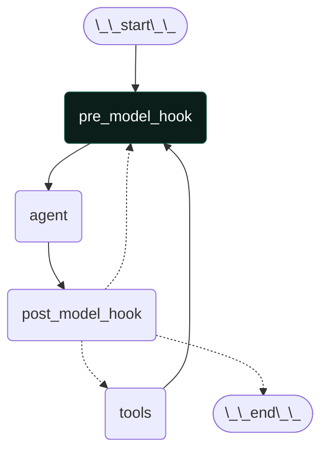
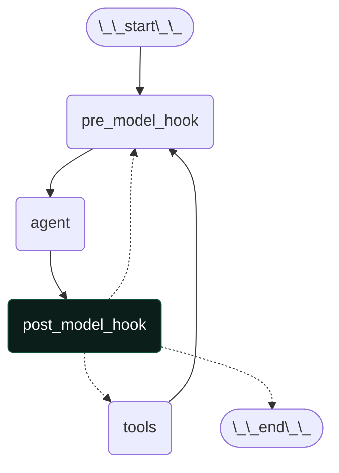

## Overview

Agents combine language models with tools to create systems that can reason about tasks, decide which tools to use, and iteratively work towards solutions. LangChain's `create_react_agent` function provides a production-ready ReAct (Reasoning + Acting) agent implementation.

## Core components

### Model

The model is the reasoning engine of your agent. It can be specified in multiple ways:

```python wrap
from langchain_openai import ChatOpenAI
from langgraph.prebuilt import create_react_agent

# Option 1: Model identifier string
agent = create_react_agent(
    "openai:gpt-5",
    tools=tools
)

# Option 2: Static model
agent = create_react_agent(
    model=ChatOpenAI(model="gpt-5", temperature=0), 
    tools=tools
)

# Option 3: Dynamic model selection based on state
def select_model(state, runtime):
    """Choose model based on task complexity."""
    messages = state["messages"]
    if len(messages) > 10:
        return ChatOpenAI(model="gpt-5")
    return ChatOpenAI(model="gpt-5-mini")

agent = create_react_agent(select_model, tools=tools)
```
Dynamic functions receive graph state and runtime, allowing for context-dependent model selection. The function must return a `BaseChatModel` instance.

<Tip>
For model configuration details, see [Models](./models).
</Tip>

### Tools

Tools give agents the ability to take actions. Agents go beyond simple model-only tool binding by facilitating:

- Multiple tool calls in sequence
- Dynamic tool selection based on results
- Retry logic and error handling
- State persistence across tool calls
- Complex reasoning chains

#### Creating a tool-calling agent

Tools can be provided to the agent as either:
1. A list of tools (LangChain `@tool`, callable, or JSON schema)
2. A configured `ToolNode`

```python wrap
from langchain_core.tools import tool
from langgraph.prebuilt import create_react_agent, ToolNode

# Option 1: List of tools
@tool
def search(query: str) -> str:
    """Search for information."""
    return f"Results for: {query}"

@tool
def calculate(expression: str) -> str:
    """Perform calculations."""
    return str(eval(expression))

agent = create_react_agent(model, tools=[search, calculate])

# Option 2: Configured ToolNode for custom error handling
tool_node = ToolNode(
    tools=[search, calculate],
    handle_tool_errors="Please check your input and try again."
)
agent = create_react_agent(model, tools=tool_node)
```
If an empty tool list is provided, the agent will consist of a single LLM node without tool calling.

### Understanding agent tool usage

The agent follows a ReAct pattern (Reasoning + Acting):

```python wrap
# The agent's response contains the full message history:
result["messages"] = [
    # Original request
    HumanMessage(content="Find wireless headphones, check if they're in stock, and calculate shipping to New York"),
    
    # Agent decides to search products
    AIMessage(
        content="",  # content is empty when calling tools
        tool_calls=[{
            'name': 'search_products',
            'args': {'query': 'wireless headphones'},
            'id': 'call_abc123'
        }]
    ),
    
    # Tool returns search results
    ToolMessage(
        content="Found 5 products matching 'wireless headphones'",
        tool_call_id="call_abc123"
    ),
    
    # Agent checks inventory for top result
    AIMessage(
        content="",
        tool_calls=[{
            'name': 'check_inventory',
            'args': {'product_id': 'WH-1000XM5'},
            'id': 'call_def456'
        }]
    ),
    
    # Tool returns inventory status
    ToolMessage(
        content="Product WH-1000XM5: 10 units in stock",
        tool_call_id="call_def456"
    ),
    
    # Agent's final response to user
    AIMessage(
        content="I found wireless headphones (model WH-1000XM5) with 10 units in stock..."
    )
]
```

<Tip>
To learn more about tools and how to configure `ToolNode`, see [Tools](./tools).
</Tip>

### Prompt

You can shape how your agent approaches tasks by providing a prompt. The `prompt` parameter can be provided in several forms:

```python wrap
from langchain_core.messages import SystemMessage
from langgraph.prebuilt import create_react_agent

# Option 1: String
agent = create_react_agent(
    model,
    tools,
    prompt="You are a helpful assistant. Be concise and accurate."
)
"""This is converted to a SystemMessage and added to the beginning of the list of messages in state["messages"]."""

# Option 2: SystemMessage
agent = create_react_agent(
    model,
    tools,
    prompt=SystemMessage(content="You are a research assistant. Cite your sources.")
)
"""This is added to the beginning of the list of messages in state["messages"]."""

# Option 3: Callable
def dynamic_prompt(state):
    user_type = state.get("user_type", "standard")
    system_msg = SystemMessage(
        content="Provide detailed technical responses." 
        if user_type == "expert" 
        else "Provide simple, clear explanations."
    )
    return [system_msg] + state["messages"]
agent = create_react_agent(model, tools, prompt=dynamic_prompt)
"""This function should take in full graph state and the output is then passed to the language model."""

# Option 4: Runnable
from langchain_core.runnables import RunnableLambda

prompt_runnable = RunnableLambda(
    lambda state: [
        SystemMessage(content=f"Current context: {state.get('context', 'general')}"),
        *state["messages"]
    ]
)
agent = create_react_agent(model, tools, prompt=prompt_runnable)
"""This runnable should take in full graph state and the output is then passed to the language model."""
```

When no prompt is provided, the agent uses the messages directly.

<Tip>
For more details on message types and formatting, see [Messages](./messages).
</Tip>

## Advanced configuration

### Structured Output

In some situations, you may want the agent to return an output in a specific format. LangChain provides a simple, universal way to do this with the `response_format` parameter.

<Tip>
To learn about structured output, see [Structured Output](./structured-output).
</Tip>

### Memory

Agents maintain conversation history automatically through the message state. Users can also configure the agent to use a custom state schema to remember additional information across tool calls.

<Tip>
To learn about **short-term memory**, see [Memory](./short-term-memory).
</Tip>

For persistent memory across sessions, use checkpointers and stores.

<Tip>
To learn about **long-term memory**, see [Memory](./long-term-memory).
</Tip>

### Pre-model hook

Pre-model hook is an optional node that can process state before the model is called. Use cases include message trimming, summarization, and context injection.



It must be a callable or a runnable that takes in current graph state and returns a state update in the form of:

```python wrap
# At least one of `messages` or `llm_input_messages` MUST be provided
{
    # If provided, will UPDATE the `messages` in the state
    "messages": [RemoveMessage(id=REMOVE_ALL_MESSAGES), ...],
    # If provided, will be used as the input to the LLM, and will NOT UPDATE `messages` in the state
    "llm_input_messages": [...],
    # Any other state keys that need to be propagated
    ...
}
```
Example of a pre-model hook that trims messages to fit the context window:

```python wrap
from langchain_core.messages import SystemMessage, RemoveMessage
from langgraph.graph.message import REMOVE_ALL_MESSAGES

def trim_messages(state):
    """Keep only the last few messages to fit context window."""
    messages = state["messages"]
    
    if len(messages) <= 3:
        return {"messages": messages}
    
    first_msg = messages[0]
    recent_messages = messages[-3:] if len(messages) % 2 == 0 else messages[-4:]
    new_messages = [first_msg] + recent_messages
    
    return {
        "messages": [
            RemoveMessage(id=REMOVE_ALL_MESSAGES),
            *new_messages
        ]
    }

agent = create_react_agent(
    model,
    tools=tools,
    pre_model_hook=trim_messages
)
```

<Info>
At least one of `messages` or `llm_input_messages` MUST be provided and will be used as an input to the `agent` node (i.e., the node that calls the LLM). The rest of the keys will be added to the graph state.
</Info>

<Warning>
If you are returning `messages` in the pre-model hook, you should OVERWRITE the `messages` key by doing the following:

```python wrap
{
    "messages": [RemoveMessage(id=REMOVE_ALL_MESSAGES), *new_messages]
    ...
}
```
</Warning>

### Post-model hook

Post-model hook is an optional node that can process the model's response before tool execution. Use cases include validation, guardrails, or other post-processing.



It must be a callable or a runnable that takes in current graph state and returns a state update.

Example of a post-model hook that filters out confidential information:

```python wrap
from langchain_core.messages import AIMessage, RemoveMessage
from langgraph.graph.message import REMOVE_ALL_MESSAGES

def validate_response(state):
    """Check model response for policy violations."""
    messages = state["messages"]
    last_message = messages[-1]
    
    if "confidential" in last_message.content.lower():
        return {
            "messages": [
                RemoveMessage(id=REMOVE_ALL_MESSAGES),
                *messages[:-1],
                AIMessage(content="I cannot share confidential information.")
            ]
        }
    
    return {}

agent = create_react_agent(
    model,
    tools=tools,
    post_model_hook=validate_response
)
```

### Streaming

We've seen how the agent can be called with `.invoke` to get a final response. If the agent executes multiple steps, this may take a while. To show intermediate progress, we can stream back messages as they occur.

<Tip>
For more details on streaming, see [Streaming](./streaming).
</Tip>

## End-to-end examples

### Simple search agent

A simple agent that answers questions by searching for information using the Tavily search tool.

To run this example, you'll need to set your Tavily and OpenAI API keys in your environment variables.

```python wrap
from langchain_openai import ChatOpenAI
from langchain_tavily import TavilySearch
from langgraph.prebuilt import create_react_agent

search = TavilySearch(max_results=2)
tools = [search]

model = ChatOpenAI(model="gpt-4o",)
agent = create_react_agent(
    model, 
    tools,
    prompt="You are a helpful assistant that can search the web for information. You can use the search tool to find information. Answer concisely."
)
```
```python wrap
agent.invoke({
    "messages": [
        {"role": "user", "content": "Tell me about LangChain."}
    ]
})
# LangChain is an open-source framework designed for building applications based on large language models (LLMs). It enables developers to create and customize prompt chains or templates, connect language models to external data sources, and adapt language models to specific business contexts. 

# LangChain also provides platforms for building reliable agents, used by top engineering teams and global brands like Replit, AT&T, Home Depot, and Klarna. The platform includes LangGraph, a framework for building controllable agents and long-running workflows, and LangSmith, which offers evaluation and monitoring tools to help developers debug and improve agents at scale. LangChain supports various integrations and makes it easy for teams to build, deploy, and manage enterprise-grade agents efficiently.

# For more detailed information, you can visit [LangChain's LinkedIn page](https://www.linkedin.com/company/langchain) or their [website](https://langchain.com/).
```

### Multi-step researcher agent

A more sophisticated agent that researches topics by collecting and summarizing multiple articles.

This example uses a Tavily search tool to browse the web, a `store` to persist state across sessions, a `post_model_hook` to track tool usage, a custom `state_schema` to store additional state.

```python wrap expandable
from langchain_openai import ChatOpenAI
from langchain_tavily import TavilySearch
from langchain_core.tools import tool
from langgraph.checkpoint.memory import MemorySaver
from langgraph.prebuilt import create_react_agent
from langgraph.prebuilt.chat_agent_executor import AgentState
import json

search = TavilySearch(max_results=3)

from langgraph.store.memory import InMemoryStore
store = InMemoryStore()

class ResearcherState(AgentState):
    tool_usage_stats: dict[str, int]

@tool
def store_article(name: str, url: str, summary: str) -> str:
    """Store an article's information in memory."""
    namespace = ("research", "articles")
    existing = store.get(namespace, "collected_articles")
    articles = existing.value if existing else []
    
    articles.append({
        "name": name,
        "url": url,
        "summary": summary
    })
    
    store.put(namespace, "collected_articles", articles)
    return f"Stored article: {name}"

@tool  
def get_stored_articles() -> str:
    """Retrieve all stored articles."""
    namespace = ("research", "articles")
    existing = store.get(namespace, "collected_articles")
    
    if not existing:
        return "No articles stored yet."
    
    articles = existing.value
    if not articles:
        return "No articles stored yet."
    
    return json.dumps(articles, indent=2)

def track_tool_usage(state):
    """Track which tools are being called and add metadata."""
    messages = state["messages"]
    last_message = messages[-1]
    
    if hasattr(last_message, 'tool_calls') and last_message.tool_calls:
        tool_names = [tc['name'] for tc in last_message.tool_calls]
                
        if not state.get("tool_usage_stats"):
            state["tool_usage_stats"] = {}
        for tool_name in tool_names:
            state["tool_usage_stats"][tool_name] = state["tool_usage_stats"].get(tool_name, 0) + 1
        
        return {"tool_usage_stats": state["tool_usage_stats"]}
    
    elif isinstance(last_message, AIMessage) and not hasattr(last_message, 'tool_calls'):
        if state.get("tool_usage_stats"):
            print(f"Tool usage summary: {json.dumps(state['tool_usage_stats'])}")

model = ChatOpenAI(model="gpt-5")
tools = [search, store_article, get_stored_articles]
agent = create_react_agent(
    model,
    tools,
    post_model_hook=track_tool_usage,
    prompt="""You are a research assistant. When asked to find articles:
1. Search for relevant content
2. Store each article with a descriptive name, URL, and summary
3. Only perform at most one tool call at a time
4. Keep track of what you've collected
5. Continue until you have the requested number of articles
6. Before you finish, double check that you have the requested number of articles by calling the get_stored_articles tool
6. If you have the requested number of articles, stop and present them in an organized format""",
    checkpointer=MemorySaver(),
    store=store,
    state_schema=ResearcherState
)
```

Invoke a research session:
```python wrap expandable
config = {"configurable": {"thread_id": "langchain-agents"}, "recursion_limit": 100}
agent.invoke({
        "messages": [
            {"role": "user", "content": "Find 5 relevant articles about LangChain and AI agents."}
        ]
    }, 
    config=config,
)
# Here are 5 relevant articles about LangChain and AI agents:

# 1) LangGraph — LangChain Blog
# - URL: https://blog.langchain.dev/langgraph
# - Summary: Official introduction to LangGraph (built on LangChain) explaining why cyclical graphs are useful for agent runtimes. Covers core concepts and how LangGraph enables robust, stateful agents with loops and branching beyond traditional DAGs.

# 2) LangGraph: Multi-Agent Workflows — LangChain Blog
# - URL: https://blog.langchain.dev/langgraph-multi-agent-workflows
# - Summary: Shows how to build multi-agent systems with LangGraph, including coordination patterns and examples. Compares to other frameworks (e.g., AutoGen) and links to repo examples for practical implementation.

# 3) Plan-and-Execute Agents — LangChain Blog
# - URL: https://blog.langchain.dev/planning-agents
# - Summary: Discusses plan-and-execute agent architectures in LangChain. Explains separating a planner LLM from a tool-execution runtime, variations like ReWOO, and a “joiner” component for dynamic replanning to improve speed and reliability.

# 4) LangGraph Tutorial: Building LLM Agents with LangChain (Zep)
# - URL: https://www.getzep.com/ai-agents/langgraph-tutorial/
# - Summary: Hands-on tutorial for building agents using LangGraph, including ReAct-style agents, tool integration (ToolNode), memory (MemorySaver), and guidelines for production-ready agent architectures.

# 5) Building AI agent systems with LangGraph (Medium)
# - URL: https://medium.com/pythoneers/building-ai-agent-systems-with-langgraph-9d85537a6326
# - Summary: Overview of using LangGraph (on top of LangChain) to build AI agents with cyclic, stateful graphs. Compares with LangChain’s AgentExecutor loop and highlights benefits for error handling, tool use, and adaptable multi-agent workflows.
```

We can then use the same `thread_id` to invoke a follow-up session where the agent maintains access to work performed in the previous session:
```python wrap expandable
config = {"configurable": {"thread_id": "research-session-2"}, "recursion_limit": 100}
agent.invoke({
        "messages": [
            {"role": "user", "content": "Find 2 more articles."}
        ]
    }, 
    config=config,
)
# Here are 2 more relevant articles about LangChain and AI agents:

# 6) LangGraph Studio: The first agent IDE — LangChain Blog
# - URL: https://blog.langchain.com/langgraph-studio-the-first-agent-ide/
# - Summary: Official announcement of LangGraph Studio, an IDE for developing, visualizing, and debugging agentic applications. Explains why specialized tooling matters for agents and how to get started using Studio.

# 7) Tool calling — Python LangChain (Docs)
# - URL: https://python.langchain.com/docs/concepts/tool_calling/
# - Summary: Concept guide to LangChain’s standardized tool-calling interface. Covers binding tools to models, controlling tool choice, and how this underpins agent behavior and AgentExecutor loops.
```