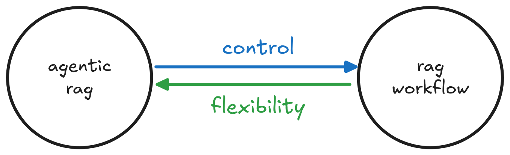
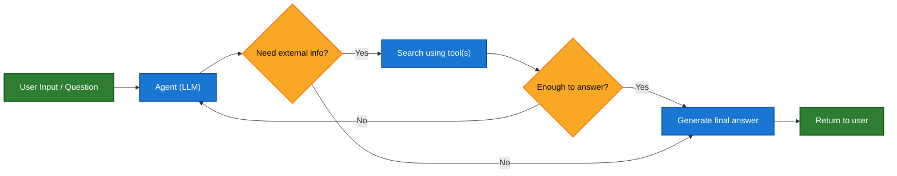
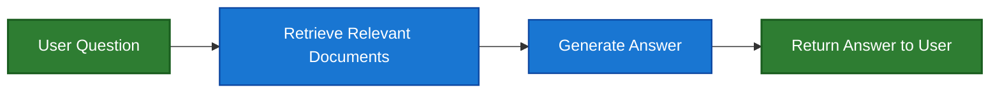

**Retrieval-Augmented Generation (RAG)** is a method for enhancing the responses of language models by injecting external knowledge at generation time. Instead of relying solely on what the model "knows" (from training), RAG enables the model to query external sources—like search engines, databases, APIs, or custom document stores—to access the most relevant and up-to-date information.

---
title: RAG Architectures
---

RAG can be implemented in multiple ways, depending on your system's needs:

* **2-Step RAG**: Retrieval always happens before generation. Simple and predictable.
* **Agentic RAG**: An LLM-powered agent decides *when* and *how* to retrieve during reasoning.



| Architecture | Control   | Flexibility | Example Use Case         |
| ------------ | --------- | ----------- | ------------------------ |
| 2-Step RAG   | ✅ High    | ❌ Low       | FAQs, documentation bots |
| Hybrid       | ⚖️ Medium | ⚖️ Medium   | Technical Q\&A           |
| Agentic RAG  | ❌ Low     | ✅ High      | Research assistants      |

## Building a knowledge base

Section contains cross-links to documentation about vectorstores and custom retrievers.

## ⚙️ Implementation

We’ll walk through three progressively more dynamic implementations.

## 1. Agentic RAG

**Agentic Retrieval-Augmented Generation (RAG)** combines the strengths of Retrieval-Augmented Generation with agent-based reasoning. Instead of retrieving documents before answering, an agent (powered by an LLM) reasons step-by-step and decides **when** and **how** to retrieve information during the interaction.

<Tip>

The only thing an agent needs to enable RAG behavior is access to one or more **tools** that can fetch external knowledge — such as documentation loaders, web APIs, or database queries. This tool-based architecture makes Agentic RAG modular, flexible, and ideal for evolving knowledge environments.

</Tip>



```python
from langchain_core.tools import tool
from langgraph.prebuilt import create_react_agent
from langchain.chat_models import init_chat_model

model = init_chat_model('claude-sonnet-4-0', max_tokens=32_000)

agent = create_react_agent(
    model=model,
    # Include tools that include retrieval tools
    tools=tools, # [!code highlight] 
    # Customize the prompt with instructions on how to retrieve
    # the data.
    prompt=system_prompt,
)
```

### 🧪 Example: Agentic RAG with LangGraph Documentation

This example implements an **Agentic RAG system** to assist users in querying LangGraph documentation. The agent begins by loading `llms.txt`, which lists available documentation URLs, and can then dynamically use a `fetch_documentation` tool to retrieve and process the relevant content based on the user’s question.

```python
from markdownify import markdownify
import requests

from langchain_core.tools import tool
from langgraph.prebuilt import create_react_agent
from langchain.chat_models import init_chat_model

ALLOWED_DOMAINS = ["https://langchain-ai.github.io/"]
LLMS_TXT = 'https://langchain-ai.github.io/langgraph/llms.txt'

@tool
def fetch_documentation(url: str) -> str:
    """Fetch and convert documentation from a URL"""
    if not any(url.startswith(domain) for domain in ALLOWED_DOMAINS):
        return f"Error: URL not allowed. Must start with one of: {', '.join(ALLOWED_DOMAINS)}"
    response = requests.get(url, timeout=10.0)
    response.raise_for_status()
    return markdownify(response.text)

# We will fetch the content of llms.txt, so this can be done ahead of time without requiring an LLM request.
llms_txt_content = requests.get(LLMS_TXT).text

# System prompt for the agent
system_prompt = f"""
You are an expert Python developer and technical assistant. 
Your primary role is to help users with questions about LangGraph and related tools.

Instructions:

1. If a user asks a question you're unsure about — or one that likely involves API usage, 
   behavior, or configuration — you MUST use the `fetch_documentation` tool to consult the relevant docs.
2. When citing documentation, summarize clearly and include relevant context from the content.
3. Do not use any URLs outside of the allowed domain.
4. If a documentation fetch fails, tell the user and proceed with your best expert understanding.

You can access official documentation from the following approved sources:

{llms_txt_content}

You MUST consult the documentation to get up to date documentation 
before answering a user's question about LangGraph.

Your answers should be clear, concise, and technically accurate.
"""

tools = [fetch_documentation]

model = init_chat_model('claude-sonnet-4-0', max_tokens=32_000)

agent = create_react_agent(
    model=model,
    tools=tools,
    prompt=system_prompt,
    name="Agentic RAG",
)

response = agent.invoke({
    'messages': [{
        'role': 'user',
        'content': (
            "Write a short example of a langgraph agent using the "
            "prebuilt create react agent. the agent should be able "
            "to loook up stock pricing information."
        )
    }]
})

print(response['messages'][-1].content)
```

```output

KeyboardInterrupt
```

# 2. Retrieval -> Generation workflow

* **2-Step RAG**: Retrieval always happens before generation.



### 🧪 Example: Working with LangGraph GitHub issues

```python
import requests
from typing import TypedDict, NotRequired
from langgraph.graph import StateGraph, END
from langchain.chat_models import init_chat_model

class GraphState(TypedDict):
    question: str
    retrieved_content: NotRequired[str]
    answer: NotRequired[str]

llm = init_chat_model('claude-sonnet-4-0', max_tokens=32000)


def retrieval_step(state: GraphState) -> GraphState:
    headers = {
        "Accept": "application/vnd.github+json",
        "User-Agent": "langgraph-rag-example",
    }

    url = "https://api.github.com/repos/langchain-ai/langgraph/issues"
    params = {
        "state": "open",
        "per_page": 50,
    }
    response = requests.get(url, headers=headers, params=params)
    response.raise_for_status()
    
    items = response.json()
    base_url = "https://github.com/langchain-ai/langgraph/issues/"
    # Filter out PRs (issues with "pull_request" key are actually PRs)
    issues = [f"- {issue['title']} {base_url}{issue['number']}" for issue in items if "pull_request" not in issue]
    retrieved = "\n".join(issues) if issues else "No issues found."
    
    return {
        "retrieved_content": retrieved
    }


def generate_response(state: GraphState) -> GraphState:
    prompt = [
        {
            "role": "system",
            "content": (
                "You are a helpful assistant. Use the following GitHub issue data to answer the user's question. "
                "When relevant also include urls to the issues in the response.\n\n---\n\n"
                f"Retrieved GitHub Issues:\n{state['retrieved_content']}"
            )
        },
        {
            "role": "user",
            "content": state["question"]
        }
    ]
    response = llm.invoke(prompt)
    return {
        "question": state["question"],
        "retrieved_content": state["retrieved_content"],
        "answer": response.content
    }


builder = StateGraph(GraphState)
builder.add_node("retrieval", retrieval_step)
builder.add_node("generation", generate_response)
builder.set_entry_point("retrieval")
builder.add_edge("retrieval", "generation")
builder.add_edge("generation", END)

graph = builder.compile(name="2-step rag")

response = graph.invoke({
    "question": "What are the themes in the recent issues?",
})

print(response['answer'])
```

## 3. Hybrid architectures

There are many possible variations on RAG architectures.

1. The retrieval step can involve an LLM to either interpret the question, to re-write the question or write multiple versions of it.
2. Reflection steps after retrieval: to decide whether retrieved results make sense and if not re-execute retrieval.
3. Reflection steps after generation: to decide whether the the generated answer is good and if not, to try re-execute retrieval or generation.
4. Variations could allow for up to a certain number of loop iterations that invclude retrieval and post generation etc.

Here's an example of

Examples

* [Agentic RAG with Self correction](https://langchain-ai.github.io/langgraph/tutorials/rag/langgraph_agentic_rag)
