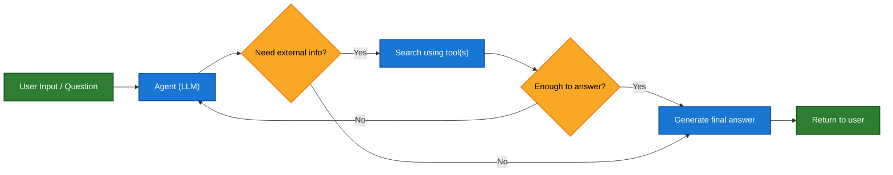
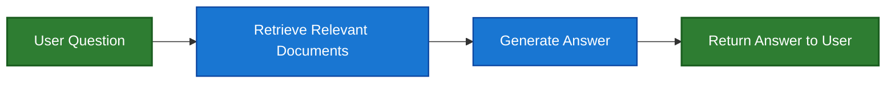
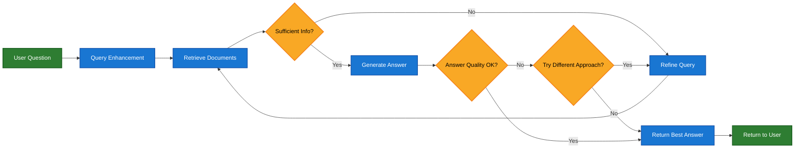

**Retrieval-Augmented Generation (RAG)** is a method for enhancing the responses of language models by injecting external knowledge at generation time. Instead of relying solely on what the model "knows" (from training), RAG enables the model to query external sources—like search engines, databases, APIs, or custom document stores—to access the most relevant and up-to-date information.

RAG can be implemented in multiple ways, depending on your system's needs:

| Architecture            | Description                                                                | Control   | Flexibility | Latency        | Example Use Case                                   |
|-------------------------|----------------------------------------------------------------------------|-----------|-------------|----------------|----------------------------------------------------|
| **Agentic RAG**         | An LLM-powered agent decides *when* and *how* to retrieve during reasoning | ❌ Low     | ✅ High      | ⏳ Variable     | Research assistants with access to multiple tools  |
| **Bounded Agentic RAG** | Agentic RAG with a fixed number of reasoning/retrieval loops               | ✅ Medium  | ✅ Medium    | ⏱️ Predictable | Smart assistants with predictable runtime/behavior |
| **2-Step RAG**          | Retrieval always happens before generation. Simple and predictable         | ✅ High    | ❌ Low       | ⚡ Fast         | FAQs, documentation bots                           |
| **Hybrid**              | Combines characteristics of both approaches with validation steps          | ⚖️ Medium | ⚖️ Medium   | ⏳ Variable     | Domain-specific Q&A with quality validation        |

<Info>
**Latency**: Latency is generally more **predictable** in both **Bounded Agentic RAG** and **2-Step RAG**, as the maximum number of LLM calls is known and capped. This predictability assumes that LLM inference time is the dominant factor. However, real-world latency may also be affected by the performance of retrieval steps—such as API response times, network delays, or database queries—which can vary based on the tools and infrastructure in use.
</Info>

## Agentic RAG

**Agentic Retrieval-Augmented Generation (RAG)** combines the strengths of Retrieval-Augmented Generation with agent-based reasoning. Instead of retrieving documents before answering, an agent (powered by an LLM) reasons step-by-step and decides **when** and **how** to retrieve information during the interaction.

<Tip>

The only thing an agent needs to enable RAG behavior is access to one or more **tools** that can fetch external knowledge — such as documentation loaders, web APIs, or database queries. This tool-based architecture makes Agentic RAG modular, flexible, and ideal for evolving knowledge environments.

</Tip>



```python
from langchain.chat_models import init_chat_model
from langgraph.prebuilt import create_react_agent

model = init_chat_model('claude-sonnet-4-0', max_tokens=32_000)

agent = create_react_agent(
    model=model,
    # Include tools that include retrieval tools
    tools=tools,  # [!code highlight] 
    # Customize the prompt with instructions on how to retrieve
    # the data.
    prompt=system_prompt,
)
```

### Bounded Agentic RAG

Agentic RAG systems can be configured with a limit on how many reasoning/retrieval loops the agent may perform. This provides a useful balance between **flexibility** and **predictability**.

A common pattern is **1-loop Agentic RAG**:

* The agent decides whether to retrieve.
* If it does retrieve, it may rewrite the query.
* After at most one retrieval step, it generates the final answer.

This setup enables paraphrasing and tool use without allowing open-ended loops. If the LLM supports it, tool calls may run in parallel.

```python
agent = create_react_agent(
    model=model,
    tools=tools,
    prompt=system_prompt,
    max_iterations=1,  # Limits agent to one loop
)
```

<Expandable title="Extended example: Agentic RAG for LangGraph's llms.txt">

This example implements an **Agentic RAG system** to assist users in querying LangGraph documentation. The agent begins by loading [llms.txt](https://llmstxt.org/), which lists available documentation URLs, and can then dynamically use a `fetch_documentation` tool to retrieve and process the relevant content based on the user’s question.

```python
import requests
from langchain.chat_models import init_chat_model
from langchain_core.tools import tool
from langgraph.prebuilt import create_react_agent
from markdownify import markdownify

ALLOWED_DOMAINS = ["https://langchain-ai.github.io/"]
LLMS_TXT = 'https://langchain-ai.github.io/langgraph/llms.txt'


@tool
def fetch_documentation(url: str) -> str:  # [!code highlight]
    """Fetch and convert documentation from a URL"""
    if not any(url.startswith(domain) for domain in ALLOWED_DOMAINS):
        return (
            "Error: URL not allowed. "
            f"Must start with one of: {', '.join(ALLOWED_DOMAINS)}"
        )
    response = requests.get(url, timeout=10.0)
    response.raise_for_status()
    return markdownify(response.text)


# We will fetch the content of llms.txt, so this can 
# be done ahead of time without requiring an LLM request.
llms_txt_content = requests.get(LLMS_TXT).text

# System prompt for the agent
system_prompt = f"""
You are an expert Python developer and technical assistant. 
Your primary role is to help users with questions about LangGraph and related tools.

Instructions:

1. If a user asks a question you're unsure about — or one that likely involves API usage, 
   behavior, or configuration — you MUST use the `fetch_documentation` tool to consult the relevant docs.
2. When citing documentation, summarize clearly and include relevant context from the content.
3. Do not use any URLs outside of the allowed domain.
4. If a documentation fetch fails, tell the user and proceed with your best expert understanding.

You can access official documentation from the following approved sources:

{llms_txt_content}

You MUST consult the documentation to get up to date documentation 
before answering a user's question about LangGraph.

Your answers should be clear, concise, and technically accurate.
"""

tools = [fetch_documentation]

model = init_chat_model('claude-sonnet-4-0', max_tokens=32_000)

agent = create_react_agent(
    model=model,
    tools=tools,  # [!code highlight]
    prompt=system_prompt,  # [!code highlight]
    name="Agentic RAG",
)

response = agent.invoke({
    'messages': [{
        'role': 'user',
        'content': (
            "Write a short example of a langgraph agent using the "
            "prebuilt create react agent. the agent should be able "
            "to loook up stock pricing information."
        )
    }]
})

print(response['messages'][-1].content)
```
</Expandable>

## 2-step workflow

In **2-Step RAG**, the retrieval step is always executed before the generation step. This architecture is straightforward and predictable, making it suitable for many applications where the retrieval of relevant documents is a clear prerequisite for generating an answer.



<Expandable title="Extended example: 2-Step RAG for LangGraph GitHub issues">

This example demonstrates a simple 2-step RAG system that retrieves open GitHub issues from the LangGraph repository and generates an answer based on the retrieved content.

```python
from typing import TypedDict, NotRequired

import requests
from langchain.chat_models import init_chat_model
from langgraph.graph import StateGraph, END


class GraphState(TypedDict):
    question: str
    retrieved_content: NotRequired[str]
    answer: NotRequired[str]


llm = init_chat_model('claude-sonnet-4-0', max_tokens=32000)


def retrieval_step(state: GraphState):  # [!code highlight]
    """Retrieve open issues from the LangGraph GitHub repository."""
    headers = {
        "Accept": "application/vnd.github+json",
        "User-Agent": "langgraph-rag-example",
    }

    url = "https://api.github.com/repos/langchain-ai/langgraph/issues"
    params = {
        "state": "open",
        "per_page": 50,
    }
    response = requests.get(url, headers=headers, params=params)
    response.raise_for_status()

    items = response.json()
    base_url = "https://github.com/langchain-ai/langgraph/issues/"
    # Filter out PRs (issues with "pull_request" key are actually PRs)
    issues = [f"- {issue['title']} {base_url}{issue['number']}" for issue in items if
              "pull_request" not in issue]
    retrieved = "\n".join(issues) if issues else "No issues found."

    return {
        "retrieved_content": retrieved
    }


def generate_response(state: GraphState):  # [!code highlight]
    """Generate an answer based on the retrieved content and the user's question."""
    prompt = [
        {
            "role": "system",
            "content": (
                "You are a helpful assistant. Use the following GitHub issue data to answer the user's question. "
                "When relevant also include urls to the issues in the response.\n\n---\n\n"
                f"Retrieved GitHub Issues:\n{state['retrieved_content']}"
            )
        },
        {
            "role": "user",
            "content": state["question"]
        }
    ]
    response = llm.invoke(prompt)
    return {
        "question": state["question"],
        "retrieved_content": state["retrieved_content"],
        "answer": response.content
    }


builder = StateGraph(GraphState)
builder.add_node("retrieval", retrieval_step)  # [!code highlight]
builder.add_node("generation", generate_response)  # [!code highlight]
builder.set_entry_point("retrieval")
builder.add_edge("retrieval", "generation")
builder.add_edge("generation", END)

graph = builder.compile(name="2-step rag")

response = graph.invoke({
    "question": "What are the themes in the recent issues?",
})

print(response['answer'])
```

</Expandable>

## Hybrid RAG

Hybrid RAG combines characteristics of both 2-Step and Agentic RAG. It introduces intermediate steps such as query preprocessing, retrieval validation, and post-generation checks. These systems offer more flexibility than fixed pipelines while maintaining some control over execution.

Typical components include:

* **Query enhancement**: Modify the input question to improve retrieval quality. This can involve rewriting unclear queries, generating multiple variations, or expanding queries with additional context.
* **Retrieval validation**: Evaluate whether retrieved documents are relevant and sufficient. If not, the system may refine the query and retrieve again.
* **Answer validation**: Check the generated answer for accuracy, completeness, and alignment with source content. If needed, the system can regenerate or revise the answer.

The architecture often supports multiple iterations between these steps:



This architecture is suitable for:

* Applications with ambiguous or underspecified queries
* Systems that require validation or quality control steps
* Workflows involving multiple sources or iterative refinement

**Example** [Agentic RAG with Self-Correction](https://langchain-ai.github.io/langgraph/tutorials/rag/langgraph_agentic_rag)

## Building a knowledge base

A key component of RAG systems is a **knowledge base**—a repository of documents or data that the retrieval step can query.

If you want to build a custom knowledge base, you can use LangChain's document loaders and vector stores to create one from your own data.