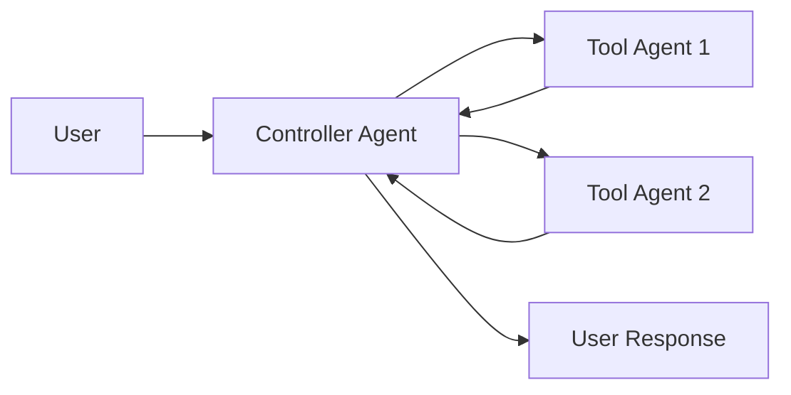
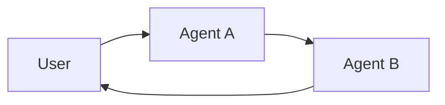

import AlphaCallout from '/snippets/alpha-lc-callout.mdx';

<AlphaCallout />

# Multi-agent systems

**Multi-agent systems** break a complex application into multiple specialized agents that work together to solve problems.
Instead of relying on a single agent to handle every step, **multi-agent architectures** allow you to compose smaller, focused agents into a coordinated workflow.

Multi-agent systems are useful when:

* A single agent has too many tools and makes poor decisions about which to use.
* Context or memory grows too large for one agent to track effectively.
* Tasks require **specialization** (e.g., a planner, researcher, math expert).

Benefits include:

| Benefit            | Description                                                       |
| ------------------ | ----------------------------------------------------------------- |
| **Modularity**     | Easier to develop, test, and maintain smaller, focused agents.    |
| **Specialization** | Each agent can be optimized for a particular domain or task type. |
| **Control**        | Explicitly define communication and control flow between agents.  |

## Two common patterns

| Pattern          | How it Works                                                                                                                                                     | Control Flow                                                | Example Use Case                                 |
| ---------------- | ---------------------------------------------------------------------------------------------------------------------------------------------------------------- | ----------------------------------------------------------- | ------------------------------------------------ |
| **Tool Calling** | A central agent calls other agents as *tools*. The "tool" agents don't talk to the user directly — they just run their task and return results.                  | Centralized — all routing passes through the calling agent. | Task orchestration, structured workflows.        |
| **Handoffs**     | The current agent decides to **transfer control** to another agent. The active agent changes, and the user may continue interacting directly with the new agent. | Decentralized — agents can change who is active.            | Multi-domain conversations, specialist takeover. |

### Tool calling

In **tool calling**, one agent (the "**controller**") treats other agents as *tools* to be invoked when needed.

Flow:

1. The **controller** receives input and decides which tool (subagent) to call.
2. The **tool agent** runs its task based on the controller's instructions.
3. The **tool agent** returns results to the controller.
4. The **controller** decides the next step or finishes.

✅ Predictable, centralized routing.<br />
⚠️ Tool agents won't initiate new questions to the user — their role is fully defined by the controller.



### Handoffs

In **handoffs**, agents can directly pass control to each other. The "active" agent changes, and the user interacts with whichever agent currently has control.

Flow:

1. The **current agent** decides it needs help from another agent.
2. It passes control (and state) to the **next agent**.
3. The **new agent** interacts directly with the user until it decides to hand off again or finish.

✅ Flexible, more natural conversational flow between specialists.<br />
⚠️ Less centralized — harder to guarantee predictable behavior.



## Choosing between tool calling and handoffs

| Question                                              | Tool Calling | Handoffs |
| ----------------------------------------------------- | ------------ | -------- |
| Need centralized control over workflow?               | ✅ Yes        | ❌ No     |
| Want agents to interact directly with the user?       | ❌ No         | ✅ Yes    |
| Complex, human-like conversation between specialists? | ❌ Limited    | ✅ Strong |

<Tip>
    You can also combine these patterns — e.g., use a top-level **tool-calling controller** for high-level routing, but allow **handoffs** within a team of related agents for smoother conversation.
</Tip>

## How handoffs work

Under the hood, **handoffs** are implemented using the `Command` object in LangGraph.
When an agent decides to hand off, it returns a special `Command` that:

1. Updates the **graph state** with any necessary information.
2. Changes the **active agent** so that subsequent steps are handled by the new agent.

:::python

```python
from langgraph.types import Command

def agent(state) -> Command[Literal["agent", "another_agent"]]:
    # The condition for routing/halting can be anything, e.g. LLM tool call / structured output, etc.
    goto = get_next_agent(...)  # 'agent' / 'another_agent'
    return Command(
        # Specify which agent to call next
        goto=goto,
        # Update the graph state
        update={"my_state_key": "my_state_value"}
    )
```

:::

:::js

```typescript
import { Command } from "@langchain/langgraph";

const agent = (state) => {
    // The condition for routing/halting can be anything, e.g. LLM tool call / structured output, etc.
    const goto = getNextAgent(...); // 'agent' / 'another_agent'
    return new Command({
        // Specify which agent to call next
        goto,
        // Update the graph state
        update: { myStateKey: "myStateValue" }
    });
};
```

:::

One of the most common patterns is wrapping a handoff in a tool call for tool-calling agents:

:::python

```python
from langchain_core.tools import tool
from langgraph.types import Command

@tool
def transfer_to_bob():
    """Transfer to bob."""
    return Command(
        # name of the agent (node) to go to
        goto="bob",
        # data to send to the agent
        update={"my_state_key": "my_state_value"},
        # indicate to LangGraph that we need to navigate to
        # agent node in a parent graph
        graph=Command.PARENT,
    )
```

:::

:::js

```typescript
import { tool } from "langchain";
import { Command } from "@langchain/langgraph";
import { z } from "zod";

const transferToBob = tool(
    async () => {
        return new Command({
        // name of the agent (node) to go to
        goto: "bob",
        // data to send to the agent
        update: { myStateKey: "myStateValue" },
        // indicate to LangGraph that we need to navigate to
        // agent node in a parent graph
        graph: Command.PARENT,
        });
    },
    {
        name: "transfer_to_bob",
        description: "Transfer to bob.",
        schema: z.object({}),
    }
);
```

:::

## Multi-agent architectures

There are several ways to connect agents in a multi-agent system:

<AccordionGroup>
  <Accordion title="Network" icon="network-wired">
    In this architecture, each agent can communicate with every other agent (many-to-many connections). This architecture is good for problems that do not have a clear hierarchy of agents or a specific sequence in which agents should be called.

:::python

```python
from typing import Literal
from langchain_openai import ChatOpenAI
from langgraph.types import Command
from langgraph.graph import StateGraph, MessagesState, START, END

model = ChatOpenAI()

def agent_1(state: MessagesState) -> Command[Literal["agent_2", "agent_3", END]]:
    # you can pass relevant parts of the state to the LLM (e.g., state["messages"])
    # to determine which agent to call next. a common pattern is to call the model
    # with a structured output (e.g. force it to return an output with a "next_agent" field)
    response = model.invoke(...)
    # route to one of the agents or exit based on the LLM's decision
    # if the LLM returns "__end__", the graph will finish execution
    return Command(
        goto=response["next_agent"],
        update={"messages": [response["content"]]},
    )

def agent_2(state: MessagesState) -> Command[Literal["agent_1", "agent_3", END]]:
    response = model.invoke(...)
    return Command(
        goto=response["next_agent"],
        update={"messages": [response["content"]]},
    )

def agent_3(state: MessagesState) -> Command[Literal["agent_1", "agent_2", END]]:
    ...
    return Command(
        goto=response["next_agent"],
        update={"messages": [response["content"]]},
    )

builder = StateGraph(MessagesState)
builder.add_node(agent_1)
builder.add_node(agent_2)
builder.add_node(agent_3)

builder.add_edge(START, "agent_1")
network = builder.compile()
```

:::

:::js

```typescript
import { StateGraph, MessagesAnnotation, START, END, Command } from "@langchain/langgraph";
import { ChatOpenAI } from "@langchain/openai";

const model = new ChatOpenAI();

const agent1 = async (state: typeof MessagesAnnotation.State) => {
    // You can pass relevant parts of the state to the LLM (e.g., state.messages)
    // to determine which agent to call next. a common pattern is to call the model
    // with a structured output (e.g. force it to return an output with a "next_agent" field)
    const response = await model.invoke(...);
    // Route to one of the agents or exit based on the LLM's decision
    // if the LLM returns "__end__", the graph will finish execution
    return new Command({
        goto: response.nextAgent,
        update: { messages: [response.content] },
    });
};

const agent2 = async (state: typeof MessagesAnnotation.State) => {
    const response = await model.invoke(...);
    return new Command({
        goto: response.nextAgent,
        update: { messages: [response.content] },
    });
};

const agent3 = async (state: typeof MessagesAnnotation.State) => {
    // ...
    return new Command({
        goto: response.nextAgent,
        update: { messages: [response.content] },
    });
};

const builder = new StateGraph(MessagesAnnotation)
    .addNode("agent1", agent1, {
        ends: ["agent2", "agent3", END]
    })
    .addNode("agent2", agent2, {
        ends: ["agent1", "agent3", END]
    })
    .addNode("agent3", agent3, {
        ends: ["agent1", "agent2", END]
    })
    .addEdge(START, "agent1");

const network = builder.compile();
```

:::
    </Accordion>

    <Accordion title="Supervisor" icon="user-crown">
        In this architecture, we define agents as nodes and add a supervisor node (LLM) that decides which agent nodes should be called next. This architecture also lends itself well to running multiple agents in parallel or using map-reduce patterns.

:::python

```python
from typing import Literal
from langchain_openai import ChatOpenAI
from langgraph.types import Command
from langgraph.graph import StateGraph, MessagesState, START, END

model = ChatOpenAI()

def supervisor(state: MessagesState) -> Command[Literal["agent_1", "agent_2", END]]:
    # You can pass relevant parts of the state to the LLM (e.g., state["messages"])
    # to determine which agent to call next. a common pattern is to call the model
    # with a structured output (e.g. force it to return an output with a "next_agent" field)
    response = model.invoke(...)
    # Route to one of the agents or exit based on the supervisor's decision
    # if the supervisor returns "__end__", the graph will finish execution
    return Command(goto=response["next_agent"])

def agent_1(state: MessagesState) -> Command[Literal["supervisor"]]:
    # You can pass relevant parts of the state to the LLM (e.g., state["messages"])
    # and add any additional logic (different models, custom prompts, structured output, etc.)
    response = model.invoke(...)
    return Command(
        goto="supervisor",
        update={"messages": [response]},
    )

def agent_2(state: MessagesState) -> Command[Literal["supervisor"]]:
    response = model.invoke(...)
    return Command(
        goto="supervisor",
        update={"messages": [response]},
    )

builder = StateGraph(MessagesState)
builder.add_node(supervisor)
builder.add_node(agent_1)
builder.add_node(agent_2)

builder.add_edge(START, "supervisor")

supervisor = builder.compile()
```

:::

:::js

```typescript
import { StateGraph, MessagesAnnotation, Command, START, END } from "@langchain/langgraph";
import { ChatOpenAI } from "@langchain/openai";

const model = new ChatOpenAI();

const supervisor = async (state: typeof MessagesAnnotation.State) => {
    // You can pass relevant parts of the state to the LLM (e.g., state.messages)
    // to determine which agent to call next. a common pattern is to call the model
    // with a structured output (e.g. force it to return an output with a "next_agent" field)
    const response = await model.invoke(...);
    // Route to one of the agents or exit based on the supervisor's decision
    // if the supervisor returns "__end__", the graph will finish execution
    return new Command({ goto: response.nextAgent });
};

const agent1 = async (state: typeof MessagesAnnotation.State) => {
    // You can pass relevant parts of the state to the LLM (e.g., state.messages)
    // and add any additional logic (different models, custom prompts, structured output, etc.)
    const response = await model.invoke(...);
    return new Command({
        goto: "supervisor",
        update: { messages: [response] },
    });
};

const agent2 = async (state: typeof MessagesAnnotation.State) => {
    const response = await model.invoke(...);
    return new Command({
        goto: "supervisor",
        update: { messages: [response] },
    });
};

const builder = new StateGraph(MessagesAnnotation)
    .addNode("supervisor", supervisor, {
        ends: ["agent1", "agent2", END]
    })
    .addNode("agent1", agent1, {
        ends: ["supervisor"]
    })
    .addNode("agent2", agent2, {
        ends: ["supervisor"]
    })
    .addEdge(START, "supervisor");

const supervisorGraph = builder.compile();
```

:::
    </Accordion>

    <Accordion title="Supervisor (tool-calling)" icon="toolbox">
        In this variant of the supervisor architecture, we define a supervisor agent which is responsible for calling sub-agents. The sub-agents are exposed to the supervisor as tools:

<Tabs>
    <Tab title="Supervisor (from scratch)">
    :::python

    ```python
    from typing import Annotated
    from langchain_openai import ChatOpenAI
    from langchain_core.tools import tool
    from langgraph.prebuilt import InjectedState, create_react_agent

    model = ChatOpenAI()

    # This is the agent function that will be called as tool
    # notice that you can pass the state to the tool via InjectedState annotation
    @tool
    def agent_1(instructions: str, state: Annotated[dict, InjectedState]):
        """Give instructions to agent 1."""
        # You can pass relevant parts of the state to the LLM (e.g., state["messages"])
        # and add any additional logic (different models, custom prompts, structured output, etc.)
        response = model.invoke(...)
        # Return the LLM response as a string (expected tool response format)
        # this will be automatically turned to ToolMessage
        # by the prebuilt create_react_agent (supervisor)
        return response.content

    @tool
    def agent_2(instructions: str, state: Annotated[dict, InjectedState]):
        """Give instructions to agent 2."""
        response = model.invoke(...)
        return response.content

    tools = [agent_1, agent_2]
    # The simplest way to build a supervisor w/ tool-calling is to use prebuilt ReAct agent graph
    # that consists of a tool-calling LLM node (i.e. supervisor) and a tool-executing node
    supervisor = create_react_agent(model, tools)
    ```

    :::

    :::js

    ```typescript
    import { z } from "zod";
    import { ChatOpenAI } from "@langchain/openai";
    import { createAgent, tool } from "langchain";

    const model = new ChatOpenAI();

    // This is the agent function that will be called as tool
    // notice that you can pass the state to the tool via config parameter
    const agent1 = tool(
        async ({ instructions }, config) => {
            const state = config.configurable?.state;
            // You can pass relevant parts of the state to the LLM (e.g., state.messages)
            // and add any additional logic (different models, custom prompts, structured output, etc.)
            const response = await model.invoke(...);
            // Return the LLM response as a string (expected tool response format)
            // this will be automatically turned to ToolMessage
            // by the prebuilt createAgent (supervisor)
            return response.content;
        },
        {
            name: "agent1",
            description: "Give instructions to agent 1.",
            schema: z.object({
            instructions: z.string().describe("Instructions for agent 1"),
            }),
        }
    );

    const agent2 = tool(
        async ({ instructions }, config) => {
            const state = config.configurable?.state;
            const response = await model.invoke(...);
            return response.content;
        },
        {
            name: "agent2",
            description: "Give instructions to agent 2.",
            schema: z.object({
            instructions: z.string().describe("Instructions for agent 2"),
            }),
        }
    );

    const tools = [agent1, agent2];
    // The simplest way to build a supervisor w/ tool-calling is to use prebuilt ReAct agent graph
    // that consists of a tool-calling LLM node (i.e. supervisor) and a tool-executing node
    const supervisor = createAgent({ llm: model, tools });
    ```

    :::
  </Tab>

  <Tab title="Supervisor prebuilt">
    :::python

    ```python
    from langgraph.prebuilt import create_react_agent
    from langgraph_supervisor import create_supervisor
    from langchain_openai import ChatOpenAI

    model = ChatOpenAI()

    def book_hotel(hotel_name: str):
        """Book a hotel"""
        return f"Successfully booked a stay at {hotel_name}."

    def book_flight(from_airport: str, to_airport: str):
        """Book a flight"""
        return f"Successfully booked a flight from {from_airport} to {to_airport}."

    flight_assistant = create_react_agent(
        model=model,
        tools=[book_flight],
        state_modifier="You are a flight booking assistant",
    )

    hotel_assistant = create_react_agent(
        model=model,
        tools=[book_hotel],
        state_modifier="You are a hotel booking assistant",
    )

    supervisor = create_supervisor(
        model=model,
        state_modifier=(
            "You manage a hotel booking assistant and a"
            "flight booking assistant. Assign work to them."
        ),
        agents=[flight_assistant, hotel_assistant],
    ).compile()

    response = supervisor.invoke(
        {
            "messages": [
                {
                    "role": "user",
                    "content": "book a flight from BOS to JFK and a stay at McKittrick Hotel"
                }
            ]
        }
    )
    ```

    :::

    :::js

    ```typescript
    import { createAgent } from "langchain";
    import { createSupervisor } from "@langchain/langgraph-supervisor";
    import { ChatOpenAI } from "@langchain/openai";

    const model = new ChatOpenAI();

    function bookHotel(hotelName: string): string {
        return `Successfully booked a stay at ${hotelName}.`;
    }

    function bookFlight(fromAirport: string, toAirport: string): string {
        return `Successfully booked a flight from ${fromAirport} to ${toAirport}.`;
    }

    const flightAssistant = createAgent({
        llm: model,
        tools: [bookFlight],
        stateModifier: "You are a flight booking assistant",
    });

    const hotelAssistant = createAgent({
        llm: model,
        tools: [bookHotel],
        stateModifier: "You are a hotel booking assistant",
    });

    const supervisor = createSupervisor({
        llm: model,
        stateModifier:
            "You manage a hotel booking assistant and a" +
            "flight booking assistant. Assign work to them.",
        agents: [flightAssistant, hotelAssistant],
    }).compile();

    const response = await supervisor.invoke({
        messages: [
            {
            role: "user",
            content: "book a flight from BOS to JFK and a stay at McKittrick Hotel"
            }
        ]
    });
    ```

    :::
    </Tab>
</Tabs>
    </Accordion>

    <Accordion title="Hierarchical" icon="sitemap">
        As you add more agents to your system, it might become too hard for the supervisor to manage all of them. To address this, you can design your system hierarchically:

:::python

```python
from typing import Literal
from langchain_openai import ChatOpenAI
from langgraph.graph import StateGraph, MessagesState, START, END
from langgraph.types import Command

model = ChatOpenAI()

# Define team 1 (same as the single supervisor example above)
def team_1_supervisor(state: MessagesState) -> Command[Literal["team_1_agent_1", "team_1_agent_2", END]]:
    response = model.invoke(...)
    return Command(goto=response["next_agent"])

def team_1_agent_1(state: MessagesState) -> Command[Literal["team_1_supervisor"]]:
    response = model.invoke(...)
    return Command(goto="team_1_supervisor", update={"messages": [response]})

def team_1_agent_2(state: MessagesState) -> Command[Literal["team_1_supervisor"]]:
    response = model.invoke(...)
    return Command(goto="team_1_supervisor", update={"messages": [response]})

team_1_builder = StateGraph(MessagesState)
team_1_builder.add_node(team_1_supervisor)
team_1_builder.add_node(team_1_agent_1)
team_1_builder.add_node(team_1_agent_2)
team_1_builder.add_edge(START, "team_1_supervisor")
team_1_graph = team_1_builder.compile()

# Define team 2 (similar structure)
# ... (team 2 implementation)

# Define top-level supervisor
def top_level_supervisor(state: MessagesState) -> Command[Literal["team_1_graph", "team_2_graph", END]]:
    response = model.invoke(...)
    return Command(goto=response["next_team"])

builder = StateGraph(MessagesState)
builder.add_node(top_level_supervisor)
builder.add_node("team_1_graph", team_1_graph)
builder.add_node("team_2_graph", team_2_graph)
builder.add_edge(START, "top_level_supervisor")
builder.add_edge("team_1_graph", "top_level_supervisor")
builder.add_edge("team_2_graph", "top_level_supervisor")
graph = builder.compile()
```

:::

:::js

```typescript
import { StateGraph, MessagesAnnotation, Command, START, END } from "@langchain/langgraph";
import { ChatOpenAI } from "@langchain/openai";

const model = new ChatOpenAI();

// Define team 1 (same as the single supervisor example above)
const team1Supervisor = async (state: typeof MessagesAnnotation.State) => {
    const response = await model.invoke(...);
    return new Command({ goto: response.nextAgent });
};

const team1Agent1 = async (state: typeof MessagesAnnotation.State) => {
    const response = await model.invoke(...);
    return new Command({
        goto: "team1Supervisor",
        update: { messages: [response] }
    });
};

const team1Agent2 = async (state: typeof MessagesAnnotation.State) => {
    const response = await model.invoke(...);
    return new Command({
        goto: "team1Supervisor",
        update: { messages: [response] }
    });
};

const team1Builder = new StateGraph(MessagesAnnotation)
    .addNode("team1Supervisor", team1Supervisor, {
        ends: ["team1Agent1", "team1Agent2", END]
    })
    .addNode("team1Agent1", team1Agent1, {
        ends: ["team1Supervisor"]
    })
    .addNode("team1Agent2", team1Agent2, {
        ends: ["team1Supervisor"]
    })
    .addEdge(START, "team1Supervisor");
const team1Graph = team1Builder.compile();

// Define team 2 (similar structure)
// ... (team 2 implementation)

// Define top-level supervisor
const topLevelSupervisor = async (state: typeof MessagesAnnotation.State) => {
    const response = await model.invoke(...);
    return new Command({ goto: response.nextTeam });
};

const builder = new StateGraph(MessagesAnnotation)
    .addNode("topLevelSupervisor", topLevelSupervisor, {
        ends: ["team1Graph", "team2Graph", END]
    })
    .addNode("team1Graph", team1Graph)
    .addNode("team2Graph", team2Graph)
    .addEdge(START, "topLevelSupervisor")
    .addEdge("team1Graph", "topLevelSupervisor")
    .addEdge("team2Graph", "topLevelSupervisor");

const graph = builder.compile();
```

:::
    </Accordion>

    <Accordion title="Custom multi-agent workflow" icon="route">
        In this architecture we add individual agents as graph nodes and define the order in which agents are called ahead of time:

:::python

```python
from langchain_openai import ChatOpenAI
from langgraph.graph import StateGraph, MessagesState, START

model = ChatOpenAI()

def agent_1(state: MessagesState):
    response = model.invoke(...)
    return {"messages": [response]}

def agent_2(state: MessagesState):
    response = model.invoke(...)
    return {"messages": [response]}

builder = StateGraph(MessagesState)
builder.add_node(agent_1)
builder.add_node(agent_2)
# define the flow explicitly
builder.add_edge(START, "agent_1")
builder.add_edge("agent_1", "agent_2")
```

:::

:::js

```typescript
import { StateGraph, MessagesAnnotation, START } from "@langchain/langgraph";
import { ChatOpenAI } from "@langchain/openai";

const model = new ChatOpenAI();

const agent1 = async (state: typeof MessagesAnnotation.State) => {
    const response = await model.invoke(...);
    return { messages: [response] };
};

const agent2 = async (state: typeof MessagesAnnotation.State) => {
    const response = await model.invoke(...);
    return { messages: [response] };
};

const builder = new StateGraph(MessagesAnnotation)
    .addNode("agent1", agent1)
    .addNode("agent2", agent2)
    // Define the flow explicitly
    .addEdge(START, "agent1")
    .addEdge("agent1", "agent2");
```

:::
    </Accordion>
</AccordionGroup>

## Communication and state management

The most important thing when building multi-agent systems is figuring out how the agents communicate. A common way for agents to communicate is via a shared list of messages in the graph state.

### Context engineering

Whether you're implementing handoffs or tool calling, the quality of your system depends heavily on **how you pass context** to agents and subagents.

LangGraph gives you fine-grained control over this process, allowing you to:

* Decide **which parts of the conversation history** or state are passed to each agent.
* Provide **specialized prompts** for different subagents.
* Include or exclude **intermediate reasoning steps** from the shared state.
* Tailor inputs so that each agent gets exactly the information it needs to work effectively.

### Message passing strategies

When agents communicate via a shared message list, you have two main strategies:

<AccordionGroup>
    <Accordion title="Sharing full thought process" icon="brain">
        Agents can share the full history of their thought process (i.e., "scratchpad") with all other agents:

:::python

```python
@tool
def booking_agent(instructions: str) -> str:
    """Use an agent to book a flight."""
    result = flight_assistant.invoke({
        "messages": [{
            "role": "user",
            "content": instructions
        }]
    })

    # Include full message history in the response
    content = "<history>"
    for msg in result['messages'][:-1]:
        content += f"<message role='{msg.role}'>{msg.content}</message>"
    content += "</history>"
    content += f"<result>{result['messages'][-1].content}</result>"
    return content
```

:::

:::js

```typescript
const bookingAgent = tool(
    async ({ instructions }) => {
        const result = await flightAssistant.invoke({
        messages: [{
            role: "user",
            content: instructions
        }]
        });

        // Include full message history in the response
        let content = "<history>";
        for (const msg of result.messages.slice(0, -1)) {
        content += `<message role='${msg.role}'>${msg.content}</message>`;
        }
        content += "</history>";
        content += `<result>${result.messages[result.messages.length - 1].content}</result>`;
        return content;
    },
    {
        name: "booking_agent",
        description: "Use an agent to book a flight.",
        schema: z.object({
        instructions: z.string(),
        }),
    }
);
```

:::
    </Accordion>

    <Accordion title="Sharing only final results" icon="message-check">
        Agents can have their own private "scratchpad" and only share the final result:

:::python

```python
@tool
def booking_agent(instructions: str):
    """Give instructions to the booking agent about what flight to book."""
    results = flight_assistant.invoke({
        "messages": [{
        "role": "user",
        "content": instructions
        }]
    })
    # Only return the final result
    return results['messages'][-1].content
```

:::

:::js

```typescript
const bookingAgent = tool(
    async ({ instructions }) => {
        const results = await flightAssistant.invoke({
        messages: [{
            role: "user",
            content: instructions
        }]
        });
        // Only return the final result
        return results.messages[results.messages.length - 1].content;
    },
    {
        name: "booking_agent",
        description: "Give instructions to the booking agent about what flight to book.",
        schema: z.object({
        instructions: z.string(),
        }),
    }
);
```

:::
    </Accordion>
</AccordionGroup>

### State management for subagents

<AccordionGroup>
    <Accordion title="Managing separate message lists" icon="list-tree">
        If you want to maintain separate message lists for each agent while still having a shared conversation:

:::python

```python
# Option 1: Filter messages before passing to subagent
def agent_node(state: MessagesState):
    # Filter out tool calls from other agents
    filtered_messages = [
        msg for msg in state["messages"]
        if not (msg.type == "ai" and msg.tool_calls and msg.name != "current_agent")
    ]
    response = model.invoke(filtered_messages)
    return {"messages": [response]}

# Option 2: Maintain separate message lists
from typing import Annotated
from langgraph.graph import add_messages

class MultiAgentState(TypedDict):
    messages: Annotated[list[BaseMessage], add_messages]
    alice_messages: Annotated[list[BaseMessage], add_messages]
    bob_messages: Annotated[list[BaseMessage], add_messages]
```

:::

:::js

```typescript
// Option 1: Filter messages before passing to subagent
const agentNode = async (state: typeof MessagesAnnotation.State) => {
    // Filter out tool calls from other agents
    const filteredMessages = state.messages.filter(
        msg => !(msg._getType() === "ai" && msg.tool_calls?.length && msg.name !== "current_agent")
    );
    const response = await model.invoke(filteredMessages);
    return { messages: [response] };
};

// Option 2: Maintain separate message lists
import { Annotation } from "@langchain/langgraph";
import { BaseMessage } from "@langchain/core/messages";

const MultiAgentAnnotation = Annotation.Root({
    messages: Annotation<BaseMessage[]>({
        reducer: (x, y) => x.concat(y),
    }),
    aliceMessages: Annotation<BaseMessage[]>({
        reducer: (x, y) => x.concat(y),
    }),
    bobMessages: Annotation<BaseMessage[]>({
        reducer: (x, y) => x.concat(y),
    }),
});
```

:::
    </Accordion>

    <Accordion title="Using different state schemas" icon="shapes">
        An agent might need to have a different state schema from the rest of the agents. You can achieve this by:

        1. **Defining subgraph agents** with a separate state schema:

:::python

```python
from typing import TypedDict
from langgraph.graph import StateGraph
from langchain_core.messages import AIMessage

class SearchAgentState(TypedDict):
    query: str
    documents: list[Document]

# Define search agent as a subgraph
search_builder = StateGraph(SearchAgentState)
# ... add nodes and edges
search_agent = search_builder.compile()

# Add to main graph with state transformation
def transform_to_search_state(state: MessagesState) -> SearchAgentState:
    return {"query": state["messages"][-1].content, "documents": []}

def transform_from_search_state(search_state: SearchAgentState) -> dict:
    return {"messages": [AIMessage(content=f"Found {len(search_state['documents'])} documents")]}

# In main graph
builder.add_node("search_agent", search_agent | transform_from_search_state)
```

:::

:::js

```typescript
import { Annotation } from "@langchain/langgraph";
import { StateGraph } from "@langchain/langgraph";
import { AIMessage } from "@langchain/core/messages";

const SearchAgentAnnotation = Annotation.Root({
    query: Annotation<string>(),
    documents: Annotation<Document[]>(),
});

// Define search agent as a subgraph
const searchBuilder = new StateGraph(SearchAgentAnnotation);
// ... add nodes and edges
const searchAgent = searchBuilder.compile();

// Add to main graph with state transformation
const transformToSearchState = (state: typeof MessagesAnnotation.State) => {
    return {
        query: state.messages[state.messages.length - 1].content,
        documents: []
    };
};

const transformFromSearchState = (searchState: typeof SearchAgentAnnotation.State) => {
    return {
        messages: [new AIMessage(`Found ${searchState.documents.length} documents`)]
    };
};

// In main graph
builder.addNode("searchAgent", (state) =>
    searchAgent.invoke(transformToSearchState(state))
        .then(transformFromSearchState)
);
```

:::

2. **Using private input schemas** for agent nodes:

:::python

```python
from typing import TypedDict

class PrivateAgentInput(TypedDict):
    task: str
    context: dict

def specialized_agent(state: MessagesState) -> dict:
    # Transform main state to private input
    private_input = PrivateAgentInput(
        task=state["messages"][-1].content,
        context={"history": state["messages"][:-1]}
    )
    # Process with private schema
    result = process_task(private_input)
    return {"messages": [AIMessage(content=result)]}
```

:::

:::js

```typescript
interface PrivateAgentInput {
    task: string;
    context: Record<string, any>;
}

const specializedAgent = async (state: typeof MessagesAnnotation.State) => {
    // Transform main state to private input
    const privateInput: PrivateAgentInput = {
        task: state.messages[state.messages.length - 1].content,
        context: { history: state.messages.slice(0, -1) }
    };
    // Process with private schema
    const result = await processTask(privateInput);
    return { messages: [new AIMessage(result)] };
};
```

:::
    </Accordion>
</AccordionGroup>

## Summary

Multi-agent systems in LangGraph provide powerful patterns for building complex AI applications. Whether you choose tool calling for centralized control or handoffs for flexible agent interactions, the key is to carefully design your communication patterns and state management strategy to match your specific use case.
