import StableCalloutPy from '/snippets/stable-lc-callout-py.mdx';

:::python
<StableCalloutPy />
:::

## Overview

The **handoffs pattern** is a [multi-agent](/oss/langchain/multi-agent#handoffs) architecture where agents pass control to each other through state transitions. This tutorial demonstrates how to build an online customer support system where different "agents" (really, different configurations of a single agent) handle specific stages of the support workflow.

In this tutorial, you'll build a support bot that:
- Collects warranty information before proceeding
- Classifies issues as hardware or software
- Provides solutions or escalates to human support
- Maintains conversation state across multiple turns

Unlike the [supervisor pattern](/oss/langchain/supervisor) where subagents are called as tools, handoffs create a **state machine** where the active stage changes based on workflow progress. The key insight is that each "stage" is just a different configuration (system prompt + tools) of the same underlying agent, selected dynamically based on state.

Here's the workflow we'll build:

```mermaid
flowchart TD
    %% Start
    Start([💬 Customer reports<br>an issue]) --> Warranty{🧾 Is device<br>under warranty?}

    %% Warranty check
    Warranty -->|✅ Yes| IssueType{🧩 What type<br>of issue?}
    Warranty -->|❌ No| OutOfWarranty{🛠️ What type<br>of issue?}

    %% In-Warranty branch
    IssueType -->|🔩 Hardware| Repair[🔧 Provide warranty<br>repair instructions]
    IssueType -->|💻 Software| Troubleshoot[💡 Provide troubleshooting<br>steps]

    %% Out-of-Warranty branch
    OutOfWarranty -->|🔩 Hardware| Escalate[🧑 Escalate to human<br>for paid repair options]
    OutOfWarranty -->|💻 Software| Troubleshoot

    %% Troubleshooting follow-up
    Troubleshoot --> Close([✅ Issue Resolved])
    Repair --> Close
    Escalate --> Close

    %% === Styling ===
    classDef decisionNode fill:#e1f5fe,stroke:#0277bd,stroke-width:2px
    classDef actionNode fill:#fff3e0,stroke:#f57c00,stroke-width:2px
    classDef escalateNode fill:#ffebee,stroke:#d32f2f,stroke-width:2px
    classDef endNode fill:#e8f5e8,stroke:#388e3c,stroke-width:2px

    class Warranty,IssueType,OutOfWarranty decisionNode
    class Repair,Troubleshoot actionNode
    class Escalate escalateNode
    class Close endNode
```



### When to use handoffs

Handoffs excel at **sequential information collection** in online customer support:

* **Warranty verification** - Collect warranty ID before processing refunds
* **Account verification** - Gather credentials before accessing sensitive data
* **Progressive disclosure** - Unlock options only after collecting required information

<Warning>
    Design handoff flows to avoid frustrating users. Allow them to:
    * Correct previous responses
    * Navigate back to earlier steps
    * Change the conversation flow naturally

    Rigid workflows feel like poorly designed phone trees.
</Warning>

### Concepts

We will cover the following concepts:

- [Multi-agent systems](/oss/langchain/multi-agent)
- [Middleware](/oss/langchain/middleware) for dynamic agent configuration
- [Tools](/oss/langchain/tools) for state management
- [Short-term memory](/oss/langchain/short-term-memory) for state persistence

## Setup

### Installation

This tutorial requires the `langchain` package:

<CodeGroup>
```bash pip
pip install langchain
```
```bash conda
conda install langchain -c conda-forge
```
</CodeGroup>

For more details, see our [Installation guide](/oss/langchain/install).

### LangSmith

Set up [LangSmith](https://smith.langchain.com) to inspect what is happening inside your agent:

<CodeGroup>
```bash bash
export LANGSMITH_TRACING="true"
export LANGSMITH_API_KEY="..."
```
```python python
import getpass
import os

os.environ["LANGSMITH_TRACING"] = "true"
os.environ["LANGSMITH_API_KEY"] = getpass.getpass()
```
</CodeGroup>

### Components

We will need to select a chat model:

```python
from langchain.chat_models import init_chat_model

model = init_chat_model("anthropic:claude-3-5-sonnet-latest")
```

## 1. Define custom state

First, define a custom state schema that tracks which stage is currently active:

```python
from langchain.agents import AgentState
from typing_extensions import NotRequired
from typing import Literal

# Define the possible workflow stages
SupportStage = Literal["warranty_collector", "issue_classifier", "resolution_specialist"]

class SupportState(AgentState):
    """State for customer support workflow with handoffs."""
    current_stage: NotRequired[SupportStage]
    warranty_status: NotRequired[Literal["in_warranty", "out_of_warranty"]]
    issue_type: NotRequired[Literal["hardware", "software"]]
```

The `current_stage` field is the core of the handoffs pattern - it determines which configuration (prompt + tools) is loaded on each turn.

## 2. Create handoff tools

Create tools that update the workflow state. These tools allow the agent to record information and transition to the next stage.

The key to handoffs is using `Command` to update state, including the `current_stage` field:

```python
from langchain.tools import tool, ToolRuntime
from langchain_core.messages import ToolMessage
from langgraph.types import Command

@tool
def record_warranty_status(
    status: Literal["in_warranty", "out_of_warranty"],
    runtime: ToolRuntime[None, SupportState],
) -> Command:
    """Record the customer's warranty status and transition to issue classification."""
    return Command(
        update={
            "messages": [
                ToolMessage(
                    content=f"Warranty status recorded as: {status}",
                    tool_call_id=runtime.tool_call_id,
                )
            ],
            "warranty_status": status,
            "current_stage": "issue_classifier",  # Transition to next stage
        }
    )


@tool
def record_issue_type(
    issue_type: Literal["hardware", "software"],
    runtime: ToolRuntime[None, SupportState],
) -> Command:
    """Record the type of issue and transition to resolution specialist."""
    return Command(
        update={
            "messages": [
                ToolMessage(
                    content=f"Issue type recorded as: {issue_type}",
                    tool_call_id=runtime.tool_call_id,
                )
            ],
            "issue_type": issue_type,
            "current_stage": "resolution_specialist",  # Transition to next stage
        }
    )


@tool
def escalate_to_human(reason: str, runtime: ToolRuntime[None, SupportState]) -> str:
    """Escalate the case to a human support specialist."""
    # In a real system, this would create a ticket, notify staff, etc.
    return f"Escalating to human support. Reason: {reason}"


@tool
def provide_solution(solution: str, runtime: ToolRuntime[None, SupportState]) -> str:
    """Provide a solution to the customer's issue."""
    return f"Solution provided: {solution}"
```

Notice how `record_warranty_status` and `record_issue_type` return `Command` objects that update both the data (warranty_status, issue_type) AND the `current_stage`. This is the handoff mechanism - tools control the workflow.

## 3. Define stage configurations

Now define prompts and tools for each stage. We'll use a simple dictionary to map stage names to their configurations:

```python
# Define prompts as constants for easy reference
WARRANTY_COLLECTOR_PROMPT = """You are a customer support agent helping with device issues.

CURRENT STAGE: Warranty verification

At this stage, you need to:
1. Greet the customer warmly
2. Ask if their device is under warranty
3. Use record_warranty_status to record their response and move to the next stage

Be conversational and friendly. Don't ask multiple questions at once."""

ISSUE_CLASSIFIER_PROMPT = """You are a customer support agent helping with device issues.

CURRENT STAGE: Issue classification
CUSTOMER INFO: Warranty status is {warranty_status}

At this stage, you need to:
1. Ask the customer to describe their issue
2. Determine if it's a hardware issue (physical damage, broken parts) or software issue (app crashes, performance)
3. Use record_issue_type to record the classification and move to the next stage

If unclear, ask clarifying questions before classifying."""

RESOLUTION_SPECIALIST_PROMPT = """You are a customer support agent helping with device issues.

CURRENT STAGE: Resolution
CUSTOMER INFO: Warranty status is {warranty_status}, issue type is {issue_type}

At this stage, you need to:
1. For SOFTWARE issues: provide troubleshooting steps using provide_solution
2. For HARDWARE issues:
   - If IN WARRANTY: explain warranty repair process using provide_solution
   - If OUT OF WARRANTY: escalate_to_human for paid repair options

Be specific and helpful in your solutions."""


# Stage configuration: maps stage name to (prompt_template, tools, required_state)
STAGE_CONFIG = {
    "warranty_collector": {
        "prompt": WARRANTY_COLLECTOR_PROMPT,
        "tools": [record_warranty_status],
        "requires": [],
    },
    "issue_classifier": {
        "prompt": ISSUE_CLASSIFIER_PROMPT,
        "tools": [record_issue_type],
        "requires": ["warranty_status"],
    },
    "resolution_specialist": {
        "prompt": RESOLUTION_SPECIALIST_PROMPT,
        "tools": [provide_solution, escalate_to_human],
        "requires": ["warranty_status", "issue_type"],
    },
}
```

This dictionary-based configuration makes it easy to:
- See all stages at a glance
- Add new stages (just add another entry)
- Understand the workflow dependencies (`requires` field)
- Use prompt templates with state variables (e.g., `{warranty_status}`)

## 4. Create stage-based middleware

Create middleware that reads `current_stage` from state and applies the appropriate configuration. We'll use the `@wrap_model_call` decorator for a clean implementation:

```python
from langchain.agents.middleware import wrap_model_call, ModelRequest, ModelResponse
from typing import Callable


@wrap_model_call
async def apply_stage_config(
    request: ModelRequest,
    handler: Callable[[ModelRequest], ModelResponse],
) -> ModelResponse:
    """Configure agent behavior based on the current stage."""
    # Get current stage (defaults to warranty_collector for first interaction)
    current_stage = request.state.get("current_stage", "warranty_collector")

    # Look up stage configuration
    stage_config = STAGE_CONFIG[current_stage]

    # Validate required state exists
    for key in stage_config["requires"]:
        if request.state.get(key) is None:
            raise ValueError(f"{key} must be set before reaching {current_stage}")

    # Format prompt with state values (supports {warranty_status}, {issue_type}, etc.)
    system_prompt = stage_config["prompt"].format(**request.state)

    # Inject system prompt and stage-specific tools
    request = request.override(
        system_prompt=system_prompt,
        tools=stage_config["tools"],
    )

    return await handler(request)
```

This middleware:
1. **Reads current stage**: Gets `current_stage` from state (defaults to "warranty_collector")
2. **Looks up configuration**: Finds the matching entry in `STAGE_CONFIG`
3. **Validates dependencies**: Ensures required state fields exist
4. **Formats prompt**: Injects state values into the prompt template
5. **Applies configuration**: Overrides the system prompt and available tools

The `request.override()` method is key - it allows us to dynamically change the agent's behavior based on state without creating separate agent instances.

## 5. Create the agent

Now create the agent with the stage-based middleware and a checkpointer for state persistence:

```python
from langchain.agents import create_agent
from langgraph.checkpoint.memory import InMemorySaver

# Collect all tools from all stage configurations
all_tools = [
    record_warranty_status,
    record_issue_type,
    provide_solution,
    escalate_to_human,
]

# Create the agent with stage-based configuration
agent = create_agent(
    model,
    tools=all_tools,
    state_schema=SupportState,
    middleware=[apply_stage_config],  # Single middleware handles all stages
    checkpointer=InMemorySaver(),  # Required for state persistence across turns
)
```

<Note>
**Why a checkpointer?** The checkpointer maintains state across conversation turns. Without it, the `current_stage` state would be lost between user messages, breaking the handoff flow.
</Note>

## 6. Test the workflow

Test the complete handoff workflow:

```python
from langchain_core.messages import HumanMessage

# Configuration for this conversation thread
config = {"configurable": {"thread_id": "support-001"}}

# Turn 1: Initial message - starts with warranty_collector stage
print("=== Turn 1: Warranty Collection ===")
result = agent.invoke(
    {"messages": [HumanMessage("Hi, my phone screen is cracked")]},
    config
)
print(result["messages"][-1].content)

# Turn 2: User responds about warranty
print("\n=== Turn 2: Warranty Response ===")
result = agent.invoke(
    {"messages": [HumanMessage("Yes, it's still under warranty")]},
    config
)
print(result["messages"][-1].content)
print(f"Current stage: {result.get('current_stage')}")

# Turn 3: User describes the issue
print("\n=== Turn 3: Issue Description ===")
result = agent.invoke(
    {"messages": [HumanMessage("The screen is physically cracked from dropping it")]},
    config
)
print(result["messages"][-1].content)
print(f"Current stage: {result.get('current_stage')}")

# Turn 4: Resolution
print("\n=== Turn 4: Resolution ===")
result = agent.invoke(
    {"messages": [HumanMessage("What should I do?")]},
    config
)
print(result["messages"][-1].content)
```

Expected flow:
1. **Warranty verification stage**: Asks about warranty status
2. **Issue classification stage**: Asks about the problem, determines it's hardware
3. **Resolution stage**: Provides warranty repair instructions

## 7. Understanding the handoff mechanism

Let's trace what happens at each turn:

### Turn 1: Initial message
```python
{
    "messages": [HumanMessage("Hi, my phone screen is cracked")],
    "current_stage": "warranty_collector"  # Default value
}
```

Middleware applies:
- System prompt: `WARRANTY_COLLECTOR_PROMPT`
- Tools: `[record_warranty_status]`

### Turn 2: After warranty recorded
Tool call: `record_warranty_status("in_warranty")` returns:
```python
Command(update={
    "warranty_status": "in_warranty",
    "current_stage": "issue_classifier"  # State transition!
})
```

Next turn, middleware applies:
- System prompt: `ISSUE_CLASSIFIER_PROMPT` (formatted with `warranty_status="in_warranty"`)
- Tools: `[record_issue_type]`

### Turn 3: After issue classified
Tool call: `record_issue_type("hardware")` returns:
```python
Command(update={
    "issue_type": "hardware",
    "current_stage": "resolution_specialist"  # State transition!
})
```

Next turn, middleware applies:
- System prompt: `RESOLUTION_SPECIALIST_PROMPT` (formatted with `warranty_status` and `issue_type`)
- Tools: `[provide_solution, escalate_to_human]`

The key insight: **Tools drive the workflow** by updating `current_stage`, and **middleware responds** by applying the appropriate configuration.

## 8. Adding flexibility: Going back

A key UX requirement is allowing users to correct mistakes. Add "go back" tools:

```python
@tool
def go_back_to_warranty(runtime: ToolRuntime[None, SupportState]) -> Command:
    """Go back to warranty verification step."""
    return Command(update={"current_stage": "warranty_collector"})


@tool
def go_back_to_classification(runtime: ToolRuntime[None, SupportState]) -> Command:
    """Go back to issue classification step."""
    return Command(update={"current_stage": "issue_classifier"})


# Update the resolution_specialist configuration to include these tools
STAGE_CONFIG["resolution_specialist"]["tools"].extend([
    go_back_to_warranty,
    go_back_to_classification
])
```

Update the resolution specialist's prompt to mention these tools:
```python
RESOLUTION_SPECIALIST_PROMPT = """You are a customer support agent helping with device issues.

CURRENT STAGE: Resolution
CUSTOMER INFO: Warranty status is {warranty_status}, issue type is {issue_type}

At this stage, you need to:
1. For SOFTWARE issues: provide troubleshooting steps using provide_solution
2. For HARDWARE issues:
   - If IN WARRANTY: explain warranty repair process using provide_solution
   - If OUT OF WARRANTY: escalate_to_human for paid repair options

If the customer indicates any information was wrong, use:
- go_back_to_warranty to correct warranty status
- go_back_to_classification to correct issue type

Be specific and helpful in your solutions."""
```

Now the agent can handle corrections:
```python
result = agent.invoke(
    {"messages": [HumanMessage("Actually, I made a mistake - my device is out of warranty")]},
    config
)
# Agent will call go_back_to_warranty and restart the warranty verification stage
```

## 9. Complete example

Here's everything together in a runnable script:

<Expandable title="View complete code" defaultOpen={false}>

```python
"""
Customer Support Handoffs Example

This example demonstrates the handoffs pattern for multi-agent systems.
A single agent dynamically changes its behavior based on the current_stage state,
creating a state machine for sequential information collection.
"""

from langgraph.checkpoint.memory import InMemorySaver
from langgraph.types import Command
from typing import Callable
from typing import Literal
from typing_extensions import NotRequired

from langchain.agents import AgentState
from langchain.agents import create_agent
from langchain.agents.middleware import wrap_model_call, ModelRequest, ModelResponse
from langchain.chat_models import init_chat_model
from langchain.messages import HumanMessage
from langchain.tools import tool, ToolRuntime
from langchain_core.messages import ToolMessage

model = init_chat_model("anthropic:claude-3-5-sonnet-latest")


# Define the possible workflow stages
SupportStage = Literal["warranty_collector", "issue_classifier", "resolution_specialist"]


class SupportState(AgentState):
    """State for customer support workflow with handoffs."""

    current_stage: NotRequired[SupportStage]
    warranty_status: NotRequired[Literal["in_warranty", "out_of_warranty"]]
    issue_type: NotRequired[Literal["hardware", "software"]]


@tool
def record_warranty_status(
    status: Literal["in_warranty", "out_of_warranty"],
    runtime: ToolRuntime[None, SupportState],
) -> Command:
    """Record the customer's warranty status and transition to issue classification."""
    return Command(
        update={
            "messages": [
                ToolMessage(
                    content=f"Warranty status recorded as: {status}",
                    tool_call_id=runtime.tool_call_id,
                )
            ],
            "warranty_status": status,
            "current_stage": "issue_classifier",
        }
    )


@tool
def record_issue_type(
    issue_type: Literal["hardware", "software"],
    runtime: ToolRuntime[None, SupportState],
) -> Command:
    """Record the type of issue and transition to resolution specialist."""
    return Command(
        update={
            "messages": [
                ToolMessage(
                    content=f"Issue type recorded as: {issue_type}",
                    tool_call_id=runtime.tool_call_id,
                )
            ],
            "issue_type": issue_type,
            "current_stage": "resolution_specialist",
        }
    )


@tool
def escalate_to_human(reason: str, runtime: ToolRuntime[None, SupportState]) -> str:
    """Escalate the case to a human support specialist."""
    # In a real system, this would create a ticket, notify staff, etc.
    return f"Escalating to human support. Reason: {reason}"


@tool
def provide_solution(solution: str, runtime: ToolRuntime[None, SupportState]) -> str:
    """Provide a solution to the customer's issue."""
    return f"Solution provided: {solution}"


# Define prompts as constants for lazy interpolation
WARRANTY_COLLECTOR_PROMPT = """You are a customer support agent helping with device issues.

CURRENT STAGE: Warranty verification

At this stage, you need to:
1. Greet the customer warmly
2. Ask if their device is under warranty
3. Use record_warranty_status to record their response and move to the next stage

Be conversational and friendly. Don't ask multiple questions at once."""

ISSUE_CLASSIFIER_PROMPT = """You are a customer support agent helping with device issues.

CURRENT STAGE: Issue classification
CUSTOMER INFO: Warranty status is {warranty_status}

At this stage, you need to:
1. Ask the customer to describe their issue
2. Determine if it's a hardware issue (physical damage, broken parts) or software issue (app crashes, performance)
3. Use record_issue_type to record the classification and move to the next stage

If unclear, ask clarifying questions before classifying."""

RESOLUTION_SPECIALIST_PROMPT = """You are a customer support agent helping with device issues.

CURRENT STAGE: Resolution
CUSTOMER INFO: Warranty status is {warranty_status}, issue type is {issue_type}

At this stage, you need to:
1. For SOFTWARE issues: provide troubleshooting steps using provide_solution
2. For HARDWARE issues:
   - If IN WARRANTY: explain warranty repair process using provide_solution
   - If OUT OF WARRANTY: escalate_to_human for paid repair options

Be specific and helpful in your solutions."""


# Stage configuration: maps stage name to (prompt_template, tools, required_state)
STAGE_CONFIG = {
    "warranty_collector": {
        "prompt": WARRANTY_COLLECTOR_PROMPT,
        "tools": [record_warranty_status],
        "requires": [],
    },
    "issue_classifier": {
        "prompt": ISSUE_CLASSIFIER_PROMPT,
        "tools": [record_issue_type],
        "requires": ["warranty_status"],
    },
    "resolution_specialist": {
        "prompt": RESOLUTION_SPECIALIST_PROMPT,
        "tools": [provide_solution, escalate_to_human],
        "requires": ["warranty_status", "issue_type"],
    },
}


@wrap_model_call
async def apply_stage_config(
    request: ModelRequest,
    handler: Callable[[ModelRequest], ModelResponse],
) -> ModelResponse:
    """Configure agent behavior based on the current stage."""
    # Get current stage (defaults to warranty_collector for first interaction)
    current_stage = request.state.get("current_stage", "warranty_collector")

    # Look up stage configuration
    stage_config = STAGE_CONFIG[current_stage]

    # Validate required state exists
    for key in stage_config["requires"]:
        if request.state.get(key) is None:
            raise ValueError(f"{key} must be set before reaching {current_stage}")

    # Format prompt with state values (supports {warranty_status}, {issue_type}, etc.)
    system_prompt = stage_config["prompt"].format(**request.state)

    # Inject system prompt and stage-specific tools
    request = request.override(
        system_prompt=system_prompt,
        tools=stage_config["tools"],
    )

    return await handler(request)

# Collect all tools from all agent configurations
all_tools = [
    record_warranty_status,
    record_issue_type,
    provide_solution,
    escalate_to_human,
]

# Create the agent with stage-based configuration
agent = create_agent(
    model,
    tools=all_tools,
    state_schema=SupportState,
    middleware=[apply_stage_config],  # Single middleware handles all stages
    checkpointer=InMemorySaver(),  # Required for state persistence across turns
)


# ============================================================================
# Test the workflow
# ============================================================================

if __name__ == "__main__":
    config = {"configurable": {"thread_id": "support-001"}}

    print("=== Turn 1: Initial Contact ===")
    result = agent.invoke(
        {"messages": [HumanMessage("Hi, my phone screen is cracked")]},
        config
    )
    print(f"Bot: {result['messages'][-1].content}\n")

    print("=== Turn 2: Warranty Response ===")
    result = agent.invoke(
        {"messages": [HumanMessage("Yes, it's still under warranty")]},
        config
    )
    print(f"Bot: {result['messages'][-1].content}")
    print(f"State: current_stage={result.get('current_stage')}, warranty={result.get('warranty_status')}\n")

    print("=== Turn 3: Issue Description ===")
    result = agent.invoke(
        {"messages": [HumanMessage("The screen is physically cracked from dropping it")]},
        config
    )
    print(f"Bot: {result['messages'][-1].content}")
    print(f"State: current_stage={result.get('current_stage')}, issue_type={result.get('issue_type')}\n")

    print("=== Turn 4: Resolution ===")
    result = agent.invoke(
        {"messages": [HumanMessage("What should I do?")]},
        config
    )
    print(f"Bot: {result['messages'][-1].content}\n")
```

</Expandable>

## Key takeaways

The handoffs pattern demonstrates several important concepts:

1. **State machines**: The `current_stage` field creates a state machine where each state has different behavior (prompts + tools).

2. **Dictionary-based configuration**: `STAGE_CONFIG` makes it easy to see all stages at a glance and add new ones.

3. **Dynamic middleware**: A single middleware function reads state and applies the appropriate configuration on-the-fly.

4. **State persistence**: A checkpointer maintains state across conversation turns, enabling the handoff mechanism.

5. **Sequential workflows**: Perfect for collecting information in a specific order (warranty → classification → resolution).

6. **Flexibility**: Tools can transition forward OR backward, allowing users to correct mistakes.

<Tip>
**When to use handoffs vs supervisor pattern**

Use **handoffs** when:
- Agents need direct conversation with users
- Workflow requires sequential information collection
- State transitions depend on user responses

Use **[supervisor](/oss/langchain/supervisor)** when:
- Sub-agents don't need to converse with users
- You want centralized orchestration
- Sub-agents are truly independent specialists

You can also mix both patterns!
</Tip>

## Next steps

- Learn about the [supervisor pattern](/oss/langchain/supervisor) for centralized orchestration
- Explore [middleware](/oss/langchain/middleware) for more dynamic behaviors
- Read the [multi-agent overview](/oss/langchain/multi-agent) to compare patterns
- Use [LangSmith](https://smith.langchain.com) to debug and monitor your multi-agent system
