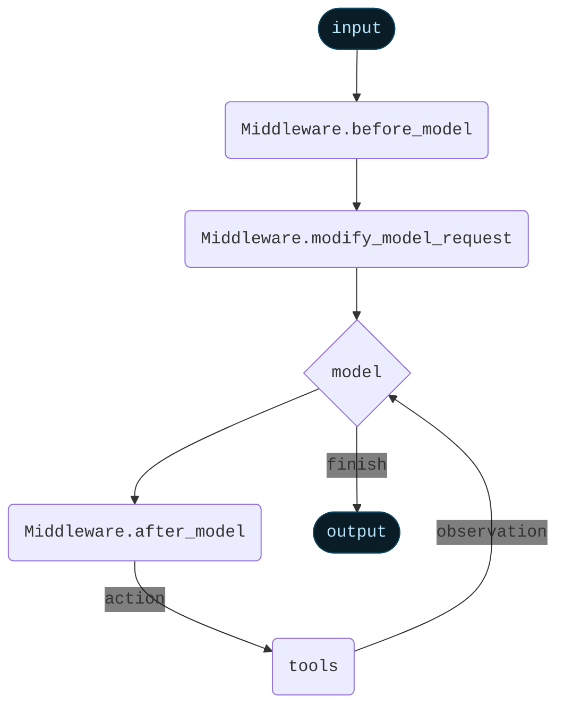

import AlphaCallout from '/snippets/alpha-lc-callout.mdx';

<AlphaCallout />


Middleware provides a way to more tightly control what happens inside the agent.

The core agent loop involves calling a `model`, letting it choose `tools` to execute, and then finishing when it calls no more tools.


<Card>

</Card>

Middleware provides control over what happens before and after those steps.
Each middleware can add in three different types of modifiers:

:::python
- `before_model`: Runs before model execution. Can update state or jump to a different node (`model`, `tools`, `end`)
- `modify_model_request`: Runs before model execution, to prepare the model request object. Can only modify the current model request object (no permanent state updates) and cannot jump to a different node.
- `after_model`: Runs after model execution, before tools are executed. Can update state or jump to a different node (`model`, `tools`, `END`)

In addition to that, each middleware can define the following static properties:
- `name`: The name of the middleware (required)
- `tools`: The tools that the middleware makes available to the agent (optional)
- `state_schema`: The schema of the state that the middleware requires (optional)
:::
:::js
- `beforeModel`: Runs before model execution. Can update state or jump to a different node (`model`, `tools`, `end`)
- `modifyModelRequest`: Runs before model execution, to prepare the model request object. Can only modify the current model request object (no permanent state updates) and cannot jump to a different node.
- `afterModel`: Runs after model execution, before tools are executed. Can update state or jump to a different node (`model`, `tools`, `__end__`)

In addition to that, each middleware can define the following static properties:
- `name`: The name of the middleware (required)
- `tools`: The tools that the middleware makes available to the agent (optional)
- `stateSchema`: The schema of the state that the middleware requires (optional)
- `contextSchema`: The schema of the context that the middleware requires (optional)
:::

:::python
An agent can contain `before_model`, `modify_model_request`, or `after_model` middleware. All three do not need to be implemented.
:::
:::js
An agent can contain multiple middleware. Each middleware does not need to implement all three of `beforeModel`, `modifyModelRequest`, `afterModel`.
:::

<Card>

</Card>

## Using in an agent

:::python
You can use middleware in an agent by passing it `create_agent`:
```python
from langchain.agents import create_agent
from langchain.agents.middleware import SummarizationMiddleware, HumanInTheLoopMiddleware

agent = create_agent(
    ...,
    middleware=[SummarizationMiddleware(), HumanInTheLoopMiddleware()],
    ...
)
```
:::
:::js
```typescript
import {
  createAgent,
  summarizationMiddleware,
  humanInTheLoopMiddleware,
} from "langchain";

const agent = createAgent({
  // ...
  middleware: [summarizationMiddleware, humanInTheLoopMiddleware],
  // ...
});
```
:::

Middleware is highly flexible and replaces some other functionality in the agent.
As such, when middleware are used, there are some restrictions on the arguments used to create the agent:
:::python
- `model` must be either a string or a `BaseChatModel`. Will error if a function is passed. If you want to dynamically control the model, use `AgentMiddleware.modify_model_request`
- `prompt` must be either a string or None. Will error if a function is passed. If you want to dynamically control the prompt, use `AgentMiddleware.modify_model_request`
- `pre_model_hook` must not be provided. Use `AgentMiddleware.before_model` instead.
- `post_model_hook` must not be provided. Use `AgentMiddleware.after_model` instead.
:::
:::js
- `model` must be either a string or a BaseChatModel. Will error if a function is passed. If you want to dynamically control the model, use `AgentMiddleware.modifyModelRequest`
- `prompt` must be either a string or None. Will error if a function is passed. If you want to dynamically control the prompt, use `AgentMiddleware.modifyModelRequest`
- `preModelHook` must not be provided. Use `AgentMiddleware.beforeModel` instead.
- `postModelHook` must not be provided. Use `AgentMiddleware.afterModel` instead.
:::

## Built-in middleware

LangChain provides several built in middleware to use off-the-shelf

- [Summarization](#summarization)
- [Human-in-the-loop](#human-in-the-loop)
- [Anthropic prompt caching](#anthropic-prompt-caching)
- [Dynamic system prompt](#dynamic-system-prompt)

### Summarization

The `summarizationMiddleware` automatically manages conversation history by summarizing older messages when token limits are approached. This middleware monitors the total token count of messages and creates concise summaries to preserve context while staying within model limits.

**Key features:**

- Automatic token counting and threshold monitoring
- Intelligent message partitioning that preserves AI/Tool message pairs
- Customizable summary prompts and token limits

**Use Cases:**

- Long-running conversations that exceed token limits
- Multi-turn dialogues with extensive context

:::python
```python
from langchain.agents import create_agent
from langchain.agents.middleware import SummarizationMiddleware

agent = create_agent(
    model="openai:gpt-4o",
    tools=[weather_tool, calculator_tool],
    middleware=[
        SummarizationMiddleware(
            model="openai:gpt-4o-mini",
            max_tokens_before_summary=4000,  # Trigger summarization at 4000 tokens
            messages_to_keep=20,  # Keep last 20 messages after summary
            summary_prompt="Custom prompt for summarization...",  # Optional
        ),
    ],
)
```
:::

:::js
```typescript
import { createAgent, summarizationMiddleware } from "langchain";

const agent = createAgent({
  model: "openai:gpt-4o",
  tools: [weatherTool, calculatorTool],
  middleware: [
    summarizationMiddleware({
      model: "openai:gpt-4o-mini",
      maxTokensBeforeSummary: 4000, // Trigger summarization at 4000 tokens
      messagesToKeep: 20, // Keep last 20 messages after summary
      summaryPrompt: "Custom prompt for summarization...", // Optional
    }),
  ],
});
```
:::

**Configuration options:**

:::python
- `model`: Language model to use for generating summaries (required)
- `max_tokens_before_summary`: Token threshold that triggers summarization
- `messages_to_keep`: Number of recent messages to preserve (default: 20)
- `token_counter`: Custom function for counting tokens (defaults to character-based approximation)
- `summary_prompt`: Custom prompt template for summary generation
- `summary_prefix`: Prefix added to system messages containing summaries (default: "## Previous conversation summary:")
:::

:::js

- `model`: Language model to use for generating summaries (required)
- `maxTokensBeforeSummary`: Token threshold that triggers summarization
- `messagesToKeep`: Number of recent messages to preserve (default: 20)
- `tokenCounter`: Custom function for counting tokens (defaults to character-based approximation)
- `summaryPrompt`: Custom prompt template for summary generation
- `summaryPrefix`: Prefix added to system messages containing summaries (default: "## Previous conversation summary:")
:::

The middleware ensures tool call integrity by:

1. Never splitting AI messages from their corresponding tool responses
2. Preserving the most recent messages for continuity
3. Including previous summaries in new summarization cycles

### Human-in-the-loop

The `HumanInTheLoopMiddleware` enables human oversight and intervention for tool calls made by the agents. Please
see [human-in-the-loop documentation](/oss/langchain/human-in-the-loop) for more details.

This middleware intercepts tool executions and allows human operators to approve, modify, reject, or manually respond to tool calls before they execute.

### Anthropic prompt caching

`AnthropicPromptCachingMiddleware` is a middleware that enables you to enable Anthropic's native prompt caching.

Prompt caching enables optimal API usage by allowing resuming from specific prefixes in your prompts.
This is particularly useful for tasks with repetitive prompts or prompts with redundant information.

<Info>
Learn more about Anthropic Prompt Caching (strategies, limitations, etc.) [here](https://docs.anthropic.com/en/docs/build-with-claude/prompt-caching#cache-limitations).
</Info>

When using prompt caching, you'll likely want to use a checkpointer to store conversation
history across invocations.

:::python
```python
from langchain_anthropic import ChatAnthropic
from langchain.agents.middleware.prompt_caching import AnthropicPromptCachingMiddleware
from langchain.agents import create_agent

LONG_PROMPT = """
Please be a helpful assistant.

<Lots more context ...>
"""

agent = create_agent(
    model=ChatAnthropic(model="claude-sonnet-4-latest"),
    prompt=LONG_PROMPT,
    middleware=[AnthropicPromptCachingMiddleware(ttl="5m")],
)

# cache store
agent.invoke({"messages": [HumanMessage("Hi, my name is Bob")]})

# cache hit, system prompt is cached
agent.invoke({"messages": [HumanMessage("What's my name?")]})
```
:::
:::js
```typescript
import { createAgent, HumanMessage, anthropicPromptCachingMiddleware } from "langchain";

const LONG_PROMPT = `
Please be a helpful assistant.

<Lots more context ...>
`;

const agent = createAgent({
  model: "anthropic:claude-sonnet-4-latest",
  prompt: LONG_PROMPT,
  middleware: [anthropicPromptCachingMiddleware({ ttl: "5m" })],
});

// cache store
await agent.invoke({
  messages: [HumanMessage("Hi, my name is Bob")]
});

// cache hit, system prompt is cached
const result = await agent.invoke({
  messages: [HumanMessage("What's my name?")]
});
```
:::

### Dynamic system prompt

:::python
A system prompt can be dynamically set right before each model invocation using the `@modify_model_request` decorator. This middleware is particularly useful when the prompt depends on the current agent state or runtime context.

For example, you can adjust the system prompt based on the user's expertise level:

```python
from typing import TypedDict

from langchain.agents import create_agent
from langchain.agents.middleware.types import modify_model_request, AgentState, ModelRequest
from langgraph.runtime import Runtime

class Context(TypedDict):
    user_role: str

@modify_model_request
def dynamic_system_prompt(request: ModelRequest, state: AgentState, runtime: Runtime[Context]) -> ModelRequest:
    user_role = runtime.context.get("user_role", "user")
    base_prompt = "You are a helpful assistant."

    if user_role == "expert":
        prompt = f"{base_prompt} Provide detailed technical responses."
    elif user_role == "beginner":
        prompt = f"{base_prompt} Explain concepts simply and avoid jargon."
    else:
        prompt = base_prompt

    request.system_prompt = prompt
    return request

agent = create_agent(
    model="openai:gpt-4o",
    tools=[web_search],
    middleware=[dynamic_system_prompt],
    context_schema=Context
)

# Use with context
result = agent.invoke(
    {"messages": [{"role": "user", "content": "Explain async programming"}]},
    context={"user_role": "expert"}
)
```
:::
:::js

A system prompt can be dynamically set right before each model invocation using the `dynamicSystemPromptMiddleware` middleware. This middleware is particularly useful when the prompt depends on the current agent state or runtime context.

For example, you can adjust the system prompt based on the user's expertise level:

```typescript
import { z } from "zod";
import { createAgent, dynamicSystemPromptMiddleware } from "langchain";

const contextSchema = z.object({
    userRole: z.enum(["expert", "beginner"]),
});

const agent = createAgent({
    model: "openai:gpt-4o",
    tools: [...],
    contextSchema,
    middleware: [
        dynamicSystemPromptMiddleware<z.infer<typeof contextSchema>>((state, runtime) => {
            const userRole = runtime.context.userRole || "user";
            const basePrompt = "You are a helpful assistant.";

            if (userRole === "expert") {
                return `${basePrompt} Provide detailed technical responses.`;
            } else if (userRole === "beginner") {
                return `${basePrompt} Explain concepts simply and avoid jargon.`;
            }
            return basePrompt;
        }),
    ],
});

// The system prompt will be set dynamically based on context
const result = await agent.invoke(
    { messages: [{ role: "user", content: "Explain async programming" }] },
    { context: { userRole: "expert" } }
);
```
:::

Alternatively, you can adjust the system prompt based on the conversation length:

:::python
```python
from langchain.agents.middleware.types import modify_model_request

@modify_model_request
def simple_prompt(state: AgentState, request: ModelRequest) -> ModelRequest:
    message_count = len(state["messages"])

    if message_count > 10:
        prompt = "You are in an extended conversation. Be more concise."
    else:
        prompt = "You are a helpful assistant."

    request.system_prompt = prompt
    return request

agent = create_agent(
    model="openai:gpt-4o",
    tools=[search_tool],
    middleware=[simple_prompt],
)
```
:::
:::js
```typescript
const agent = createAgent({
  model: "openai:gpt-4o",
  tools: [searchTool],
  middleware: [
    dynamicSystemPromptMiddleware((state) => {
      const messageCount = state.messages.length;

      if (messageCount > 10) {
        return "You are in an extended conversation. Be more concise.";
      }
      return "You are a helpful assistant.";
    }),
  ],
});
```
:::

## Custom Middleware

Middleware for agents are subclasses of `AgentMiddleware`, which implement one or more of its hooks.

`AgentMiddleware` currently provides three different ways to modify the core agent loop:

:::python
- `before_model`: runs before the model is run. Can update state or exit early with a jump.
- `modify_model_request`: runs before the model is run. Cannot update state or exit early with a jump.
- `after_model`: runs after the model is run. Can update state or exit early with a jump.
:::
:::js
- `beforeModel`: runs before the model is run. Can update state or exit early with a jump.
- `modifyModelRequest`: runs before the model is run. Cannot update state or exit early with a jump.
- `afterModel`: runs after the model is run. Can update state or exit early with a jump.
:::

In order to **exit early**, you can add a `jump_to` key to the state update with one of the following values:

- `"model"`: Jump to the model node
- `"tools"`: Jump to the tools node
- `"end"`: Jump to the end node

If this is specified, all subsequent middleware will not run.

Learn more about exiting early in the [agent jumps](#agent-jumps) section.

:::python
### `before_model`
:::
:::js
### `beforeModel`
:::

Runs before the model is run. Can modify state by returning a new state object or state update.

Signature:
:::python
```python
from langchain.agents.middleware import AgentMiddleware, AgentState
from langchain_core.messages import AIMessage

class MyMiddleware(AgentMiddleware):
    def before_model(self, state: AgentState) -> dict[str, Any] | None:
        # terminate early if the conversation is too long
        if len(state["messages"]) > 50:
            return {
                "messages": [AIMessage("I'm sorry, the conversation has been terminated.")],
                "jump_to": "end"
            }
        return state
```
:::
:::js
```typescript
import { createMiddleware, AIMessage } from "langchain";

const myMiddleware = createMiddleware({
  name: "MyMiddleware",
  beforeModel: (state) => {
    if (state.messages.length > 50) {
      return {
        messages: [
          new AIMessage("I'm sorry, the conversation has been terminated."),
        ],
        jumpTo: "end",
      };
    }
    return state;
  },
});
```
:::

:::python
### `modify_model_request`
:::
:::js
### `modifyModelRequest`
:::

:::python
Runs before the model has run, but after all the `before_model` calls.
:::
:::js
Runs before the model has run, but after all the `beforeModel` calls.
:::
These functions **cannot** modify permanent state or exit early.
Rather, they are intended to modify calls to the model in a **stateless** way.
:::python
If you want to modify calls to the model in a **stateful** way, you will need to use `before_model`
:::
:::js
If you want to modify calls to the model in a **stateful** way, you will need to use `beforeModel`
:::

Modifies the model request. The model request has several key properties:
- `model` (`BaseChatModel`): the model to use. Note: this needs to the base chat model, not a string.
:::python
- `system_prompt` (`str`): the system prompt to use. Will get prepended to `messages`
:::
:::js
- `systemPrompt` (`string`): the system prompt to use. Will get prepended to `messages`
:::
- `messages` (list of messages): the message list. Should not include system prompt.
:::python
- `tool_choice` (Any): the tool choice to use
:::
:::js
- `toolChoice`: Can be one of:
  - `"auto"`: means the model can pick between generating a message or calling one or more tools.
  - `"none"`: means the model will not call any tool and instead generates a message.
  - `"required"`: means the model must call one or more tools.
  - `{ type: "function", function: { name: string } }`: The model will use the specified function.
:::
- `tools` (list of strings): the tool names to use for this model call
:::python
- `response_format` (`ResponseFormat`): the response format to use for structured output
:::
:::js
- `responseFormat` (`ResponseFormat`): the response format to use for structured output
:::

Signature:
:::python
```python
from langchain.agents.middleware import AgentState, ModelRequest, AgentMiddleware

class MyMiddleware(AgentMiddleware):
    def modify_model_request(self, request: ModelRequest, state: AgentState) -> ModelRequest:
        if len(state["messages"]) > 10:
            request.model = "gpt-5"
        else:
            request.model = "gpt-5-nano"
        return request
```
:::
:::js
```typescript
import { createMiddleware, AIMessage } from "langchain";

const myMiddleware = createMiddleware({
  name: "MyMiddleware",
  modifyModelRequest: (request) => {
    // Select specific tools by name for this model call
    return {
      ...request,
      tools: ["weatherTool", "calculatorTool"], // Array of tool names
    };
  },
});
```
:::

:::python
### `after_model`
:::
:::js
### `afterModel`
:::

Runs after the model is run. Can modify state by returning a new state object or state update.

Signature:
:::python
```python
from langchain.agents.middleware import AgentState, AgentUpdate, AgentMiddleware

class MyMiddleware(AgentMiddleware):
    def after_model(self, state: AgentState) -> dict[str, Any] | None:
        ...
```
:::
:::js
```typescript
import { createMiddleware } from "langchain";

const myMiddleware = createMiddleware({
  name: "MyMiddleware",
  afterModel: (state) => {
    // ...
  },
});
```
:::

## New state keys

Middleware can extend the agent's state with custom properties, enabling rich data flow between middleware components and ensuring type safety throughout the agent execution.

### State extension

Middleware can define additional state properties that persist throughout the agent's execution. These properties become part of the agent's state and are available to all hooks for said middleware.

:::python
```python
from langchain.agents.middleware import AgentState, AgentMiddleware

class MyState(AgentState):
    model_call_count: int

class MyMiddleware(AgentMiddleware[MyState]):
    state_schema: MyState

    def before_model(self, state: AgentState) -> dict[str, Any] | None:
        # terminate early if the model has been called too many times
        if state["model_call_count"] > 10:
            return {"jump_to": "end"}
        return state

    def after_model(self, state: AgentState) -> dict[str, Any] | None:
        return {"model_call_count": state["model_call_count"] + 1}
```
:::

:::js
When a middleware defines required state properties through its `stateSchema`, these properties must be provided when invoking the agent:

```typescript
import { createMiddleware, createAgent, HumanMessage } from "langchain";
import { z } from "zod";

// Middleware with custom state requirements
const authMiddleware = createMiddleware({
  name: "AuthMiddleware",
  stateSchema: z.object({
    userId: z.string(), // Required
    userRole: z.string().default("user"), // Optional with default
  }),
  beforeModel: (state) => {
    // Access custom state properties
    console.log(`User ${state.userId} with role ${state.userRole}`);
    return;
  },
});

const agent = createAgent({
  model: "openai:gpt-4o",
  tools: [],
  middleware: [authMiddleware] as const,
});

// TypeScript enforces required state properties
const result = await agent.invoke({
  messages: [new HumanMessage("Hello")],
  userId: "user-123", // Required by middleware
  // userRole is optional due to default value
});
```
:::

### Context extension

<Note>
This is currently only available in JavaScript.
</Note>

Context properties are configuration values passed through the runnable config. Unlike state, context is read-only and typically used for configuration that doesn't change during execution.

:::js
Middleware can define context requirements that must be satisfied through the agent's configuration:

```typescript
import { z } from "zod";
import { createMiddleware, HumanMessage } from "langchain";

const rateLimitMiddleware = createMiddleware({
  name: "RateLimitMiddleware",
  contextSchema: z.object({
    maxRequestsPerMinute: z.number(),
    apiKey: z.string(),
  }),
  beforeModel: async (state, runtime) => {
    // Access context through runtime
    const { maxRequestsPerMinute, apiKey } = runtime.context;

    // Implement rate limiting logic
    const allowed = await checkRateLimit(apiKey, maxRequestsPerMinute);
    if (!allowed) {
      return { jumpTo: "END" };
    }

    return state;
  },
});

// Context is provided through config
await agent.invoke(
  { messages: [new HumanMessage("Process data")] },
  {
    context: {
      maxRequestsPerMinute: 60,
      apiKey: "api-key-123",
    },
  }
);
```
:::

### Combining multiple middleware

When using multiple middleware, their state and context schemas are merged. All required properties from all middleware must be satisfied:

:::python
```python
from langchain.agents.middleware import AgentMiddleware
from langchain_core.messages import HumanMessage
from typing import Any, Dict

class Middleware1State(AgentState):
    prop_1: str
    shared_prop: int

class Middleware2State(AgentState):
    prop_2: bool
    shared_prop: int

class Middleware1(AgentMiddleware):
    def before_model(self, state: Dict[str, Any]) -> Dict[str, Any] | None:
        # Access prop1 and sharedProp from state
        print(f"Middleware1: prop1={state.get('prop_1')}, sharedProp={state.get('shared_prop')}")
        return None

class Middleware2(AgentMiddleware):
    def before_model(self, state: Dict[str, Any]) -> Dict[str, Any] | None:
        # Access prop2 and sharedProp from state
        print(f"Middleware2: prop2={state.get('prop_2')}, sharedProp={state.get('shared_prop')}")
        return None

agent = create_agent(
    model="openai:gpt-4o",
    tools=[],
    middleware=[Middleware1(), Middleware2()],
)
```
:::

:::js
```typescript
import { createMiddleware, createAgent, HumanMessage } from "langchain";
import { z } from "zod";

const middleware1 = createMiddleware({
  name: "Middleware1",
  stateSchema: z.object({
    prop1: z.string(),
    sharedProp: z.number(),
  }),
});

const middleware2 = createMiddleware({
  name: "Middleware2",
  stateSchema: z.object({
    prop2: z.boolean(),
    sharedProp: z.number(), // Same property name must have compatible types
  }),
});

const agent = createAgent({
  model: "openai:gpt-4o",
  tools: [],
  middleware: [middleware1, middleware2] as const,
});

// Must provide all required properties
const result = await agent.invoke({
  messages: [new HumanMessage("Hello")],
  prop1: "value1", // Required by middleware1
  prop2: true, // Required by middleware2
  sharedProp: 42, // Required by both
});
```
:::

### Agent-level context schema

Agents can also define their own context requirements that combine with middleware requirements:

:::python
```python
# ...
```
:::
:::js
```typescript
import { createAgent, HumanMessage } from "langchain";
import { z } from "zod";

const agent = createAgent({
  model: "openai:gpt-4o",
  tools: [],
  contextSchema: z.object({
    environment: z.enum(["development", "production"]),
  }),
  middleware: [rateLimitMiddleware] as const,
});

// Must satisfy both agent and middleware context requirements
await agent.invoke(
  { messages: [new HumanMessage("Deploy application")] },
  {
    context: {
      environment: "production", // Required by agent
      maxRequestsPerMinute: 60, // Required by middleware
      apiKey: "api-key-123", // Required by middleware
    },
  }
);
```
:::

### Best practices

1. **Use State for Dynamic Data**: Properties that change during execution (user session, accumulated data)
2. **Use Context for Configuration**: Static configuration values (API keys, feature flags, limits)
3. **Provide Defaults When Possible**: Use `.default()` in Zod schemas to make properties optional
4. **Document Requirements**: Clearly document what state and context properties your middleware requires
:::js
5. **Type Safety**: Leverage TypeScript's type checking to catch missing properties at compile time

The type system ensures all required properties are provided, preventing runtime errors:

```typescript
// TypeScript error: Property 'userId' is missing
await agent.invoke({
  messages: [new HumanMessage("Hello")],
  // userId is required but not provided
});

// TypeScript error: Type 'number' is not assignable to type 'string'
await agent.invoke({
  messages: [new HumanMessage("Hello")],
  userId: 123, // Wrong type
});
```
:::

## Middleware execution order

You can provide multiple middlewares. They are executed in the following logic:

:::python
**`before_model`**: Are run in the order they are passed in. If an earlier middleware exits early, then following middleware are not run
**`modify_model_request`**: Are run in the order they are passed in.
**`after_model`**: Are run in the _reverse_ order that they are passed in. If an earlier middleware exits early, then following middleware are not run
:::
:::js
**`beforeModel`**: Are run in the order they are passed in. If an earlier middleware exits early, then following middleware are not run
**`modifyModelRequest`**: Are run in the order they are passed in.
**`afterModel`**: Are run in the _reverse_ order that they are passed in. If an earlier middleware exits early, then following middleware are not run
:::

## Agent jumps

:::python
In order to **exit early**, you can add a `jump_to` key to the state update with one of the following values:
:::
:::js
In order to **exit early**, you can add a `jumpTo` key to the state update with one of the following values:
:::

- `"model"`: Jump to the model node
- `"tools"`: Jump to the tools node
- `"end"`: Jump to the end node

If this is specified, all subsequent middleware will not run.

:::python
If you jump to `model` node, all `before_model` middleware will run. It's forbidden to jump to `model` from an existing `before_model` middleware.
:::

:::js
If you jump to `model` node, all `beforeModel` middleware will run. It's forbidden to jump to `model` from an existing `beforeModel` middleware.
:::

Example usage:
:::python
```python
from langchain.agents.types import AgentState, AgentUpdate, AgentJump
from langchain.agents.middleware import AgentMiddleware

class MyMiddleware(AgentMiddleware):
    def after_model(self, state: AgentState) -> dict[str, Any]:
        return {
        "messages": ...,
        "jump_to": "model"
    }
```
:::
:::js
```typescript
import { createMiddleware } from "langchain";

const middleware = createMiddleware({
  name: "MyMiddleware",
  afterModel: (state) => {
    // ...
    return {
      messages: [
        /* ... */
      ],
      jumpTo: "model",
    };
  },
});
```
:::

## Examples

### Dynamically selecting tools

In many applications, you may have a large set of tools, but only a small subset is relevant for a specific request. To optimize performance and accuracy, it’s best to **expose only the tools that are needed for each request**.

Doing so provides several benefits:

* **Shorter prompts** – reducing unnecessary complexity.
* **Improved accuracy** – the model chooses from fewer options.
* **Permission control** – can select tools based on user permissions.

Use middleware to dynamically select which tools are available at runtime based on context.

```python
from langchain.agents import create_agent
from langchain.agents.middleware import AgentState, ModelRequest, modify_model_request

@modify_model_request
def tool_selector(state: AgentState, request: ModelRequest) -> ModelRequest:
    """Middleware to select relevant tools based on state/context."""
    # Select a small, relevant subset of tools based on state/context
    request.tools = ["relevant_tool_1", "relevant_tool_2"] # [!code highlight]
    return request

agent = create_agent(
    ...,
    tools=all_tools,  # All available tools need to be registered upfront
    # Middleware can be used to select a smaller subset that's relevant for the given
    # run.
    middleware=[tool_selector], # [!code highlight]
)
```


<Expandable title="Extended example: Select tools based on runtime context">

This example shows how to select between GitHub and GitLab tools based on the user's provider.

:::python
```python Expandable
from dataclasses import dataclass
from typing import Literal

from langchain.agents import create_agent
from langchain.agents.middleware import AgentState, ModelRequest, modify_model_request
from langchain.tools import tool
from langgraph.runtime import get_runtime

@tool
def github_create_issue(repo: str, title: str) -> dict:
    """Create an issue in a GitHub repository."""
    return {"url": f"https://github.com/{repo}/issues/1", "title": title}

@tool
def gitlab_create_issue(project: str, title: str) -> dict:
    """Create an issue in a GitLab project."""
    return {"url": f"https://gitlab.com/{project}/-/issues/1", "title": title}

all_tools = [github_create_issue, gitlab_create_issue]

@dataclass
class Context:
    provider: Literal["github", "gitlab"]

@modify_model_request
def select_tools(request: ModelRequest, state: AgentState) -> ModelRequest:
    """Select tools based on the VCS provider."""
    runtime = get_runtime(Context)
    provider = runtime.context.provider
    selected_tools = ["gitlab_create_issue"] if provider == "gitlab" else ["github_create_issue"]
    request.tools = selected_tools
    return request

agent = create_agent(
    model="openai:gpt-4o",
    tools=all_tools,
    middleware=[select_tools],
    context_schema=Context,
)

# Invoke with GitHub context
agent.invoke(
    {
        "messages": [{
            "role": "user",
            "content": "Open an issue titled 'Bug: where are the cats' in the repository `its-a-cats-game`"
        }]
    },
    context=Context(provider="github"),
)
```
:::

:::js
```typescript Expandable
import { z } from "zod";
import { createAgent, createMiddleware, tool, HumanMessage } from "langchain";

const githubCreateIssue = tool(
  async ({ repo, title }) => ({
    url: `https://github.com/${repo}/issues/1`,
    title,
  }),
  {
    name: "github_create_issue",
    description: "Create an issue in a GitHub repository",
    schema: z.object({ repo: z.string(), title: z.string() }),
  }
);

const gitlabCreateIssue = tool(
  async ({ project, title }) => ({
    url: `https://gitlab.com/${project}/-/issues/1`,
    title,
  }),
  {
    name: "gitlab_create_issue",
    description: "Create an issue in a GitLab project",
    schema: z.object({ project: z.string(), title: z.string() }),
  }
);

const allTools = [githubCreateIssue, gitlabCreateIssue];

const toolSelector = createMiddleware({
  name: "toolSelector",
  contextSchema: z.object({ provider: z.enum(["github", "gitlab"]) }),
  modifyModelRequest: (request, _state, runtime) => {
    const provider = runtime.context.provider;
    const toolName = provider === "gitlab" ? "gitlab_create_issue" : "github_create_issue";
    return { ...request, tools: [toolName] };
  },
});

const agent = createAgent({
  model: "openai:gpt-4o",
  tools: allTools,
  middleware: [toolSelector],
});

// Invoke with GitHub context
await agent.invoke(
  {
    messages: [
      new HumanMessage("Open an issue titled 'Bug: where are the cats' in the repository `its-a-cats-game`"),
    ],
  },
  {
    context: { provider: "github" },
  }
);
```
:::

**Key points:**

- Register all tools with the agent upfront
- Use middleware to select the relevant subset per request
- Define required context properties using `contextSchema`
- Use context for configuration that doesn't change during execution
- Use state for values that change during the agent run

</Expandable>
